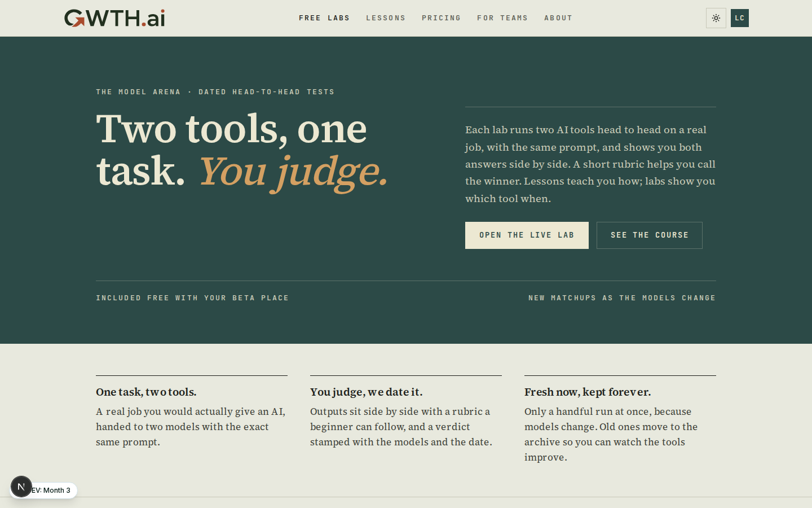
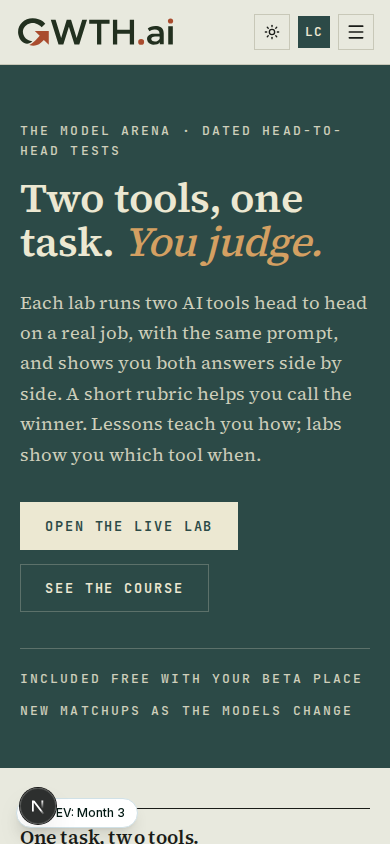
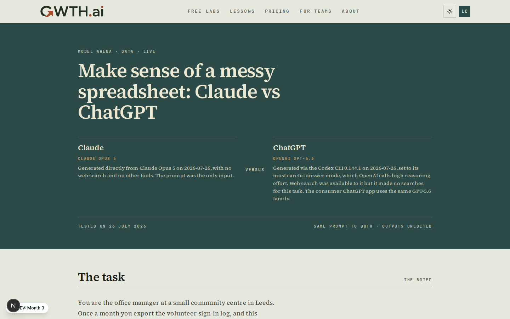
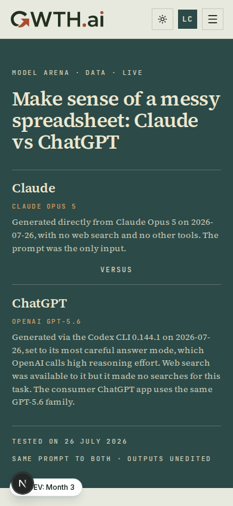
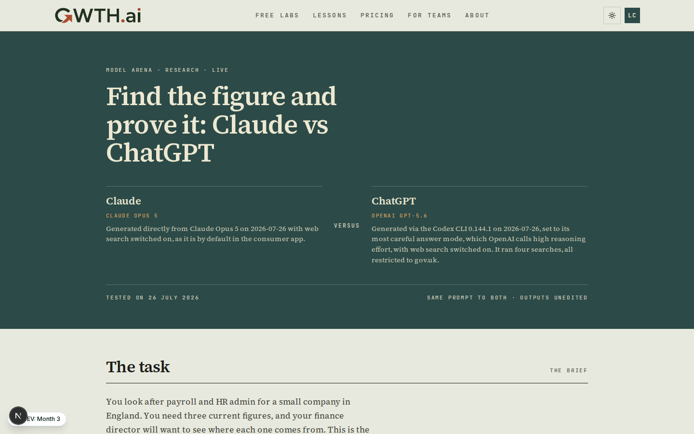
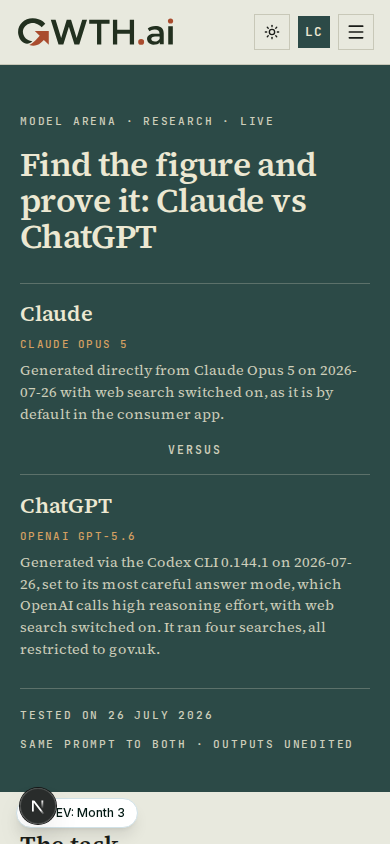
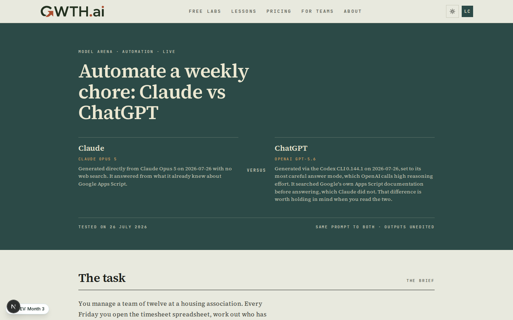
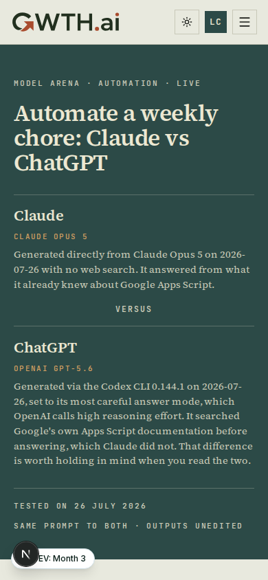

# Completion: L26 — three more Model Arena labs, live set now four

**Date:** 2026-07-26 · **Repo:** GWTH_V2 · **Commit:** `adb51f5`
**Test URL:** `https://gwth.ai/labs` (live after the next deploy; the labs are
content in this repo, nothing is deployed by this task) · **Status:** verified
locally, awaiting your sign-off

## What changed

- Three new Model Arena labs authored end to end, taking the live rotation from
  one to four. They cover **data**, **research** and **automation**, so no two
  live labs test the same kind of work and none of them revisit the pilot's HR
  ground.
- Every output is a **real generation captured on 26 July 2026** and quoted
  verbatim. The Claude side is Claude Opus 5, the ChatGPT side is OpenAI GPT-5.6
  (`gpt-5.6-sol`) via the Codex CLI 0.144.1. The raw prompts, the raw outputs and
  the Codex run logs are committed under
  [completion/L26/generations](L26/generations) so the verbatim claim is
  checkable rather than asserted.
- `src/lib/data/model-arena.ts` now imports all four labs;
  `model-arena.test.ts` gained four tests that pin the rotation size, the slug
  order, unique ids and slugs, one category per live lab, and a non-empty prompt
  plus two non-empty outputs per lab.
- **No UI was touched.** The labs pages are W22's and render the new JSON
  unchanged.

## Content

| Lab | Category | Matchup | Verdict |
|---|---|---|---|
| [Make sense of a messy spreadsheet](../src/lib/data/model-arena/lab-02-messy-spreadsheet-claude-vs-chatgpt.md) | Data | Claude Opus 5 vs GPT-5.6 | Close, slight edge to ChatGPT for getting to a usable number |
| [Find the figure and prove it](../src/lib/data/model-arena/lab-03-cite-your-sources-claude-vs-chatgpt.md) | Research | Claude Opus 5 vs GPT-5.6 (both searching) | Close. ChatGPT for the citation, Claude for the warnings |
| [Automate a weekly chore](../src/lib/data/model-arena/lab-04-automate-a-weekly-chore-claude-vs-chatgpt.md) | Automation | Claude Opus 5 vs GPT-5.6 | Close. ChatGPT if you want it to keep working, Claude if you want it working today |

Live URLs once deployed:

```
https://gwth.ai/labs
https://gwth.ai/labs/messy-spreadsheet-claude-vs-chatgpt
https://gwth.ai/labs/cite-your-sources-claude-vs-chatgpt
https://gwth.ai/labs/automate-a-weekly-chore-claude-vs-chatgpt
```

### The three tasks, and why these three

- **Data.** An office manager at a Leeds community centre exports the volunteer
  sign-in log. It has three date formats, one volunteer under two spellings,
  hours logged as `7:30`, `half day` and `N/A`, a 40 hour row that appears
  twice, and a total at the bottom that reconciles with nothing. The trustees
  want two numbers. This tests whether a tool commits to a defensible figure or
  a confident wrong one.
- **Research.** A payroll administrator needs the National Living Wage, the
  Statutory Sick Pay weekly rate and the redundancy weekly pay cap, each with an
  official link. This is the honesty test: a confident wrong figure with a
  broken link looks exactly like a confident right one. **I clicked every link
  and checked every figure against GOV.UK on the test date.** All six were real
  and correct.
- **Automation.** A housing association manager who has never written code wants
  the Friday timesheet chase to run itself. This is the "which tool when"
  question at its sharpest: the two answers are a short script you could finish
  this afternoon and a six-hundred-line one that survives contact with reality.

### Fairness notes, stated because the verdicts depend on them

- Both sides of each lab got the **identical prompt**, word for word, and the
  prompt is printed in full in the lab.
- Data and automation: neither tool searched (ChatGPT had search available and
  used none on the data task; it did read Google's Apps Script documentation on
  the automation task, which Claude did not). Research: **both** searched. Each
  lab's matchup header says exactly which, because it changes how you read the
  answers.
- Two verdicts land with ChatGPT and one splits. That is what the runs showed;
  the pilot went the other way.

### One thing I could not do

A Gemini matchup would have added tool variety (the retired labs used three-way
Gemini comparisons). The Gemini API key in the pipeline repo returns
`429 RESOURCE_EXHAUSTED: your project has exceeded its monthly spending cap`, so
every Gemini generation would have been fabricated, which the format forbids.
All three labs are therefore Claude vs ChatGPT, like the pilot. Raising the cap
at [ai.studio/spend](https://ai.studio/spend) is your call, and it would unlock
Gemini for the next rotation.

## UI

The labs landing, four in the arena:




Data lab:




Research lab:




Automation lab:




Full-page shots (tall, not embedded):
[labs 1440](L26/shots/labs-1440-full.png) ·
[labs 390](L26/shots/labs-390-full.png) ·
[data 1440](L26/shots/lab-02-spreadsheet-1440-full.png) ·
[research 1440](L26/shots/lab-03-citations-1440-full.png) ·
[automation 1440](L26/shots/lab-04-automation-1440-full.png)

## Tone gate

Run per the binding gate (`GWTH-launch-plan/scripts/tone_gate.sh`, Codex GPT 5.5
at high effort) from inside the GWTH_V2 git repo on absolute paths. Raw
transcripts: [completion/L26/generations](L26/generations).

| Lab | Result | Remaining items |
|---|---|---|
| Research (lab 03) | **PASS** | none |
| Data (lab 02) | FAIL, exempt | 1 item, an em dash inside ChatGPT's verbatim answer |
| Automation (lab 04) | FAIL, exempt | 4 items, all em or en dashes inside ChatGPT's verbatim answer |

Every remaining item sits inside a quoted model output, where the "quote it
verbatim" rule overrides the dash policy. Both labs frame the outputs as raw
quoted text before showing them, so the punctuation reads as the model's and not
ours. This is the same call L23's packet recorded for the pilot.

Two gate findings **were** authored prose and were fixed:

- "run at high reasoning effort" was flagged as jargon. Now "in its most careful
  answer mode", with the exact setting still named in the JSON `howRun`, so
  nothing is rounded off.
- "rubric" was flagged as jargon in the shared intro line. The three new labs now
  say "checklist". **The pilot still says "rubric"**, so if you want the four
  labs identical it is a one-word change to
  `lab-01-job-advert-claude-vs-chatgpt.md`.

## What David should verify

- [ ] Open the three labs and read one verdict end to end. The question that
      matters: does it read as an honest call, or as Claude marking its own
      homework? Two of three go to ChatGPT, which is the evidence, not politeness.
- [ ] Spot-check the verbatim promise. Open
      [completion/L26/generations/out-02-chatgpt.txt](L26/generations/out-02-chatgpt.txt)
      against the lab page: the raw file and the published output should match
      character for character, tables and em dashes included.
- [ ] Check the research lab's six figures on GOV.UK yourself if you want the
      belt and braces: £12.71 (NLW 21+, 1 April 2026), £123.25 or 80% of normal
      weekly earnings (SSP), £751 weekly cap and £22,530 maximum (redundancy,
      on or after 6 April 2026).

## Verification run

```
npm run typecheck                       → clean, no errors
npm run lint                            → 0 errors (1 pre-existing warning in deploy/shot-audit-after-authed.mjs)
npm test                                → 66 files passed, 2 skipped · 547 tests passed, 13 skipped
node deploy/shot-l26.mjs                → 8 pages shot at 1440 and 390, every h1 the expected lab title
horizontal-overflow probe (both widths) → scrollWidth == clientWidth on all four pages, 2 outputs rendered per lab
tone_gate.sh lab-03                     → PASS
tone_gate.sh lab-02 / lab-04            → FAIL, items confined to verbatim quoted output (see table above)
```

Rendered locally from a dev server on port 3100, because the built server on
:3000 predates this change and belongs to another session. Nothing was deployed
and no running service was restarted.
