# Completion: N7 — institution admin v1 + the roster-privacy fix

**Date:** 2026-08-31 · **Repo:** GWTH_V2 (worker lane) · **Base:** `7623d88` · **Commits:** `89e2814`, `65a0aeb`, `cde866c`
**Test URL (one click, HTTPS, tailnet):** **https://hlab.taila51191.ts.net:9458/org**
**Status:** built, tested, live on the hlab review server. NOT deployed and NOT published — gwth.ai still runs `b97a1b9` with unpublished commits awaiting David, and no prod migration has been run. Ship ledger: `n7-institution-admin`, state *waiting for your verdict* on https://hlab.taila51191.ts.net:8101/ship.
**Design:** GWTH-launch-plan / "Institution - Fable Plan" / [05-syllabus-editions-design.md](../../GWTH-launch-plan/Institution%20-%20Fable%20Plan/05-syllabus-editions-design.md) sections 1.2, 4, 6 (M7/M8) + the §7b decisions of 2026-08-28; [01-cipd-meetings-digest.md](../../GWTH-launch-plan/Institution%20-%20Fable%20Plan/01-cipd-meetings-digest.md) section 7.
**Session log + plan:** [N7/session-log.md](N7/session-log.md)

## What changed

- **Roster privacy closed (N5 QA defect 3).** better-auth 1.6.19's organization
  plugin authorises `get-full-organization`, `list-members` and
  `list-invitations` on **membership**, not role — read directly in its own
  `routes/crud-*.mjs`. Giving `learner` an empty permission set does nothing,
  because those endpoints never consult the access controller. The fix is a
  `hooks.before` on the auth instance that resolves the caller's role in the
  target org from `org_membership` and returns 403. It is at the API layer, so
  `auth.api.*` server calls are covered too, and a future page cannot re-open
  the hole. `get-active-member-role?userId=` is covered as well; reading your
  own role still works.
- **`/org` — the institution's own staff surface.** Four screens gated on
  `org_membership.role`, NOT on GWTH's `ADMIN_EMAILS` allowlist: an institution
  admin must never need to be on a GWTH env var to run their edition. Overview
  (design 05 Q3), Syllabus (the tiered picker + pass mark), Ratification
  (Q4), Learners (Q1 + Q2, tutor-visible).
- **Lesson picker by tier.** Core is locked with the reason on screen (D-N7-3:
  an edition without the spine is not the course the credential attests to);
  only **optional** lessons are switchable, and `is_mandatory` is per lesson so
  CIPD may raise their students' mandatory count above the GWTH default's
  (decision 2). Exclusive lessons are governed by the ratification queue alone,
  not by a checkbox — a removal would destroy their tier, their sign-off
  history and the institution's review note (QA round-1 defects 7 + 8).
- **Ratification.** Ratify, or send back with a required note. Send-back is
  `state='draft'` **plus** `review_note`, not a third state (D-N7-2), so
  `edition_lessons_state_check` and N6's `isLessonInEdition` are untouched and
  a sent-back lesson stays invisible to learners for the same reason a draft
  does.
- **Pass mark** (Ben, 20 Aug: *"could we set like a pass mark for students?"*).
  One per edition (decision 4). It threads into grading with **zero N6
  changes** — `getEffectiveEdition()` already reads `syllabus_edition.pass_mark`
  per request. Raising it never retroactively fails anyone, because
  `lesson_progress.quiz_passed` is the persisted verdict N6 honours; the screen
  says so.
- **Co-branded masthead** from `syllabus_edition.co_brand_label` — GWTH first,
  the institution's label beside it (deck slide 7: *not* white-labelled).
  **`/for-teams` and `/pricing` are untouched** — `git diff 7623d88..HEAD --stat`
  lists neither, and a Playwright test asserts both still render with no /org
  chrome.

## UI

All four screens, desktop 1280 and mobile 390, plus dark. Rendering the
**preview** path (fixtures — see "Honesty" below), which is why every shot
carries the "Preview — example data" banner.

### Overview — `/org`

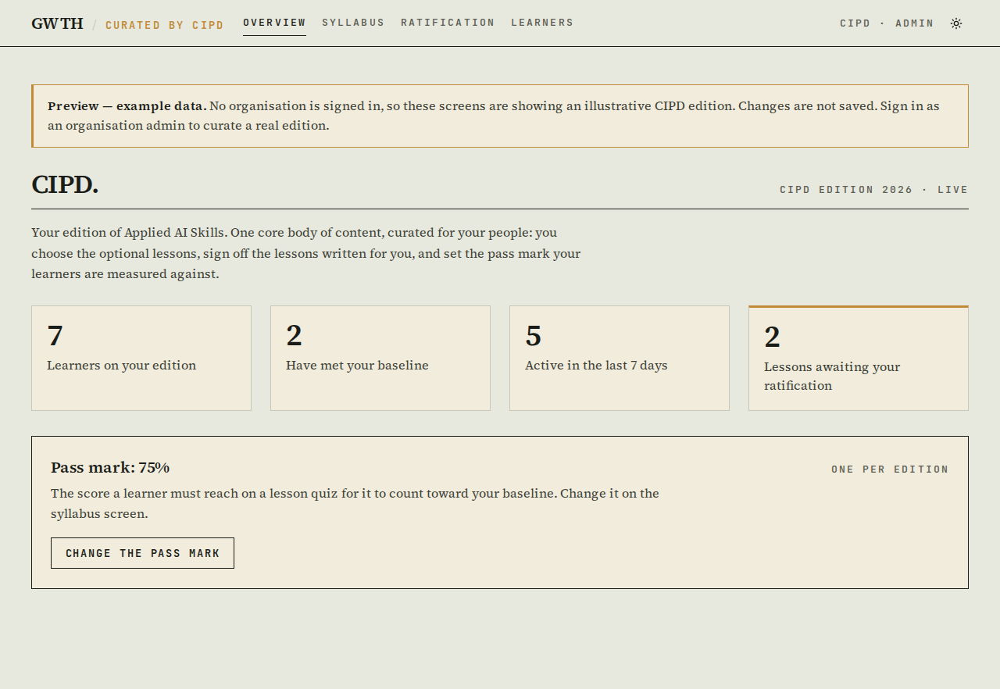
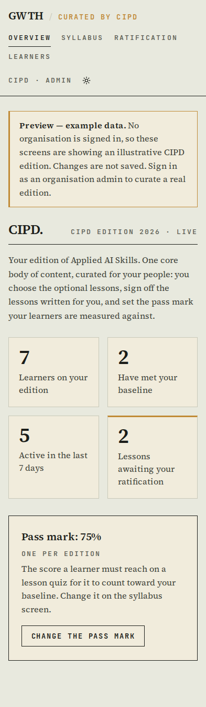

### Syllabus — `/org/syllabus` (the picker by tier + the pass mark)
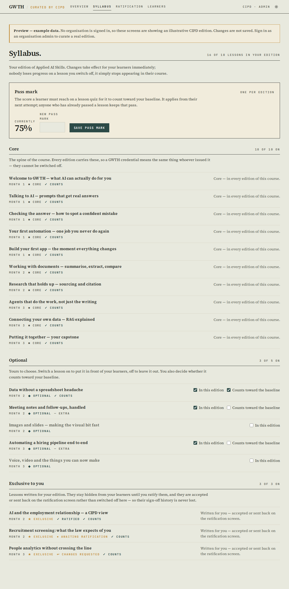
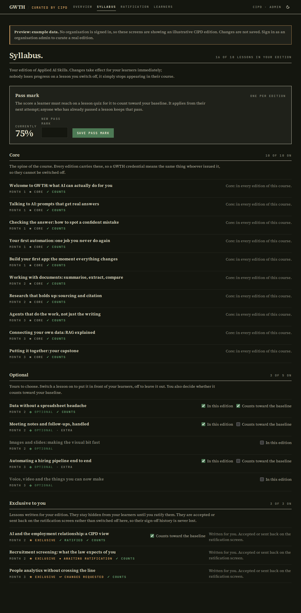
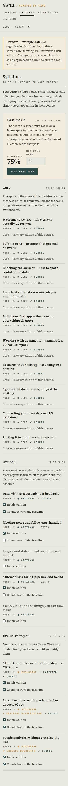

### Ratification — `/org/ratification`
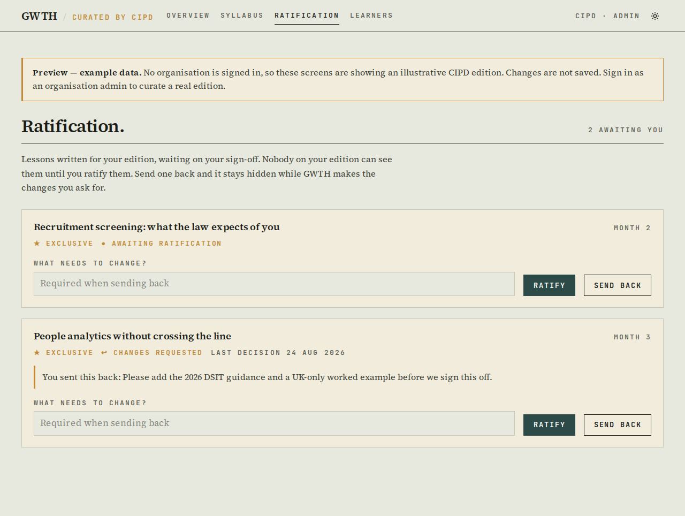
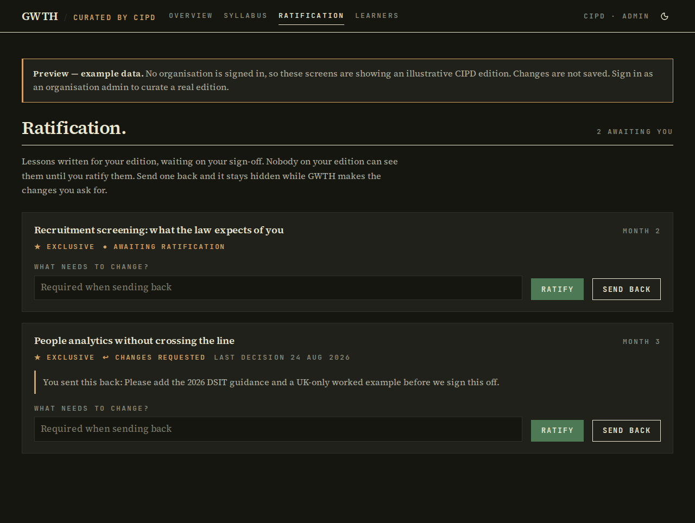
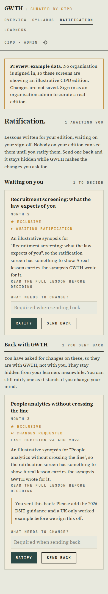

### Learners — `/org/learners` (the tutor's screen)
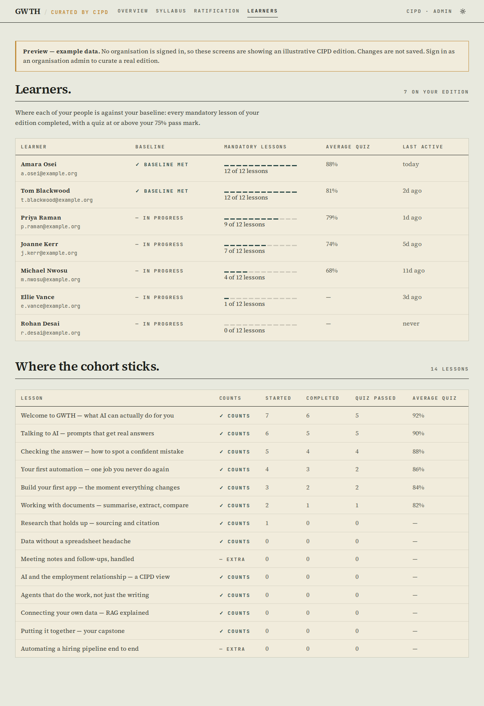
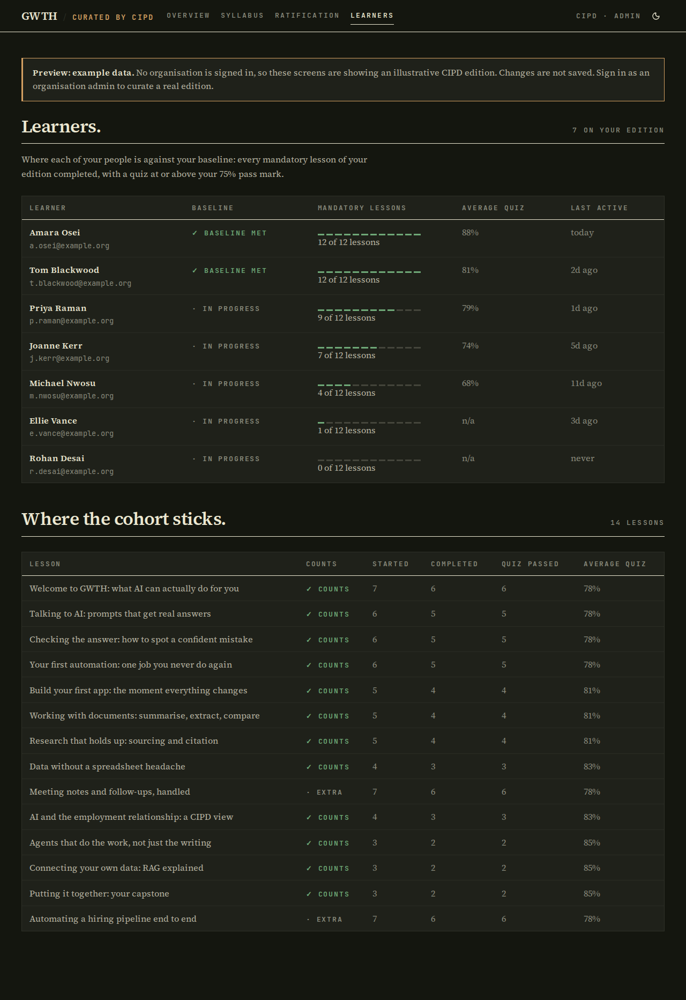
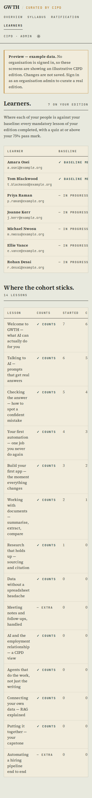

**Click it:** https://hlab.taila51191.ts.net:9458/org — the hlab review server
on the tailnet, serving commit `cde866c`. This is a *preview*, not a
deployment: gwth.ai is untouched and still on `b97a1b9`.

```
https://hlab.taila51191.ts.net:9458/org
https://hlab.taila51191.ts.net:9458/org/syllabus
https://hlab.taila51191.ts.net:9458/org/ratification
https://hlab.taila51191.ts.net:9458/org/learners
```

If that link ever stops answering, the review server is a plain dev server on
the P520 box behind the existing `tailscale serve --https=9458 →
127.0.0.1:3000`; restart it with:

```bash
cd /home/david/projects/GWTH_V2 && setsid nohup npx next dev -p 3000 &
```

## Backend / schema

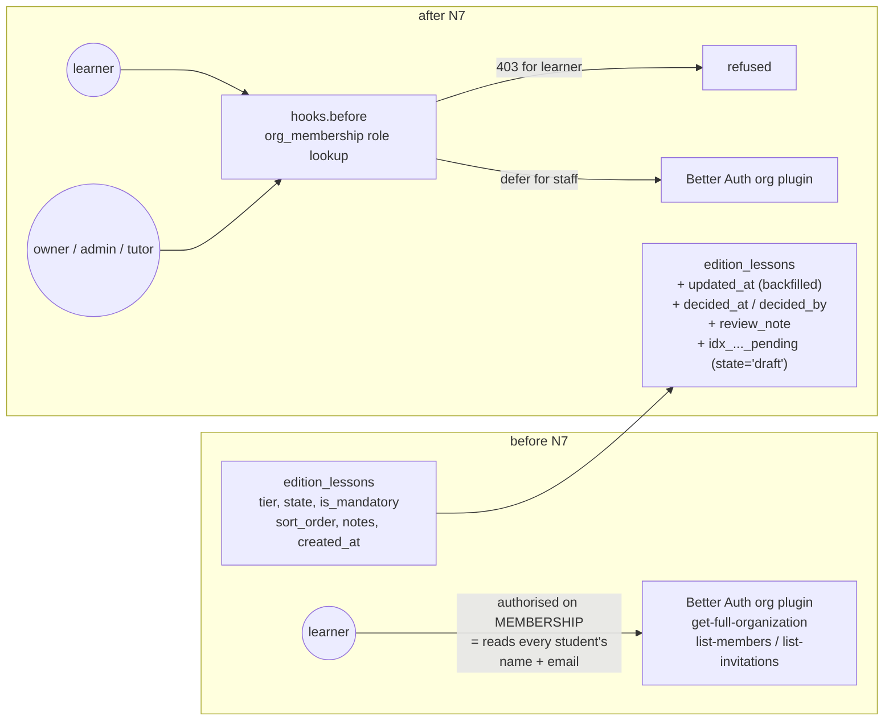

**What changed and why it is safe.** Migration
[`019_edition_ratification.sql`](../supabase/migrations/019_edition_ratification.sql)
is additive and idempotent: four `ADD COLUMN IF NOT EXISTS`, a guarded FK, a
partial index, and one backfill (`updated_at := created_at`) that runs *before*
`SET NOT NULL`, so the gwth-default rows keep an honest timestamp instead of
claiming to have been edited today. No column changes type, no constraint is
dropped, nothing existing becomes invalid. `decided_by` is
`ON DELETE SET NULL` — losing an account must never delete a lesson's
ratification state (pinned by a test). Rollback is four `DROP COLUMN`s.

**Applied to STAGING only** (`127.0.0.1:5443`), deliberately, exactly as N6's
016–018 were.

> **⚠ MIGRATION BEFORE DEPLOY.** `drizzle/schema.ts` now selects
> `edition_lessons.updated_at / decided_at / decided_by / review_note`, and
> that table is read by N6's edition resolution on every learner request. If
> the queued commits reach prod before 019 has run there, those reads fail
> with `column does not exist`. Migrations are additive and idempotent, so the
> safe order is **019 first, then the deploy** — 019 on its own changes no
> behaviour. This applies to N6's 016–018 too; all four are outstanding on
> prod.

Prod migration is a foreman/David step after the freeze lifts:

```bash
cd /home/david/projects/GWTH_V2
for f in 016_server_grading.sql 017_edition_integrity.sql \
         018_quiz_key_rls.sql 019_edition_ratification.sql; do
  ssh hetzner "sudo docker exec -i zo0gkcwoo0o4gow0go4cwk0o psql '<prod DATABASE_URL with host 127.0.0.1>' -v ON_ERROR_STOP=1" \
    < supabase/migrations/$f
done
```

## Honesty: what the screenshots are showing

The four screens above render **fixtures**, not a real institution, because no
organisation is provisioned yet. That path is the codebase's existing audited
seam — `isSessionlessMockRequest()`: a mock environment (no `DATABASE_URL`, or
the `ENABLE_DEV_MOCK_USER` review env) **and** no session cookie presented. A
request that presents a cookie always validates for real, so a forged cookie
gets the production path and bounces. Every preview screen says
"Preview — example data" on its face and every write refuses with that reason.
The real query paths are proven separately against Postgres (17 tests seeding
two organisations, including one that asserts org B's learners and progress
never appear in org A's numbers).

## Decisions taken (no David input needed)

| id | Decision | Why |
|---|---|---|
| D-N7-1 | `/org`, not `/admin/org` | `/admin` is GWTH staff on `ADMIN_EMAILS`; `/org` is the customer's staff on a DB role. Mixing them would put CIPD behind a GWTH env var. |
| D-N7-2 | Two ratification states, not three | "Send back" = `draft` + `review_note`. Keeps `edition_lessons_state_check` and N6's visibility rule exactly as shipped. |
| D-N7-3 | Core lessons are not switchable | An edition without the spine is not the course the GWTH credential attests to. Rendered locked, with the reason stated. |
| D-N7-4 | Roster privacy fails closed at the API layer | The `hooks.before` refusal covers `auth.api.*` too, so a future server component cannot re-open the hole. |
| D-N7-5 | Controls stay enabled in preview | A wall of greyed-out switches teaches nothing; the server returns the honest "changes are not saved" refusal instead — and Playwright asserts that round trip. |
| D-N7-6 | Exclusive lessons are not picker-switchable (QA round 1) | Deleting the row would destroy the tier, the sign-off audit and the review note, and re-adding would publish the lesson with no ratification. The queue owns them. |
| D-N7-7 | An org with no edition still reaches /org (QA round 1) | Bouncing a provisioned admin to the learner dashboard looks like "you have no access". The screen now says GWTH has not created the edition yet. |

Naming and the CIPD-vs-GWTH split were already settled in design 05 §7b
(2026-08-28), so **nothing here needs David tonight**. What CIPD sees is CIPD's
organisation — every query is filtered to the staff member's own org, proven by
a two-org DB test.

## What David should verify

- [ ] Open https://hlab.taila51191.ts.net:9458/org/syllabus — the three tiers
      read correctly, core lessons are locked with the reason shown, exclusive
      lessons point at the ratification screen rather than offering a switch,
      and the pass-mark panel says what changing it does and does not do.
- [ ] https://hlab.taila51191.ts.net:9458/org/ratification — a lesson you have
      sent back shows "changes requested" and your note, and stays hidden from
      learners. (Clicking Ratify on the review server answers "changes are not
      saved": it is showing example data, by design.)
- [ ] Confirm the two open questions for the CIPD conversation, which the code
      currently answers one way: (a) a tutor is read-only and sees the roster
      but never a learner's individual answers; (b) the org's mandatory count
      may exceed the GWTH default's, which is what decision 2 chose.

## Verification run

```
npx tsc --noEmit                                        → clean
npx eslint src                                          → 1 error, PRE-EXISTING
                                                          (src/lib/data/progress-quiz-atomic.test.ts:22
                                                           no-explicit-any, from commit e44fb52 / N2)
npm test                                                → 77 files passed, 8 skipped
                                                          766 tests passed, 77 skipped (DB suites)
                                                          — 49 of those tests are new in N7
DATABASE_URL=…5443/gwth_v2 npx vitest run src/db/ \
  src/lib/data/progress.db.test.ts \
  src/lib/billing/access.db.test.ts                     → 9 files, 75 tests passed
    of which src/db/org-admin.db.test.ts                → 17 passed
             src/db/org-roster-privacy.db.test.ts       → 12 passed
PLAYWRIGHT_BASE_URL=http://localhost:3000 \
  npx playwright test org-admin \
  --project=desktop-chromium --project=desktop-dark \
  --project=mobile-chromium                             → 111 passed
npm run build                                           → Compiled successfully;
                                                          ƒ /org, /org/learners,
                                                          /org/ratification, /org/syllabus
migration 019 applied twice to staging                  → second run all NOTICE …skipping
NEGATIVE CONTROL: hooks.before removed, DB suite re-run → 4 failed / 8 passed
  (exactly the learner-refusal tests — proof the hook is what closes defect 3)
```

Not run, deliberately: any deploy, any publish, any prod migration. The ship
ledger entry `n7-institution-admin` is open and **waiting for your verdict**;
it will not publish until you say so and the freeze lifts.

## QA chain

`qa_chain.py N7 --repo /home/david/projects/GWTH_V2 --range 7623d88..HEAD`,
run **before** this hand-over. Round 1 raised **14 defects and 10 style
notes**; the full report is
[`GWTH-launch-plan/completion/N7/qa-report.md`](../../GWTH-launch-plan/completion/N7/qa-report.md).

**Fixed (commit `cde866c`) — 11 defects, 6 style notes.** The four that
mattered most, because they were real and would have bitten:

1. **A forged send-back could delete a core lesson from every learner's
   syllabus.** `decideEditionLessonAction` had no tier guard; the UPDATE is now
   scoped to `tier='exclusive'`.
2. **Switching an exclusive lesson off destroyed its sign-off history** and
   re-adding it republished it as an ordinary optional lesson with no
   ratification. Exclusive lessons are no longer picker-switchable at all.
3. **Every "dark" screenshot was a light render.** next-themes runs
   `attribute="class"` with `defaultTheme="light"`, so `emulateMedia` never
   flipped the theme — the dark baselines and the packet's dark images were
   light renders mislabelled. The spec now seeds `localStorage` before
   navigation and asserts the `html` class; all baselines regenerated, and the
   light/dark blobs now differ.
4. **A provisioned admin whose org had no edition yet was bounced to the
   learner dashboard**, looking like they had no access. The context carries a
   nullable edition and each screen explains the state.

Plus: a failed queue read no longer renders as a healthy "0"; the roster's
average no longer drops scores for uncompleted lessons and "last active" counts
all activity; the toggles resync with the server value; the two DB suites no
longer share an id prefix; migration 019 runs before cleanup so a fresh
database is covered; one role list instead of two; `targetsAnotherUser` is
required rather than fail-open; the hook reads body as well as query; the note
field keeps its visible label as its accessible name; and the action test's DB
double routes by table name instead of call parity. Playwright now exercises
the workflows end to end (toggle → server → refusal; ratify; send-back with no
note) instead of only rendering the screens.

**Rebutted with evidence — 3 defects:**

- *"The QA gate was never run."* It was — this section is its output. The
  chain runs before the RECORD call, which is where the brief puts it.
- *"No walkthrough / the hand-back is a localhost URL."* Fixed rather than
  argued: the review server is now on the tailnet at
  **https://hlab.taila51191.ts.net:9458/org**, one clickable HTTPS link. A
  tailnet preview is not a deploy, so it does not breach the freeze.
- *"No ship was opened and the board was never told."* The ship
  `n7-institution-admin` is open, probed on hlab and handed over for a verdict;
  the board RECORD call is this task's final action, by the brief's own
  instruction.

**Round 2 was run after the fixes above and is recorded in the same report
file.**
