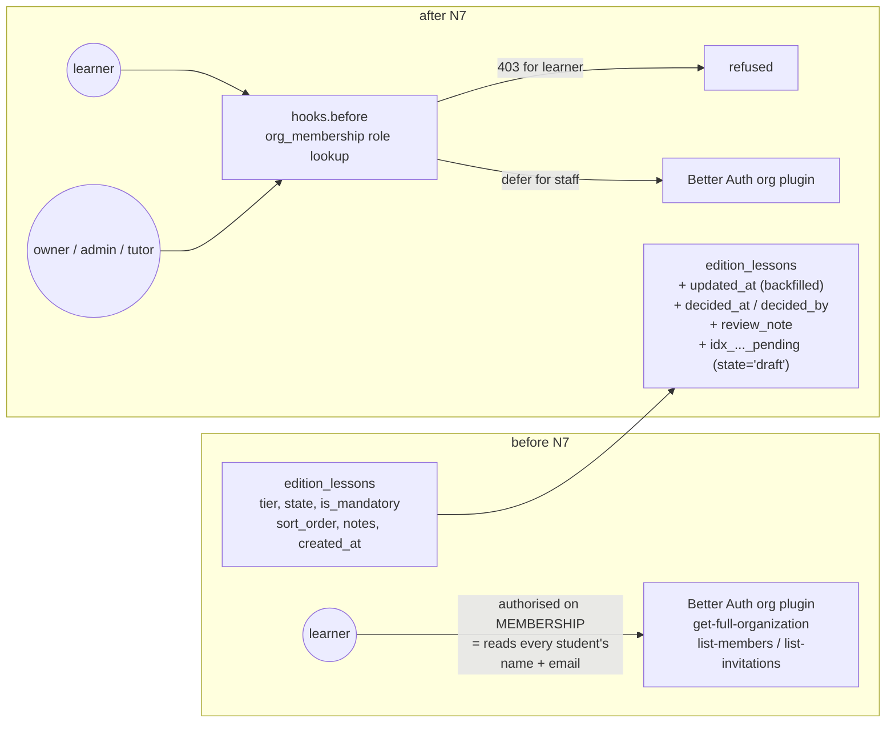

# Completion: N7 — institution admin v1 + the roster-privacy fix

**Date:** 2026-08-31 · **Repo:** GWTH_V2 (worker lane) · **Base:** `7623d88` · **Commit:** `89e2814`
**Test URL:** local only — `http://localhost:3005/org` (a dev server started for this run)
**Status:** built, tested, NOT deployed and NOT published (gwth.ai deploy freeze: b97a1b9 live, unpublished commits awaiting David). No prod migration run.
**Design:** GWTH-launch-plan / "Institution - Fable Plan" / [05-syllabus-editions-design.md](../../GWTH-launch-plan/Institution%20-%20Fable%20Plan/05-syllabus-editions-design.md) sections 1.2, 4, 6 (M7/M8) + the §7b decisions of 2026-08-28; [01-cipd-meetings-digest.md](../../GWTH-launch-plan/Institution%20-%20Fable%20Plan/01-cipd-meetings-digest.md) section 7.
**Session log + plan:** [N7/session-log.md](N7/session-log.md)

## What changed

- **Roster privacy closed (N5 QA defect 3).** better-auth 1.6.19's organization
  plugin authorises `get-full-organization`, `list-members` and
  `list-invitations` on **membership**, not role — read directly in its own
  `routes/crud-*.mjs`. Giving `learner` an empty permission set does nothing,
  because those endpoints never consult the access controller. The fix is a
  `hooks.before` on the auth instance that resolves the caller's role in the
  target org from `org_membership` and returns 403. It is at the API layer, so
  `auth.api.*` server calls are covered too, and a future page cannot re-open
  the hole. `get-active-member-role?userId=` is covered as well; reading your
  own role still works.
- **`/org` — the institution's own staff surface.** Four screens gated on
  `org_membership.role`, NOT on GWTH's `ADMIN_EMAILS` allowlist: an institution
  admin must never need to be on a GWTH env var to run their edition. Overview
  (design 05 Q3), Syllabus (the tiered picker + pass mark), Ratification
  (Q4), Learners (Q1 + Q2, tutor-visible).
- **Lesson picker by tier.** Core is locked with the reason on screen (D-N7-3:
  an edition without the spine is not the course the credential attests to);
  optional and exclusive are switchable, and `is_mandatory` is per lesson so
  CIPD may raise their students' mandatory count above the GWTH default's
  (decision 2). An exclusive lesson switched back on returns as a **draft** —
  re-adding is not the same act as signing off.
- **Ratification.** Ratify, or send back with a required note. Send-back is
  `state='draft'` **plus** `review_note`, not a third state (D-N7-2), so
  `edition_lessons_state_check` and N6's `isLessonInEdition` are untouched and
  a sent-back lesson stays invisible to learners for the same reason a draft
  does.
- **Pass mark** (Ben, 20 Aug: *"could we set like a pass mark for students?"*).
  One per edition (decision 4). It threads into grading with **zero N6
  changes** — `getEffectiveEdition()` already reads `syllabus_edition.pass_mark`
  per request. Raising it never retroactively fails anyone, because
  `lesson_progress.quiz_passed` is the persisted verdict N6 honours; the screen
  says so.
- **Co-branded masthead** from `syllabus_edition.co_brand_label` — GWTH first,
  the institution's label beside it (deck slide 7: *not* white-labelled).
  **`/for-teams` and `/pricing` are untouched** — `git diff 7623d88..HEAD --stat`
  lists neither, and a Playwright test asserts both still render with no /org
  chrome.

## UI

All four screens, desktop 1280 and mobile 390, plus dark. Rendering the
**preview** path (fixtures — see "Honesty" below), which is why every shot
carries the "Preview — example data" banner.

### Overview — `/org`


### Syllabus — `/org/syllabus` (the picker by tier + the pass mark)


### Ratification — `/org/ratification`


### Learners — `/org/learners` (the tutor's screen)


Test it locally (nothing is deployed):

```bash
cd /home/david/projects/GWTH_V2 && npx next dev -p 3005
# then open http://localhost:3005/org
```

## Backend / schema



**What changed and why it is safe.** Migration
[`019_edition_ratification.sql`](../supabase/migrations/019_edition_ratification.sql)
is additive and idempotent: four `ADD COLUMN IF NOT EXISTS`, a guarded FK, a
partial index, and one backfill (`updated_at := created_at`) that runs *before*
`SET NOT NULL`, so the gwth-default rows keep an honest timestamp instead of
claiming to have been edited today. No column changes type, no constraint is
dropped, nothing existing becomes invalid. `decided_by` is
`ON DELETE SET NULL` — losing an account must never delete a lesson's
ratification state (pinned by a test). Rollback is four `DROP COLUMN`s.

**Applied to STAGING only** (`127.0.0.1:5443`), deliberately, exactly as N6's
016–018 were. Prod migration is a foreman/David step after the freeze lifts:

```bash
cd /home/david/projects/GWTH_V2
ssh hetzner "sudo docker exec -i zo0gkcwoo0o4gow0go4cwk0o psql '<prod DATABASE_URL with host 127.0.0.1>' -v ON_ERROR_STOP=1" \
  < supabase/migrations/019_edition_ratification.sql
```

## Honesty: what the screenshots are showing

The four screens above render **fixtures**, not a real institution, because no
organisation is provisioned yet. That path is the codebase's existing audited
seam — `isSessionlessMockRequest()`: a mock environment (no `DATABASE_URL`, or
the `ENABLE_DEV_MOCK_USER` review env) **and** no session cookie presented. A
request that presents a cookie always validates for real, so a forged cookie
gets the production path and bounces. Every preview screen says
"Preview — example data" on its face and every write refuses with that reason.
The real query paths are proven separately against Postgres (14 tests seeding
two organisations).

## Decisions taken (no David input needed)

| id | Decision | Why |
|---|---|---|
| D-N7-1 | `/org`, not `/admin/org` | `/admin` is GWTH staff on `ADMIN_EMAILS`; `/org` is the customer's staff on a DB role. Mixing them would put CIPD behind a GWTH env var. |
| D-N7-2 | Two ratification states, not three | "Send back" = `draft` + `review_note`. Keeps `edition_lessons_state_check` and N6's visibility rule exactly as shipped. |
| D-N7-3 | Core lessons are not switchable | An edition without the spine is not the course the GWTH credential attests to. Rendered locked, with the reason stated. |
| D-N7-4 | Roster privacy fails closed at the API layer | The `hooks.before` refusal covers `auth.api.*` too, so a future server component cannot re-open the hole. |
| D-N7-5 | Controls stay enabled in preview | A wall of greyed-out switches teaches nothing; the server returns the honest "changes are not saved" refusal instead. |

Naming and the CIPD-vs-GWTH split were already settled in design 05 §7b
(2026-08-28), so **nothing here needs David tonight**. What CIPD sees is CIPD's
organisation — every query is filtered to the staff member's own org, proven by
a two-org DB test.

## What David should verify

- [ ] Open `http://localhost:3005/org/syllabus` (after `npx next dev -p 3005`):
      the three tiers read correctly, core lessons are locked with the reason
      shown, and the pass-mark panel says what changing it does and does not do.
- [ ] `http://localhost:3005/org/ratification`: a lesson you send back shows
      "changes requested" and your note, and stays hidden from learners.
- [ ] Confirm the two open questions for the CIPD conversation, which the code
      currently answers one way: (a) a tutor is read-only and sees the roster
      but never a learner's individual answers; (b) the org's mandatory count
      may exceed the GWTH default's, which is what decision 2 chose.

## Verification run

```
npx tsc --noEmit                                        → clean
npx eslint src                                          → 1 error, PRE-EXISTING
                                                          (src/lib/data/progress-quiz-atomic.test.ts:22
                                                           no-explicit-any, from commit e44fb52 / N2)
npm test                                                → 77 files passed, 8 skipped
                                                          761 tests passed, 74 skipped (DB suites)
                                                          — 44 of those tests are new in N7
DATABASE_URL=…5443/gwth_v2 npx vitest run src/db/ \
  src/lib/data/progress.db.test.ts \
  src/lib/billing/access.db.test.ts                     → 9 files, 75 tests passed
    of which src/db/org-admin.db.test.ts                → 14 passed
             src/db/org-roster-privacy.db.test.ts       → 12 passed
PLAYWRIGHT_BASE_URL=http://localhost:3005 \
  npx playwright test org-admin \
  --project=desktop-chromium --project=desktop-dark \
  --project=mobile-chromium                             → 99 passed
npm run build                                           → Compiled successfully;
                                                          ƒ /org, /org/learners,
                                                          /org/ratification, /org/syllabus
migration 019 applied twice to staging                  → second run all NOTICE …skipping
NEGATIVE CONTROL: hooks.before removed, DB suite re-run → 4 failed / 8 passed
  (exactly the learner-refusal tests — proof the hook is what closes defect 3)
```

Not run, deliberately: any deploy, any publish, any prod migration. The ship
ledger stays untouched for this task because nothing may go live.
