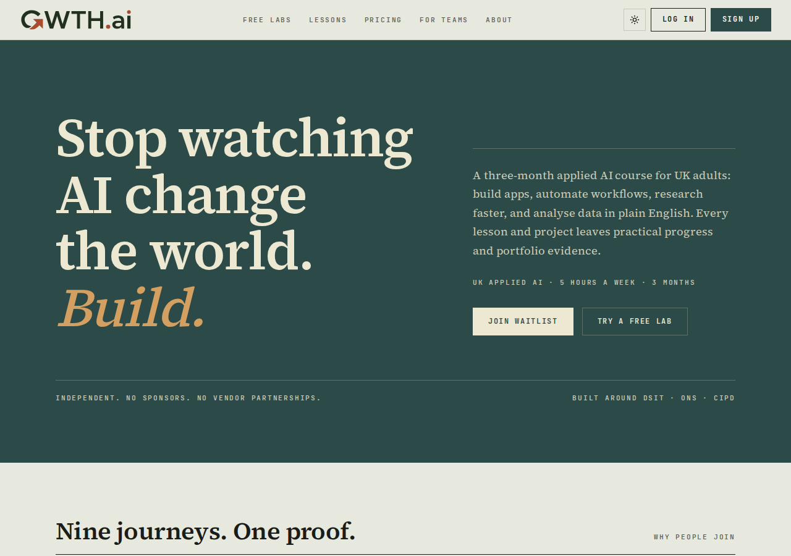
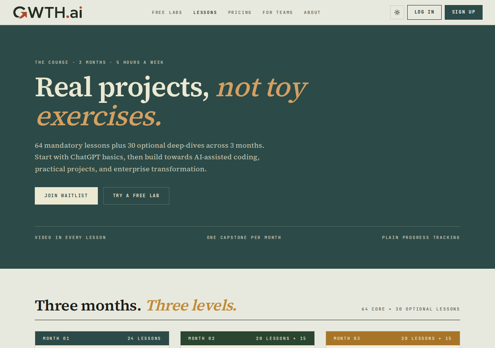
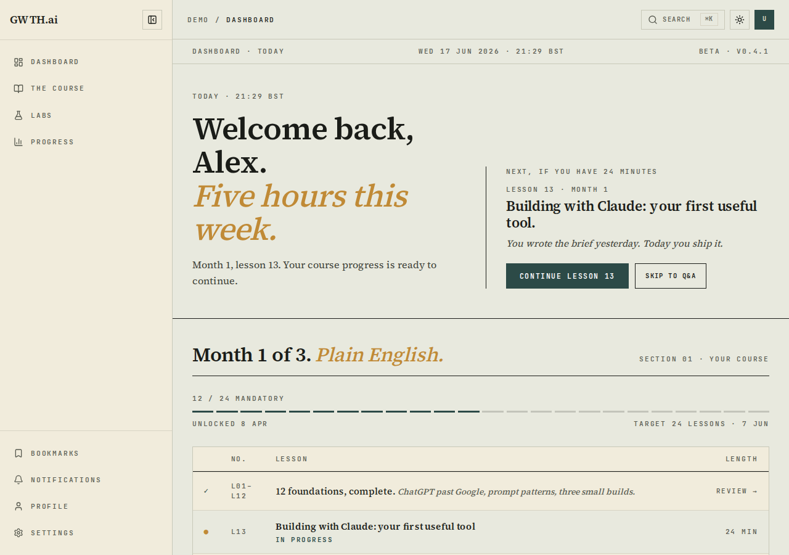
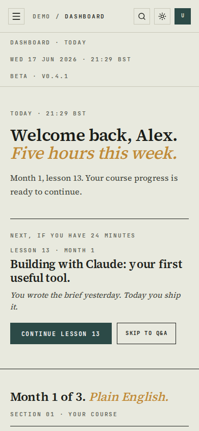
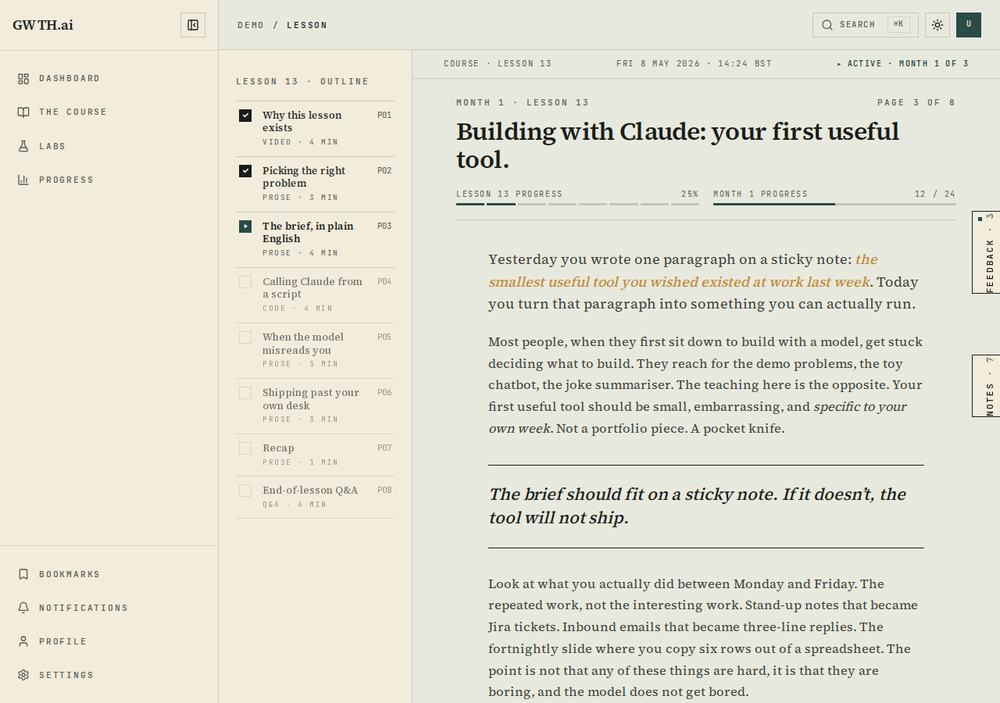
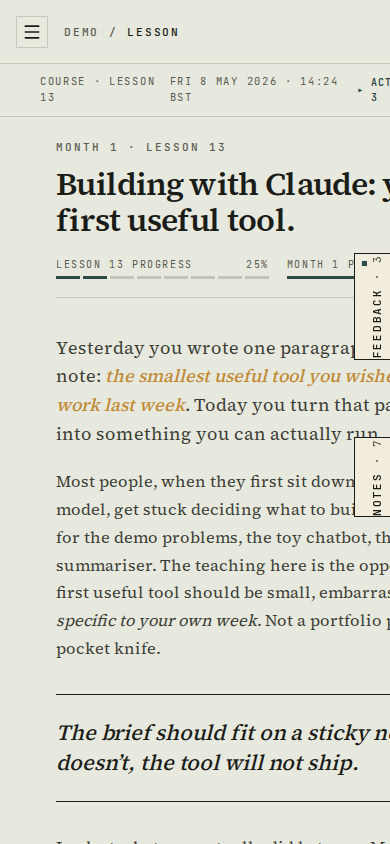

# Completion: W10 — FDE re-skin (every student-facing surface to the new guide)

**Date:** 2026-06-17 · **Repo:** GWTH_V2 · **Commit(s):** `0df913a` (public chrome + remaining public pages), `cc9a7f3` (dashboard suite), `fee4d7f` (application map marked done)
**Test URL:** http://192.168.178.50:3001/ · **Status:** verified (public surfaces live; dashboard suite verified via public demo previews — real auth-gated routes need a login)

This is the big visual change: every student-facing surface re-skinned to the FDE journal register codified in [DESIGN_FDE.md](../DESIGN_FDE.md) (W9). It re-skins what previously shipped in Stone & Sage; new builds (W1 auth, W4 admin, W5 guide) adopt FDE natively in their own tasks.

## What changed (4 bullets)
- **Homepage promoted** — `home-fde` is now the live `/` (the `/home-fde` review route was retired).
- **All public/marketing pages re-skinned** via dedicated `*-fde` modules: pricing, about, for-teams, labs, lessons, newsletter, contact, why-gwth, tech-radar, verify, privacy, terms, news — plus the public nav + footer chrome.
- **Full dashboard suite re-skinned**: dashboard, course/[slug], lesson viewer, labs/[slug], progress, profile, settings, bookmarks, notifications — each with its own `*-fde.module.css`, FDE chrome (teal sidebar), dash-progress affordance, journal framing. Data/routing/W7+W8 behaviour unchanged (plain progress, no score, no checkout).
- **Visual layer only** — copy is W2's (unchanged); pricing respects W8's no-checkout rule; the FDE palette is scoped per-surface via the `.shell` custom-property + `.dark` override pattern.

## UI — the re-skinned surfaces a student sees

### Homepage `/` (the exemplar, now live)


Test it: **http://192.168.178.50:3001/**

### Lessons `/lessons` (marketing) — colour-block month cards, journal framing


Test it: **http://192.168.178.50:3001/lessons**

### Dashboard suite — preview (real routes are auth-gated; FDE shown via public `/demo` previews)
The live `/dashboard` and `/course/...` routes 307-redirect to login (W11 auth gate), so the FDE dashboard chrome is captured from the public `/demo` previews, which render the identical FDE dashboard/lesson components. The dashboard shows plain "12 / 24 MANDATORY" dash-progress and **no GWTH Score** widget (W8 cut visible).



Test it: **http://192.168.178.50:3001/demo/dashboard**

### Lesson viewer — preview
Outline sidebar, dash-progress, pull-quote hairlines, ochre italic accent, mono metadata — the journal register applied to the lesson reader.



Test it: **http://192.168.178.50:3001/demo/lesson**

## Surfaces re-skinned (from the diff + DESIGN_FDE.md §6 application map)

**Public / marketing** — each route's `page.tsx` renders the matching `*-fde` component:

| Route | FDE component / module | Re-skinned |
|---|---|---|
| `/` | `HomeFde` (home-fde) | yes |
| `/about` | `AboutFde` | yes |
| `/contact` | `ContactFde` | yes |
| `/for-teams` | `ForTeamsFde` | yes |
| `/labs` | `LabsFde` | yes |
| `/lessons` | `LessonsFde` | yes |
| `/newsletter` | `NewsletterFde` | yes |
| `/pricing` | `PricingFde` | yes |
| `/privacy` · `/terms` | `LegalFde` | yes |
| `/tech-radar` | `TechRadarFde` | yes |
| `/why-gwth` | `WhyGwthFde` | yes |
| `/_news` · `/_news/[slug]` | news-fde.module.css | yes |
| `/verify/[code]` | `VerifyFde` | yes |
| public nav + footer | `public-nav-fde` / `footer-fde` | yes |

**Dashboard suite** — each route uses a dedicated `*-fde.module.css`:

| Route | FDE module | Re-skinned |
|---|---|---|
| `/dashboard` | dashboard-fde.module.css | yes |
| `/course/[slug]` | course-fde.module.css | yes |
| `/course/[slug]/lesson/[lessonSlug]` | lesson-fde.module.css | yes |
| `/labs/[slug]` | lab-fde.module.css | yes |
| `/progress` | progress-fde.module.css | yes |
| `/profile` | profile-fde.module.css | yes |
| `/settings` | settings-fde.module.css | yes |
| `/bookmarks` | bookmarks-fde.module.css | yes |
| `/notifications` | notifications-fde.module.css | yes |
| dashboard chrome (header/sidebar/breadcrumb) | header-fde / sidebar-fde / breadcrumb-nav-fde | yes |

**Deferred-with-reason (not a re-skin):** `/login`, `/signup`, `/forgot-password` and `/guide` are marked in DESIGN_FDE.md §6 as **new builds to FDE** (W1/W5 native), not Stone & Sage re-skins, so they are out of W10 scope. (`/signup` is the W8 invite gate.)

## What David should verify
- [ ] Click through http://192.168.178.50:3001/ → /lessons → /pricing → /about — confirm one consistent FDE language end to end (teal hero, Source Serif, colour-block cards, mono metadata).
- [ ] Open http://192.168.178.50:3001/demo/dashboard and /demo/lesson — confirm the dashboard/lesson reader carry the FDE chrome (teal sidebar, dash-progress, journal framing) with plain progress and no score.
- [ ] Toggle light/dark (sun icon top-right) on a couple of surfaces — confirm the `.dark` override holds (tokens, not raw hex).

## Verification run
```
git log --oneline -- src/app/(public) src/app/(dashboard) src/components/marketing
  → cc9a7f3 feat(design): FDE re-skin — dashboard suite (W10)
  → 0df913a feat(design): FDE re-skin — public chrome + remaining public pages (W10)
  → fee4d7f docs(design): mark W10 re-skin surfaces done in DESIGN_FDE.md application map
ls src/components/marketing | grep -- -fde   → 12 *-fde component dirs (home, about, contact, for-teams,
                                                labs, legal, lessons, newsletter, pricing, tech-radar, verify, why-gwth)
curl status: / 200 · /lessons 200 · /pricing 200 · /demo/dashboard 200 · /demo/lesson 200
            (/dashboard, /course → 307 to login — auth-gated, expected)
npx playwright screenshot → home/lessons/dashboard/lesson × {1280,390} (real renders, embedded above)
```

---
*GitHub blob (after push):*
```
https://github.com/David-ACG/gwth-v2/blob/master/completion/COMPLETION_W10.md
```
