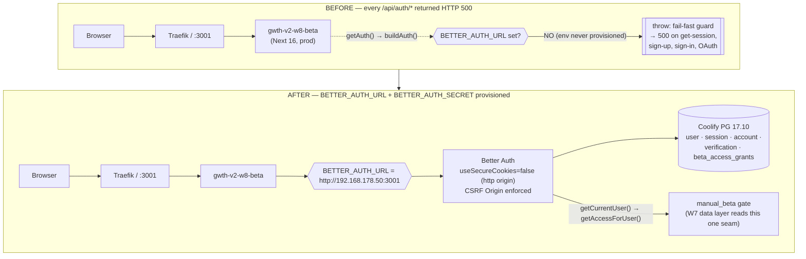
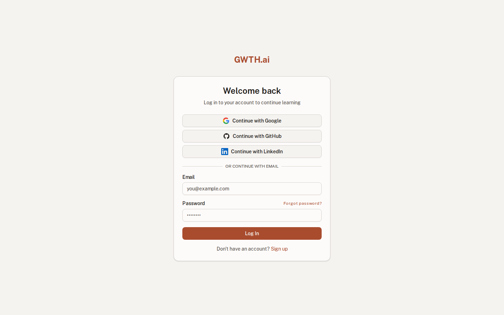
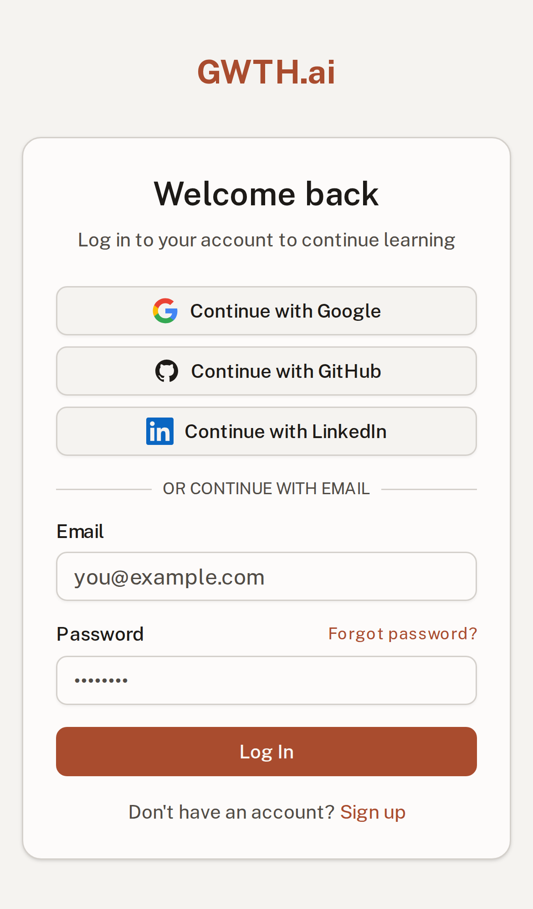
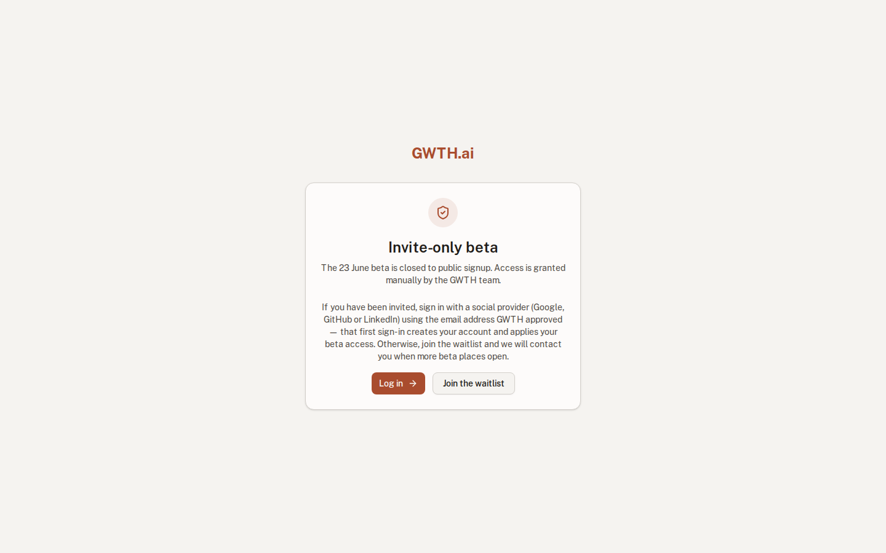
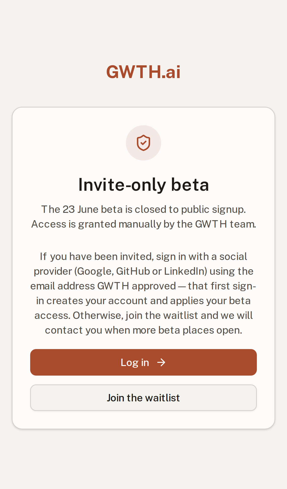
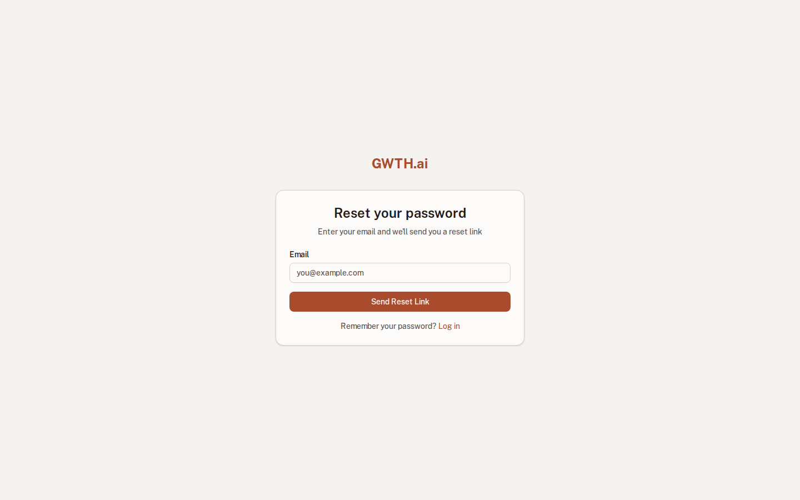
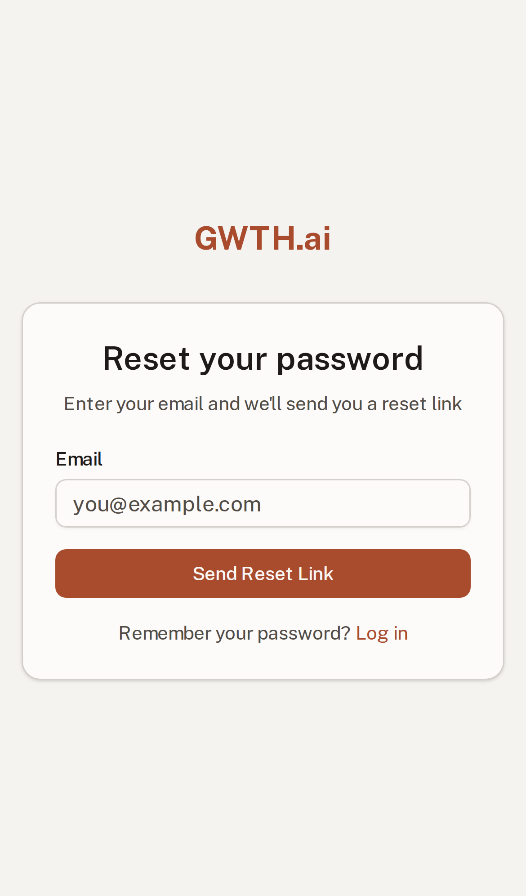

# W11 — Auth migration: live :3001 smoke + hard 2026-06-20 Clerk gate

**Task:** Finish W11 (the Supabase Auth → Better Auth migration was already CODE
COMPLETE). Run the live `:3001` round-trip smoke and resolve the hard
**2026-06-20 Clerk fallback gate** (ADR D4).
**Outcome:** Better Auth **HOLDS**. Live smoke 15/15 green behind the real proxy.
Clerk fallback **NOT** invoked. One David-only follow-up remains (staging OAuth
app registration + consent click-through — not automatable headlessly).

**Primary test URL:** http://hlab.taila51191.ts.net:3001/login (Tailscale — works from any tailnet device; LAN fallback: http://192.168.178.50:3001/login)
**Decision register:** D4 — gate resolution note recorded 2026-06-23.

> **Re-verified at completion 2026-07-01.** Independently re-ran the live smoke
> and the test suite before the final RECORD — both still green, 8 days after the
> gate resolved:
> - `bash deploy/smoke-w11-auth.sh` → **15 passed, 0 failed** against live :3001
>   (same PG 17.10 schema, same real proxy chain). Session survives reload, two-user
>   isolation holds, sign-out destroys the session, `getAccessForUser` returns the
>   right `manual_beta` id.
> - `npm test` → **298 passed, 11 skipped** (skips = live-DB tests; no auth code
>   touched). `grep @supabase src/` still only the W7 data layer — no auth client.
> - OAuth init still 500 on staging (creds never provisioned) — the one David-only
>   residual below; provider-agnostic, so *not* a Better Auth defect and not a gate
>   failure. Better Auth **still HOLDS**; Clerk fallback remains NOT invoked.

> **Addendum 2026-07-01 — staging re-pointed to the Tailscale origin.** David
> reviews remotely, so the canonical staging origin is now the tailnet name:
> `BETTER_AUTH_URL=http://hlab.taila51191.ts.net:3001` (deploy/run-staging.sh;
> WireGuard-encrypted on the wire despite the http scheme). No app code changed:
> Better Auth auto-trusts its own `baseURL` origin, and the LAN origin stays
> trusted via the existing `trustedOrigins` list in `src/lib/better-auth.ts`.
> Re-verified by running the full smoke against **both** origins after redeploy:
> - `W11_SMOKE_BASE=http://hlab.taila51191.ts.net:3001 bash deploy/smoke-w11-auth.sh` → **15/15 green**
> - `bash deploy/smoke-w11-auth.sh` (LAN default) → **15/15 green** (no regression)
>
> Deliberately **not** HTTPS via `tailscale serve`: the app stamps an HSTS header
> on every response, and browsers pin HSTS per-hostname — one https page-load on
> `hlab.taila51191.ts.net` would break every plain-http service on hlab (the
> :8090 board, :3001 itself) in that browser for the 2-year max-age. An https
> staging origin (needed for Google/LinkedIn OAuth redirect URIs) requires
> gating that header first — filed as follow-up work.

---

## What changed (this task only — no auth *code* changed)

The Better Auth seam (`src/lib/auth.ts`, `src/lib/better-auth.ts`, `src/proxy.ts`,
the 4 Drizzle tables) was already shipped and correct. The live 500s were **not**
a code defect — the staging container was simply **never provisioned with the
Better Auth env**. The app's own fail-fast guard (`BETTER_AUTH_URL must be set in
production…`) was firing exactly as designed.

| File | Change | Why |
|------|--------|-----|
| `deploy/run-staging.sh` | `+ -e BETTER_AUTH_URL="http://192.168.178.50:${HOST_PORT}"` | Static public origin → correct cookie/redirect generation behind the proxy; over plain-http staging `useSecureCookies` derives to `false` so the session cookie persists (the D4 design). |
| `deploy/secrets.staging.env` (SOPS) | `+ BETTER_AUTH_SECRET` (staging-only, generated) | Session signing secret; required or every `/api/auth/*` call 500s. |
| `deploy/smoke-w11-auth.sh` | **new** | Reproducible live round-trip smoke (15 checks). |
| `deploy/shot-w11.mjs` | **new** | Playwright-CLI screenshot capture for this packet. |

The Better Auth tables (`user`/`session`/`account`/`verification`) were already
migrated on the staging PG 17.10 schema — **no migration was applied** (D1
already shipped them; tables present, 0 rows).

## Infra / request-flow diagram

## Live smoke — 15/15 green (`deploy/smoke-w11-auth.sh` @ :3001)

| # | Check | Result |
|---|-------|--------|
| 1 | Invite-gated email/password **sign-up** → 200 | PASS |
| 2 | `user` row + `user_access` = `manual_beta:3` created by the create hook | PASS |
| 3 | Unverified **sign-in blocked** (`requireEmailVerification`) → 403 | PASS |
| 4 | Verified **sign-in** → session cookie set | PASS |
| 5 | **Session survives a reload** (re-read get-session) — *the v1 CSRF/session-loop risk class* | PASS |
| 5b | get-session returns the correct **user id** | PASS |
| 6 | Guard admits the authenticated session into **/dashboard** (W7 read path) → 200 | PASS |
| 7 | **getAccessForUser** correctness — `session.user_id` joins to `manual_beta` | PASS |
| 8 | **Password-reset** dispatch → 200 | PASS |
| 9 | **User isolation** — A's cookie sees only A, B's only B | PASS |
| 10 | **Sign-out** destroys the session (get-session → null) | PASS |
| — | Unauthenticated `/dashboard` `/progress` `/settings` → 307 → `/login` (guard) | PASS (curl) |

> **CSRF note:** `/api/auth/sign-out` correctly rejects a POST with no `Origin`
> header (`403 MISSING_OR_NULL_ORIGIN`). Browsers always send `Origin`; this is
> the proxy-safe CSRF protection working — the *exact* class of bug behind the
> v1 (2025-09-23) auth crisis, now demonstrably handled.

## OAuth — the one thing this run could NOT verify (David-only)

OAuth initiation returns 500 on staging because **the Google/GitHub/LinkedIn
client creds were never provisioned** (`WARN [Better Auth]: Social provider … is
missing clientId or clientSecret`). This is **not** a Better Auth defect and
switching to Clerk would not fix it (Clerk needs the same provider app
registrations). Completing a real consent round-trip is also not automatable in a
headless run (provider bot-detection). Therefore the Clerk fallback was **not**
invoked and this is escalated to David.

## Live auth surfaces (unchanged FDE register — W1/W10, preserved)

| | Desktop | Mobile |
|---|---|---|
| Login |  |  |
| Sign up |  |  |
| Forgot password |  |  |

## Verification state

- `npm test` → **287 passed, 11 skipped** (the 11 are live-DB tests; no app code changed this task).
- `grep @supabase src/` → only the **W7 data layer** (`api/waitlist/list`,
  `lib/supabase/server.ts`, `lib/data/email.ts`). **No auth client.** Supabase Auth retired.

## What David should verify (3)

1. **OAuth consent (the only open item).** Register the staging OAuth apps
   against the Tailscale origin. **GitHub** accepts a plain-http callback —
   redirect URI `http://hlab.taila51191.ts.net:3001/api/auth/callback/github` —
   so it can be done today. **Google and LinkedIn require an https redirect
   URI**, which staging doesn't have yet (see the HSTS note in the 2026-07-01
   addendum) — deferred to the https-staging follow-up. Drop each client
   id/secret into `deploy/secrets.staging.env` (SOPS), redeploy
   (`bash deploy/run-staging.sh`), then click "Continue with …" on
   http://hlab.taila51191.ts.net:3001/login. (Prod uses gwth.ai-scoped apps
   separately — https, so all 3 providers work there.)
2. **The gate call.** Confirm you accept "Better Auth HOLDS, Clerk fallback NOT
   invoked" — the load-bearing proxy/CSRF/session risk is retired (smoke step 5
   + the Origin-enforcement note). See the D4 note in the decision register.
3. **Re-run the smoke any time:** `bash deploy/smoke-w11-auth.sh` (creates +
   cleans up its own throwaway users on the staging DB); add
   `W11_SMOKE_BASE=http://hlab.taila51191.ts.net:3001` to smoke the Tailscale
   origin.
