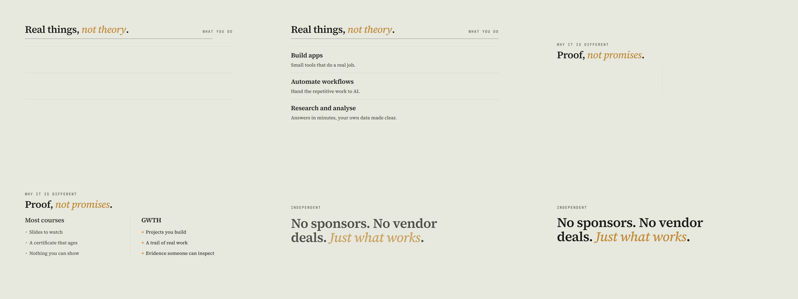
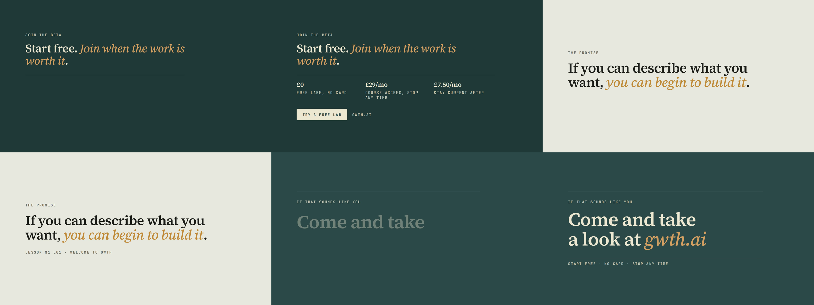
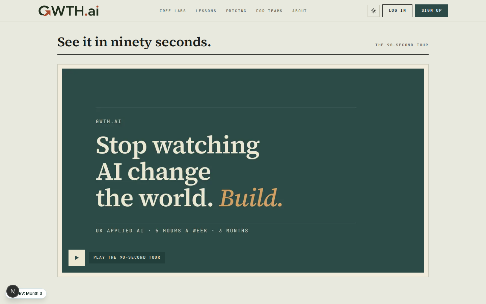
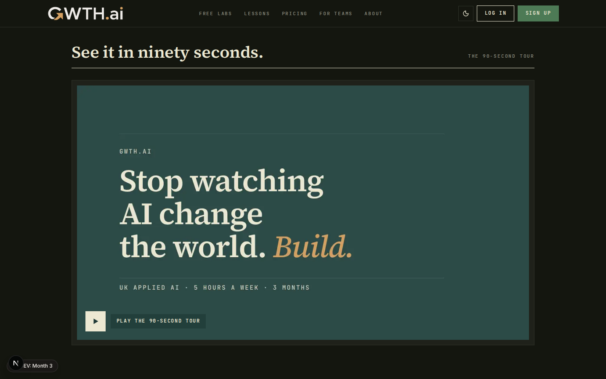
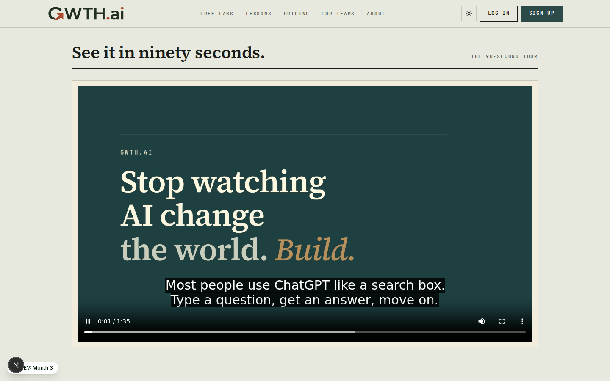
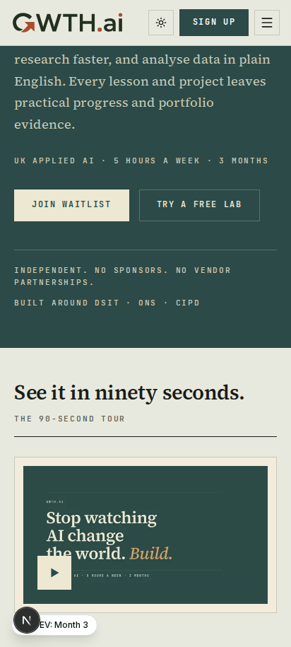
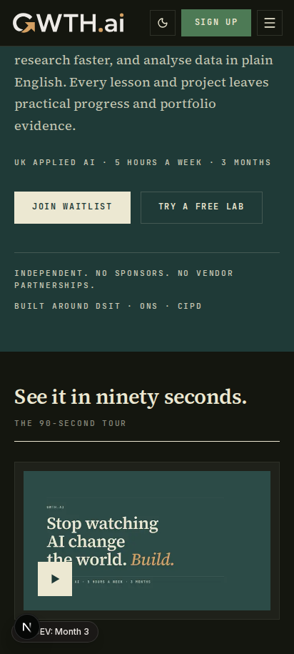
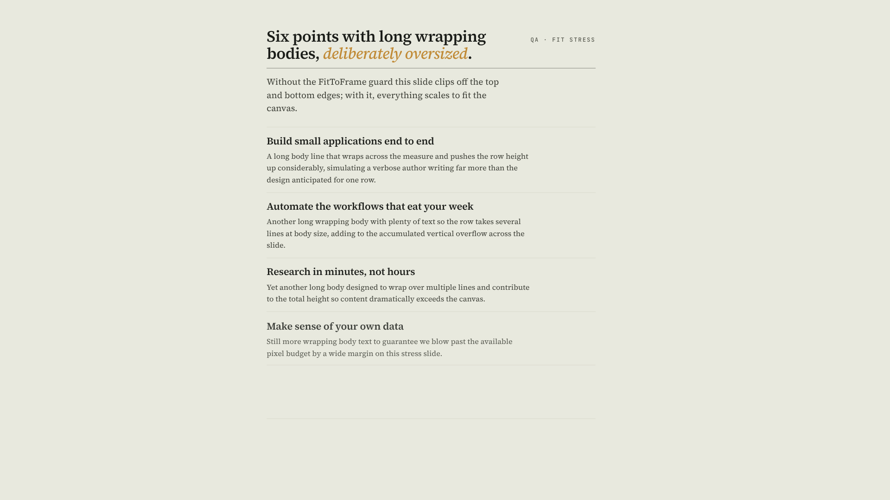
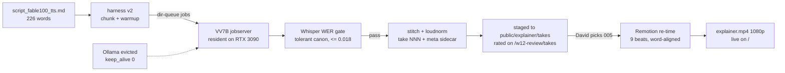

# Completion: W12 — Homepage explainer video, LIVE on / (final VV7B voice cut)

**Date:** 2026-07-04 · **Repo:** GWTH_V2 · **Commit(s):** see RECORD note
**Test URL:** http://192.168.178.50:3013/ (staging mirror: http://192.168.178.50:3001/ after next deploy) · **Status:** verified — all four of David's picks wired in

> Refreshes the 2026-06-23 packet, which described the superseded F5-TTS /
> :3009 draft state. Voice engine is **VibeVoice-7B** (David's redirect), the
> review site is **:3013**, and the explainer is now **live on the homepage**.

## David's picks (all four gates closed 2026-07-04)

Recorded in [public/explainer/w12_picks.json](../public/explainer/w12_picks.json)
(sentinel `W12_PICKS_COMPLETE`):

| Gate | Pick |
|------|------|
| Script | **Claude Fable 100s** (226 words, GWTH spoken "G-W-T-H") |
| Voice take | **`vv7b_explainer_fable100_perfect_005.wav`** — rated 5/5/5 on /w12-review/takes, `selected_as_final` |
| Motion | Page defaults for all 5 archetypes (frame-draw / line-fade / stagger / divider-first / stagger) |
| Embed | **After the hero**, **framed** chrome |

## The video, as a visitor sees it

- **Live embed:** http://192.168.178.50:3013/ — first block after the hero,
  poster + click-to-play, captions on by default.
- **Direct file:** http://192.168.178.50:3013/explainer/explainer.mp4
  ([public/explainer/explainer.mp4](../public/explainer/explainer.mp4)) —
  **95.7s, 1080p h264 + aac, 5.9 MB**, word-aligned WebVTT captions
  ([explainer.vtt](../public/explainer/explainer.vtt)) + poster.
- **Final voice:** VV7B fable100 take 005 (winning recipe: cfg 1.4 ·
  10 steps · temp 0.7 · greedy · 1.06x · 120ms gaps), Whisper-gated at
  WER 0.000, loudnorm −16 LUFS.

The re-timed cut — 9 beats, each boundary placed at the midpoint of the spoken
pause between script sections (word-level Whisper timestamps of the final
take), so slides change exactly where the voice does:

Two beats are new for the final 226-word script (both verbatim from the
approved VO copy, inheriting David's motion picks): a "How it runs" feature
slide and a "No sponsors. No vendor deals." statement; the cut now ends on a
`gwth.ai` end card.

## UI — the embed live on the homepage

Test it: **http://192.168.178.50:3013/** (light + dark; theme toggle in the nav)

Desktop light / dark (1440):

Playing, with the word-aligned captions on (click-to-play, no autoplay):

Mobile (412), light / dark:

## Template hardening (the 3 long-text-fragile slides)

The review-build FitToFrame guard on Feature / ComparisonTwoUp / CtaDispatch
was measuring before layout settled (offsetWidth 0 → no wrapping → healthy
content "measured" ~2 800px tall) and silently scaled **every** slide to ~1/3
size. Fixed in [primitives.tsx](../remotion/src/components/primitives.tsx):
the measure now waits for a real layout. Verified with roughly double-length
content on all three templates (committed proofs in
[remotion/out/fitcheck/](../remotion/out/fitcheck/)) — oversized copy scales
down to fit the canvas instead of clipping:

## How the final VO was produced (pipeline change)

Safe: the jobserver holds the model once (no VRAM race with Ollama), the
supervisor survives container restarts and only stages gate-passed takes, and
staged sidecars carrying David's ratings are never overwritten. The gpt100
runner-up script renders with the same winning recipe + the same WER gate, so
David gets a same-settings A/B pair on /w12-review/takes.

## Verification actually run

- `npm test` — **331 passed, 11 skipped** (DB suites skip off-net), 0 failed.
- `npx tsc --noEmit` — clean (site repo and remotion workspace).
- Playwright CLI on `/` (light + dark × 1440/768/412): embed present directly
  after the hero, poster visible, click-to-play mounts `<video>` with a
  captions track, **0 console errors** in all 6 runs.
- Review scaffolding still renders (all HTTP 200): /w12-review,
  /w12-review/takes, /w12-review/motion, /w12-review/script, /w12-embed-demo,
  /explainer-preview — removal stays with W15's dev-route sweep.
- Final MP4 watched via frame-extraction at every beat boundary (19 sample
  points): every slide lands with its spoken section; audio mean −19.7 dB /
  peak −4.4 dB.

## What David should verify

- [ ] Open **http://192.168.178.50:3013/** and play the video after the hero:
      the voice is take 005 ("fast"), slides change with the voice, and the
      captions read correctly (toggle CC off/on).
- [ ] Flip light ↔ dark and 412-width: the framed mat follows the theme and
      the layout below (Nine journeys onward) is untouched.
- [ ] On /w12-review/takes, listen to the new **gpt100** A/B take (same
      recipe as your pick) and confirm the fable100 script remains the winner.
