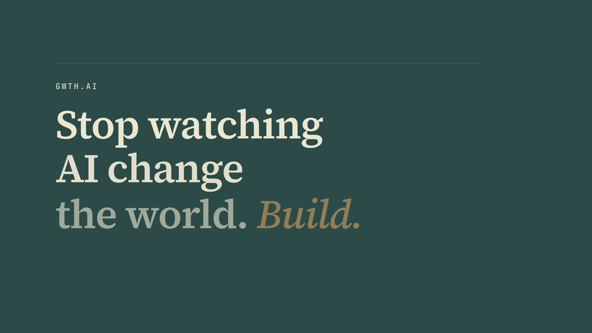
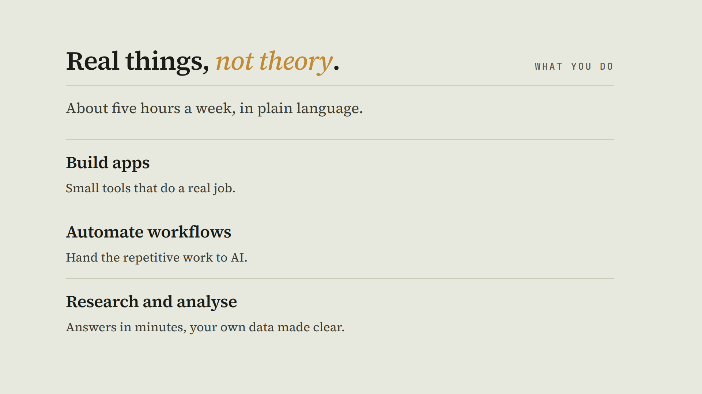
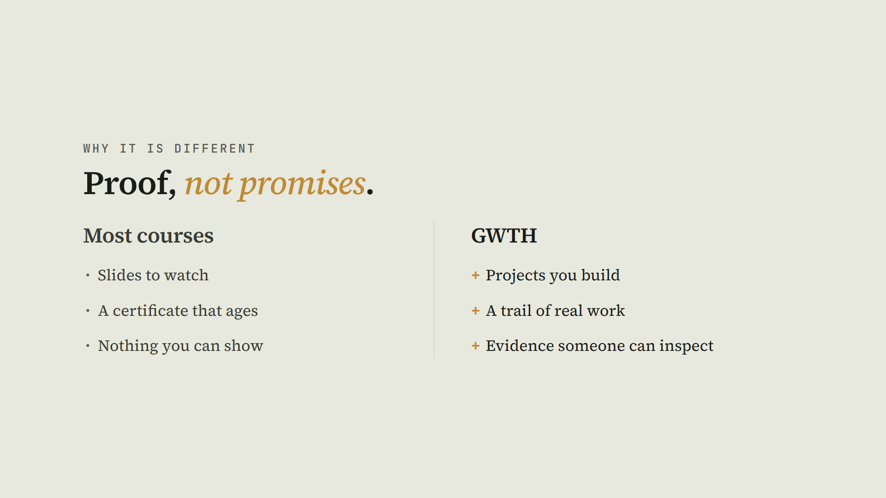
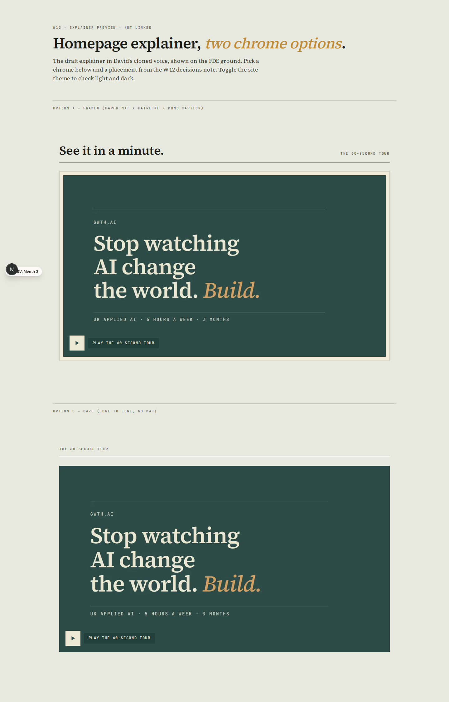
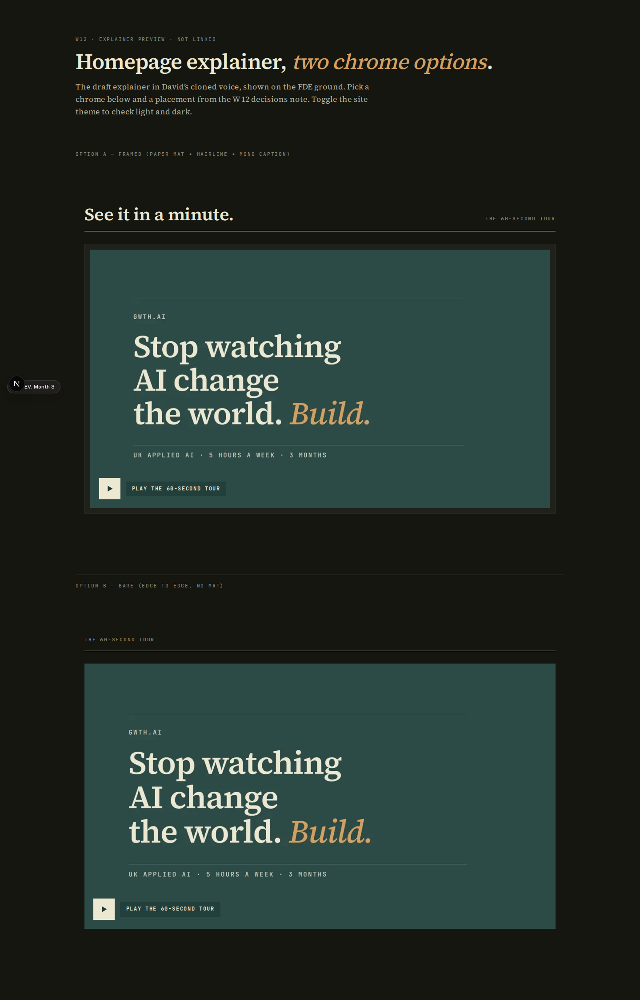
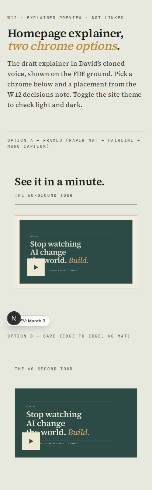
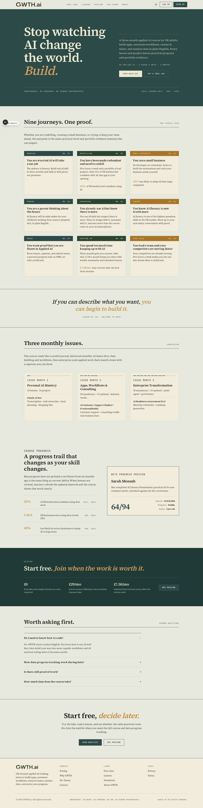
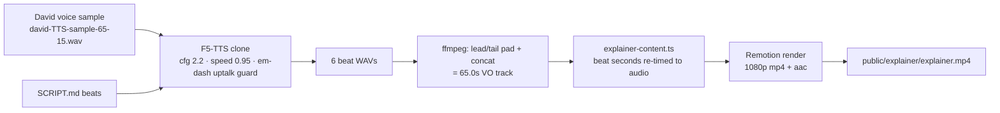

# Completion: W12 — Remotion homepage explainer + reusable FDE slide library

**Date:** 2026-06-23 · **Repo:** GWTH_V2 · **Commit(s):** see RECORD note
**Test URL:** http://192.168.178.50:3009/explainer-preview  ·  **Status:** partial (3 design/voice gates await David — by design, this is an interactive task)

## What changed (this is an interactive design task; built to the gates, not past them)
- **New Remotion workspace** at [remotion/](../remotion/) — a self-contained React 18 / Remotion 4 project that renders the explainer **and** holds the keepable deliverable: five typed, props-driven FDE-register slide templates.
- **Reusable slide library** ([remotion/src/slides/](../remotion/src/slides/)): `TitleCover`, `SingleStatement`, `Feature`, `ComparisonTwoUp`, `CtaDispatch` — FDE tokens only (no raw hex), long-text safe, each with 2–3 `motionVariant`s.
- **Composed 65s explainer** in **David's cloned voice** (F5-TTS draft) — [remotion/out/explainer-draft-vo.mp4](../remotion/out/explainer-draft-vo.mp4), staged for the site at [public/explainer/explainer.mp4](../public/explainer/explainer.mp4) with a captions track.
- **FDE embed component** ([explainer-video.tsx](../src/components/marketing/home-fde/explainer-video.tsx)) + a **non-live preview route** (`/explainer-preview`) showing two chrome options. The live homepage `/` is **unchanged** (David picks chrome + placement first — Gate 2b).
- **Remotion verdict** written ([REMOTION_REPORT.md](../remotion/REMOTION_REPORT.md)).

## Content — the explainer, as a viewer sees it
- **Video (David's cloned voice, draft):** [remotion/out/explainer-draft-vo.mp4](../remotion/out/explainer-draft-vo.mp4) — 65.0s, 1080p h264 + aac, ~3.9MB. Served at `/explainer/explainer.mp4`. Poster + WebVTT captions included.
- **Script:** [remotion/SCRIPT.md](../remotion/SCRIPT.md) (≈66s, British English, no em dashes, facts from the live homepage).
- **Motion-option reels for David's pick (Gate 2a):** `remotion/out/motion-{title,statement,feature,comparison,dispatch}.mp4`.

Poster frame:


The five reusable templates (rendered stills):







## UI — the embed in FDE context (preview route)
Test it: **http://192.168.178.50:3009/explainer-preview** (light + dark; toggle the site theme)

Desktop, light:


Desktop, dark:


Mobile (412):


Live homepage is untouched (shown for proof of no regression):


## Backend / infra — voiceover pipeline (no DB/schema change)

What changed & why it's safe: no database, schema, or live-site change. New files only (a sibling Remotion project, one unused-by-default app component, and a `noindex` review route). The live `/` homepage and all existing routes are byte-for-byte unchanged; `npm test` stays green (298 passed). Rollback = delete the new files.

## What David should verify
- [ ] Open **http://192.168.178.50:3009/explainer-preview**, play the tour, and judge the **draft VO in your cloned voice** (note: "GWTH" is pronounced "growth" — confirm or correct). Approve or choose to re-record (Gate 3, [DECISIONS.md](../remotion/DECISIONS.md)).
- [ ] Watch the five motion reels in `remotion/out/motion-*.mp4` and pick one entrance per archetype (Gate 2a), then the embed **chrome (A framed / B bare)** and **placement** (Gate 2b).
- [ ] Read [REMOTION_REPORT.md](../remotion/REMOTION_REPORT.md) and decide whether to standardise on Remotion for lesson/marketing video.

## Verification run
```
npx tsc --noEmit (remotion)        → clean
npx vitest run (GWTH_V2)           → 298 passed | 11 skipped (45 files)
ffprobe explainer-draft-vo.mp4     → 65.045s, h264 + aac
Playwright CLI (preview + home,    → 12 shots, light+dark @ 1440/768/412
  6 surfaces)                         Console/page errors: 0
curl /, /explainer-preview,        → 200 / 200 / 200
  /explainer/explainer.mp4
```
