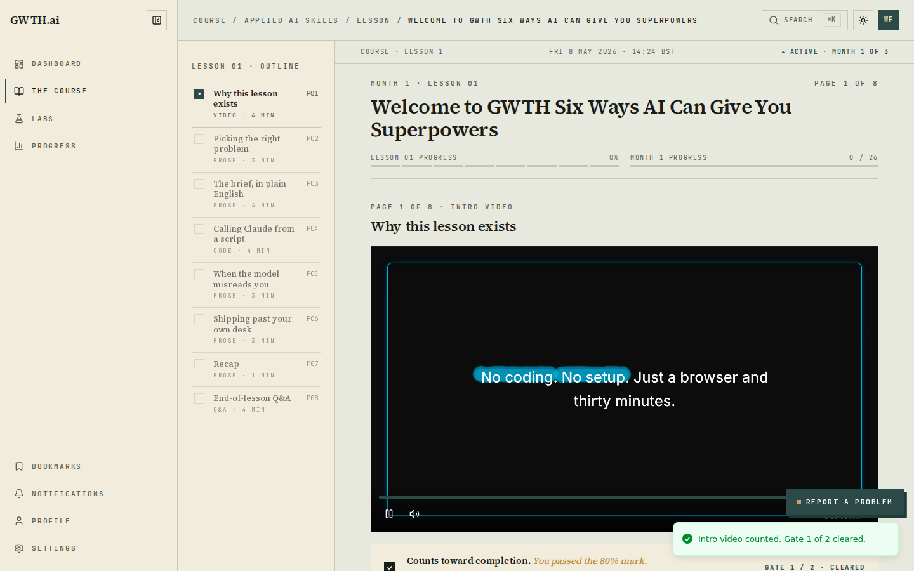
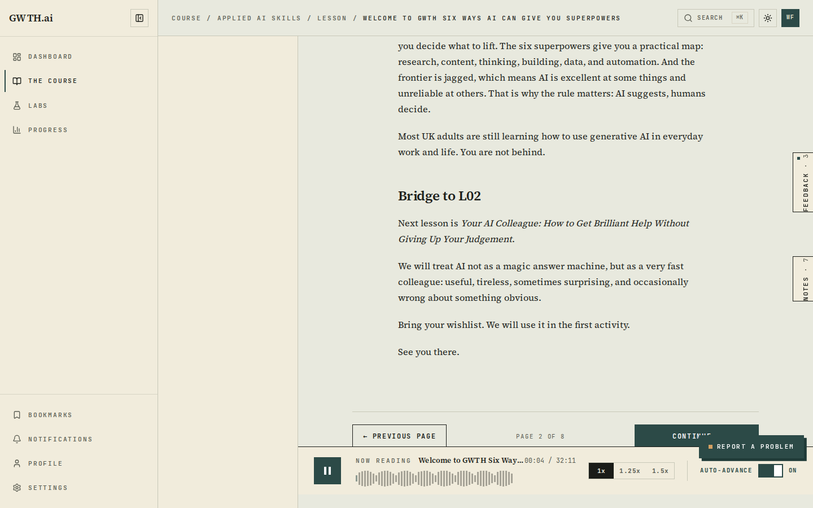
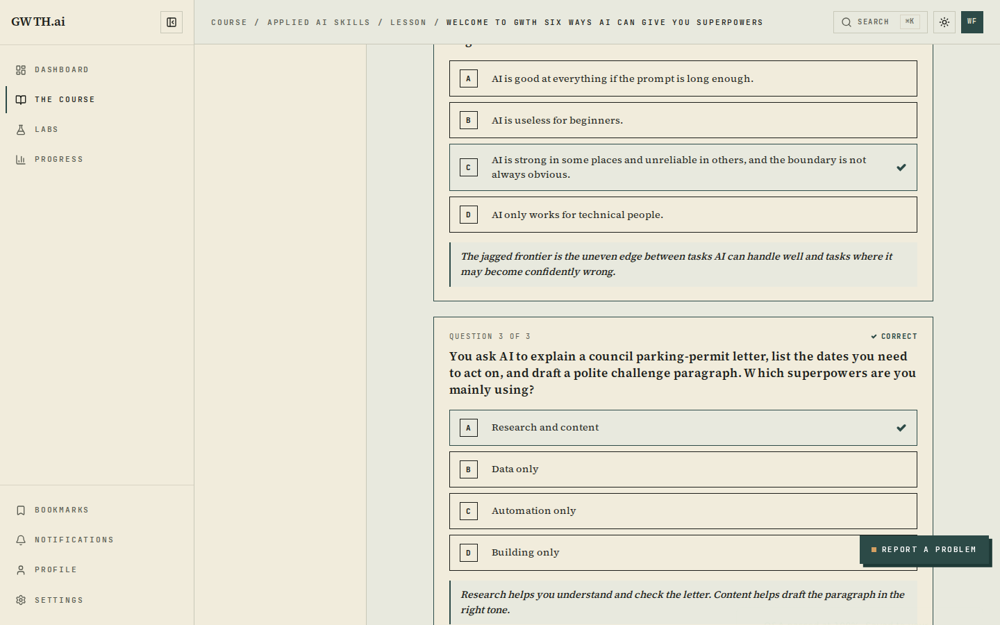
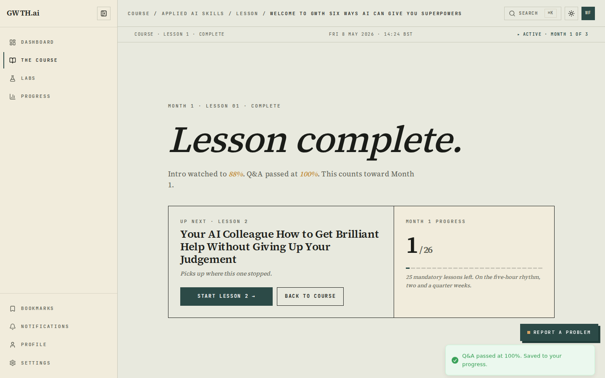
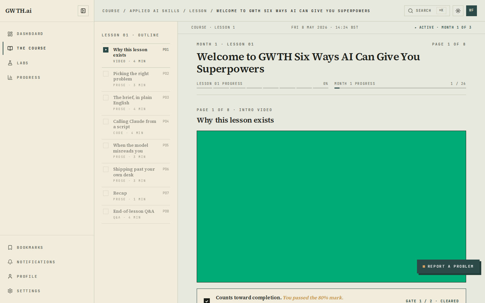
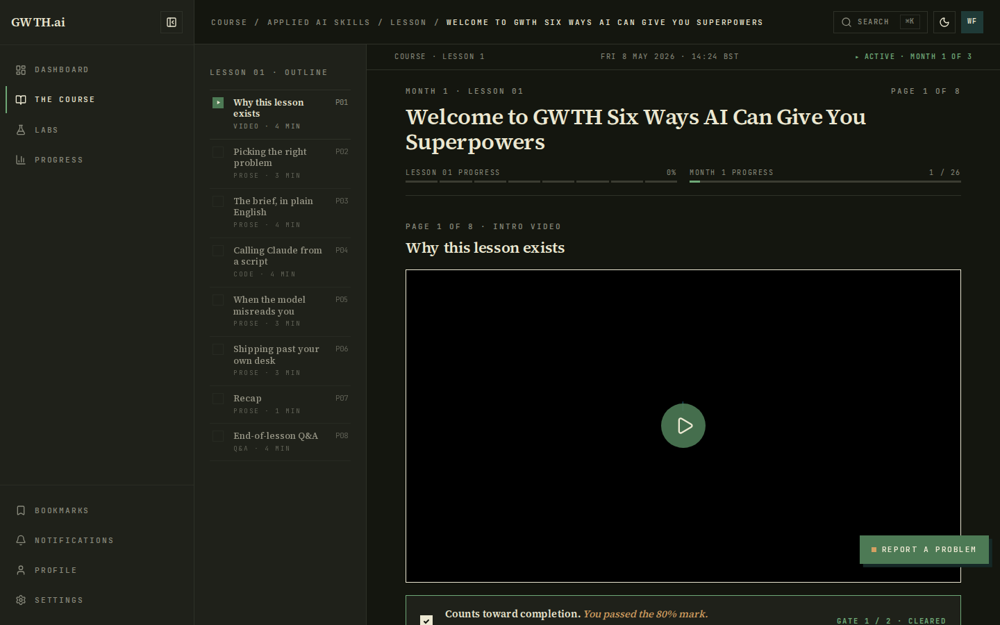
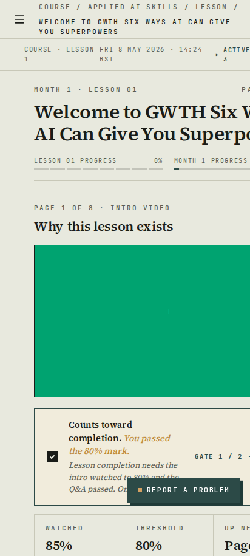
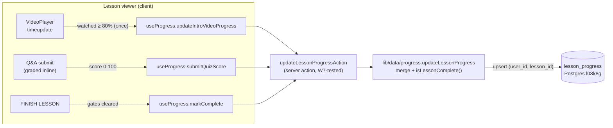

# Completion: W13 — Real media playback + progress persistence in the lesson viewer

**Date:** 2026-07-04 · **Repo:** GWTH_V2 · **Commits:** `bf07f85` (viewer wiring), `bbaba06` (CSP media-src staging fix), branch `fm/w13-lesson-viewer`
**Test URL:** http://192.168.178.50:3001/course/applied-ai-skills/lesson/welcome-to-gwth-six-ways-ai-can-give-you-superpowers · **Status:** verified (fresh-account round-trip reproduced end to end)

## What changed (summary)

- The LIVE editorial lesson viewer now plays **real media**: the audio bar drives an actual `<audio>` element (src via `mediaUrl()`, honest MM:SS readout from `timeupdate`, click/keyboard seeking, real 1x/1.25x/1.5x playback rate), and the intro-video page renders the shared `VideoPlayer` with the 80% watched hook. The hardcoded `02:14 / 03:42` timer, the fake `progress={playing ? 60 : 0}`, and the dead "PAGE 1 OF 8 · 4:12" play button are gone.
- **Persistence is wired to the W7-tested path**: crossing the video 80% mark persists `introVideoProgress`, submitting the (now interactive) end-of-lesson Q&A persists the score, and FINISH LESSON persists completion — all through `useProgress` → `updateLessonProgressAction` → the `lesson_progress` table. No second media resolver, no second write path.
- The lesson is now **walkable from the UI**: footer PREVIOUS/CONTINUE and the outline rail actually navigate (video → prose pages → Q&A), the Q&A grades inline (pass ≥67%), and the lesson-complete surface shows real stats (real watched %, real score, real next-lesson link).
- The orphaned `src/components/course/lesson-viewer.tsx` (zero importers) was deleted; its wiring was absorbed. One viewer remains.
- Data fix on staging: lesson `m1_l01` now carries its real narration (`kokoro_main.wav`, 32:11) and intro video (`lesson_01_intro.mp4`, 1:29) served by the pipeline on :8088. **The other 25 Month-1 lessons have no media files yet** — the viewer shows an honest "NARRATION NOT AVAILABLE YET" state for them (content-production gap, not a viewer gap).

## UI

Intro video page, 80% gate cleared (desktop 1440, light):


Narration actually playing — honest timer `00:04 / 32:11`, waveform, speed controls (desktop 1440, light):


Interactive Q&A graded and passed:


Lesson complete surface with real stats:


Progress still there after logout + login (gate shows CLEARED on a fresh load):


Theme/viewport sweep (all six loads had **zero console errors**):




Test it live (log in first — see verify checklist):

```
http://192.168.178.50:3001/course/applied-ai-skills/lesson/welcome-to-gwth-six-ways-ai-can-give-you-superpowers
```

> Media caveat: lesson media is served from the pipeline at `http://192.168.178.50:8088`, so audio/video plays when your browser is on the LAN. Via Tailscale the page loads but the media origin is LAN-only until the I3 CDN cutover flips `NEXT_PUBLIC_MEDIA_CDN_BASE_URL`.

## Content

- Lesson 1 narration → path `gwth-dashboard/generated_lessons/m1_l01_.../audio/kokoro_main.wav` · player URL `http://192.168.178.50:8088/api/lessons/19e4bc1c-ab8a-43b0-830e-f5f7447b295e/audio/kokoro_main.wav` (32:11)
- Lesson 1 intro video → `http://192.168.178.50:8088/api/lessons/19e4bc1c-ab8a-43b0-830e-f5f7447b295e/video/lesson_01_intro.mp4` (1:29; this is the March L01 intro cut — the current "Six Ways" script has no fresh intro render yet, flagged as a curriculum follow-up)

## Backend / data



What changed & why it's safe: no schema change and no new write path — the viewer calls the same server action W7 tested against the real DB; `isCompleted` is still derived server-side from the merged row (video ≥80% AND quiz passed), so a client can't force-complete a lesson. The staging-only CSP change appends the pipeline media origin to `media-src` **only when `ENABLE_DEV_MOCK_USER=true`** (never set on prod); production media rides the https CDN already covered by `https:`. The `m1_l01` media URLs use the legacy P520 form that `mediaUrl()` rewrites onto the CDN when I3 sets the base URL — no data migration needed at cutover.

## What David should verify

- [ ] Open http://192.168.178.50:3001/course/applied-ai-skills/lesson/welcome-to-gwth-six-ways-ai-can-give-you-superpowers logged in (staging test account: `w13-fresh@gwth.ai` / `W13-fresh-pass-2026!`, or any granted account) — press play on the intro video and on the narration bar: **you hear/see real media and the timer moves honestly**.
- [ ] Watch the video past 80% (or drag the seek bar near the end) → the gate card flips to green "GATE 1 / 2 · CLEARED"; then answer the 3 Q&A questions, SUBMIT, FINISH LESSON → "Lesson complete." with real stats.
- [ ] Log out, log back in, reopen the lesson → the gate still shows CLEARED and `/progress` reflects the completed lesson. That is runbook item [docs/runbook-go-live.md:56](../docs/runbook-go-live.md) passing from the UI.

## Known limitations / follow-ups

- Only `m1_l01` has media on staging; lessons without media show the honest fallback states (audio bar: "NARRATION NOT AVAILABLE YET"; video page: "INTRO VIDEO NOT AVAILABLE YET"). Producing + binding media for the other 25 M1 lessons is a pipeline/curriculum task.
- The 412px lesson layout still renders the desktop surface (horizontal overflow, pre-existing) — the FDE mobile reading surface exists as a design (`?surface=mobile`, now wired to the real audio engine) but is not yet breakpoint-driven.
- The mast row date ("FRI 8 MAY 2026") and outline page titles/durations are still design-bundle placeholders (per-page audio manifest follow-up).

## Verification run

```
npm test                       → 49 files / 344 tests passed (13 new viewer tests)
tsc --noEmit                   → clean
npm run build                  → clean (next build exit 0)
node w13-e2e (Playwright CLI)  → ALL GREEN, 0 console errors:
  PASS login as fresh user (w13-fresh@gwth.ai, created via sign-up API + beta grant)
  PASS lesson opens on intro-video page
  PASS video actually plays        :: currentTime=4.0s of 89.5s
  PASS 80% gate clears in UI
  PASS CONTINUE navigates to prose page 2
  PASS honest narration duration   :: 00:00 / 32:11
  PASS audio actually plays        :: currentTime=4.8s, readout=00:04 / 32:11
  PASS Q&A graded 100% and passed
  PASS lesson-complete surface shows
  PASS progress survives logout/login
  PASS visual sweep (light+dark × 1440/768/412)

DB row after the run (staging l08k8g):
  lesson_id=m1_l01  is_completed=t  progress=1  intro_video_progress=0.85
  quiz_passed=t  best_quiz_score=100  quiz_attempts=1  completed_at=2026-07-04 18:52:58
```

Deployed to :3001 as `gwth-v2:staging-w13w14-b2` (merge of `fm/w13-lesson-viewer` + sibling `fm/w14-real-progress` — the two sessions raced the `gwth-v2:staging` tag; the merge image carries both and `gwth-v2:staging` was retagged to it).
