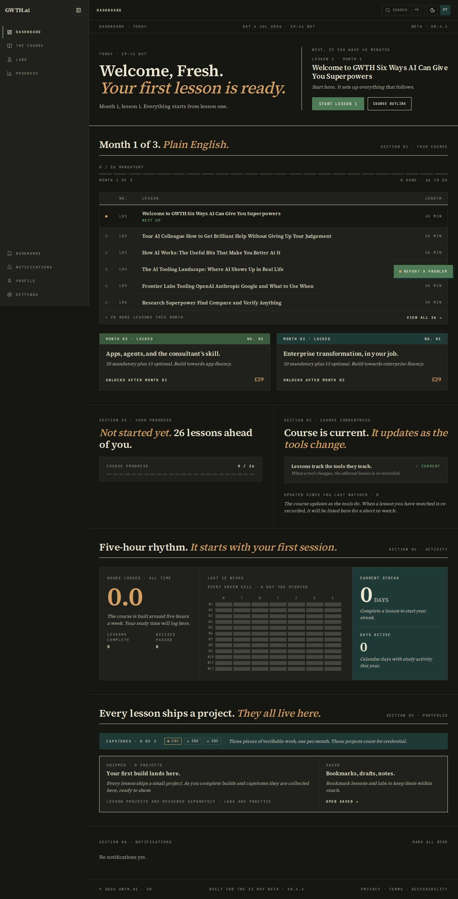
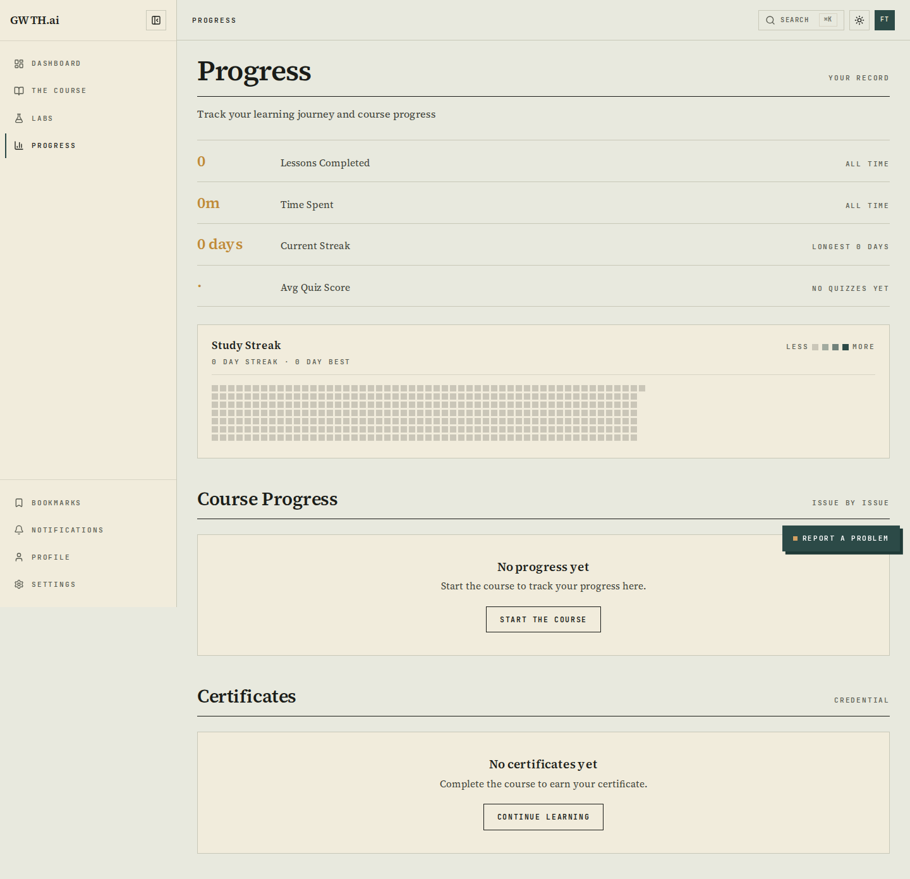
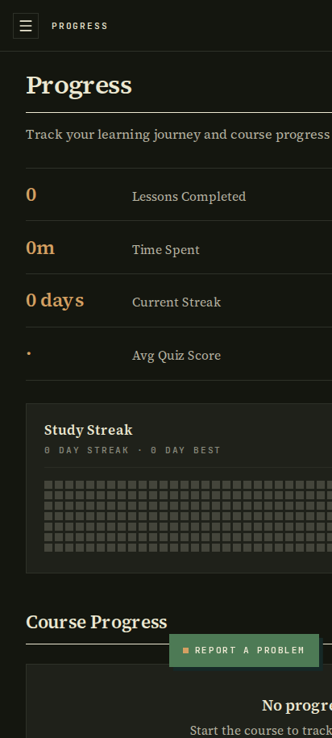
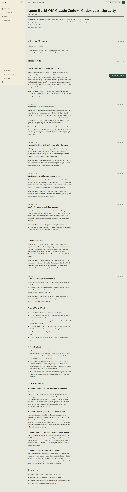
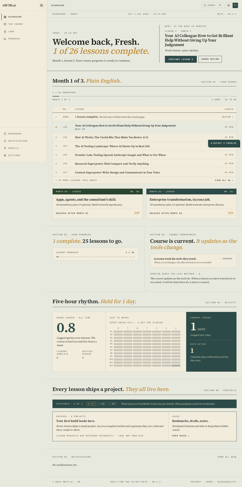
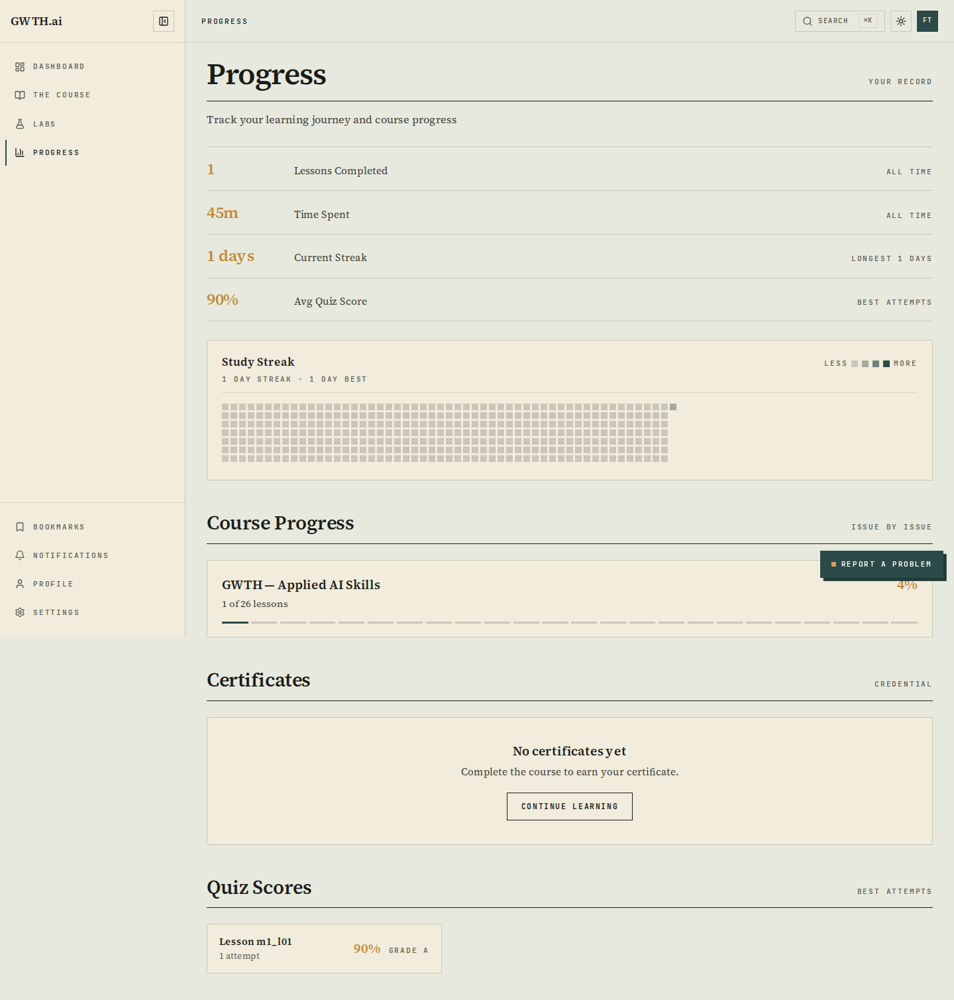
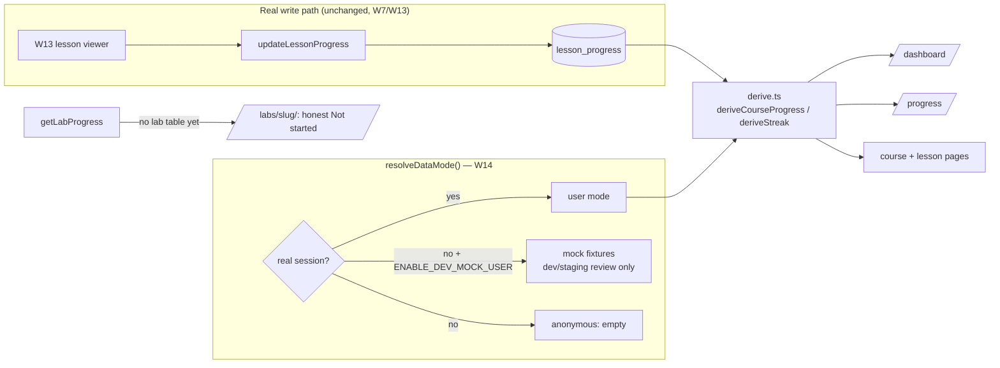

# Completion: W14 — Real (or honest-zero) progress data, no more fixtures

**Date:** 2026-07-04 · **Repo:** GWTH_V2 (branch `fm/w14-real-progress`) · **Commit(s):** f99d1be (impl) + packet commit; staging image built from the pre-rebase identical tree (tag `gwth-v2:staging-643359c`)
**Test URL:** http://192.168.178.50:3001/dashboard (Tailscale: http://hlab.taila51191.ts.net:3001/dashboard) · **Status:** verified

## What changed (4 bullets)

- **A brand-new tester now sees honest zeros everywhere.** Before: "Held for 5 days" streak, 12/24 lessons (50%), labs 1+2 pre-completed, a fake "5-Day Study Streak!" notification. After: 0 streak, 0/26 lessons, no lab activity, no notifications — all rendered as designed empty states, not blanks.
- **Course progress and the streak are now DERIVED from `lesson_progress`** (the real W7/W13 write path) via new pure functions in `src/lib/progress/derive.ts`. No parallel store. Labs / notifications / GWTH score have no tables yet, so real accounts honestly get none (post-beta follow-up).
- **A single gate decides fixture vs real:** `src/lib/data/mode.ts` `resolveDataMode()`. Fixtures serve ONLY when there is no `DATABASE_URL` (local mock mode) or on the `ENABLE_DEV_MOCK_USER` review path with no real session. A real logged-in session ALWAYS wins — fixture numbers cannot reach it. `/demo/dashboard` is pinned to fixtures explicitly (it is a visual surface, not a session).
- **The dashboard's hardcoded fixture copy is gone:** fake 5.2 hours/week, fake heatmap, "PROJECTS SHIPPED 10", fake capstone approval ("Approved 6 May by reviewer M. Patel"), "CURRENTNESS 92%", fake updated-lessons feed, fake saved items, fixture lesson titles. The lesson table now lists the REAL imported lesson titles with the user's real next lesson deep-linked.

## UI

Fresh account (zero progress) — dashboard, light + dark, desktop + mobile:





Fresh account — /progress and a lab page (honest zero, designed states):





Same account after ONE real completed lesson in `lesson_progress` — the dashboard and /progress derive it (1/26, streak 1 day, 0.8 hrs logged, heatmap cell):




Test it: http://192.168.178.50:3001/dashboard · http://192.168.178.50:3001/progress · http://192.168.178.50:3001/labs/agent-build-off
(30 screenshots total in `completion/W14/`: light + dark × 1440/768/412 for each surface, `fresh-*` and `one-*` phases. Zero console errors on every capture — the shot script fails on any.)

## Backend / data



What changed & why it is safe: reads only — the `lesson_progress` write path (W7 upsert, W13 viewer action) is untouched, and the 8 DB isolation tests still pass against it. No schema change, no migration. The `ENABLE_DEV_MOCK_USER` review path keeps its mock learner + mock data (flag never reaches prod per W6/W15). Staging :3001 now runs image `gwth-v2:staging-643359c`; the previous image is kept as `gwth-v2:staging-pre-w14` for one-command rollback (`IMAGE=gwth-v2:staging-pre-w14 bash deploy/run-staging.sh`).

## What David should verify

- [ ] Log in on http://192.168.178.50:3001/dashboard with a fresh (or your own real) account: streak, lessons, hours, capstones, portfolio all read real-or-zero — no 5-day streak, no 12/24, no 5.2 hours anywhere.
- [ ] Open http://192.168.178.50:3001/labs/agent-build-off logged in: step tracker says "Not started · N steps"; no lab is pre-completed (labs list has no fixture ticks either).
- [ ] Complete (or partially watch) a lesson via the viewer, re-login, and confirm /dashboard + /progress move to the real count — my staged check: 1 completed row → "1 of 26 lessons complete", streak "Held for 1 day", one heatmap cell (screenshots above).

## Verification run

```
npm test                                       → 344 passed | 13 skipped (49 files), 0 failed
DATABASE_URL=<dev> vitest run progress.db.test → 8/8 passed (incl. new W14 fresh-account-zeros
                                                 + derived-course-progress tests, live Postgres)
./node_modules/.bin/tsc --noEmit               → clean
npm run build                                  → clean (all routes compile)
npm run lint                                   → 0 findings in W14-touched files
                                                 (2 pre-existing errors in remotion/ + w12-review/, untouched)
bash deploy/run-staging.sh                     → gwth-v2-w8-beta redeployed from branch build, :3001 HTTP 200
PHASE=fresh node deploy/shot-w14.mjs           → 18 screenshots, ALL CHECKS PASSED (0 console errors)
  (fresh Better Auth account w14-fresh-tester@example.com, manual_beta month 1, real session)
PHASE=one   node deploy/shot-w14.mjs           → 12 screenshots, ALL CHECKS PASSED
  (after inserting one real completed row into lesson_progress — the same table the viewer writes)
```
