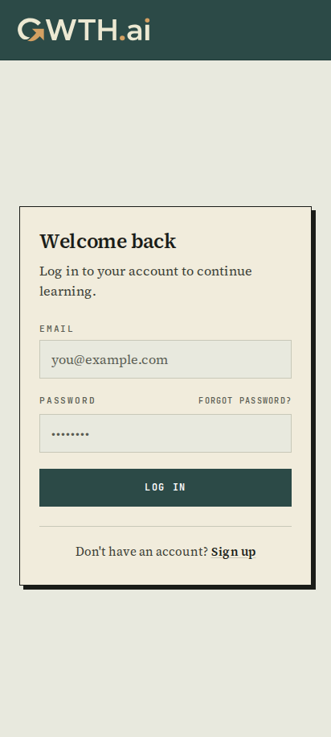
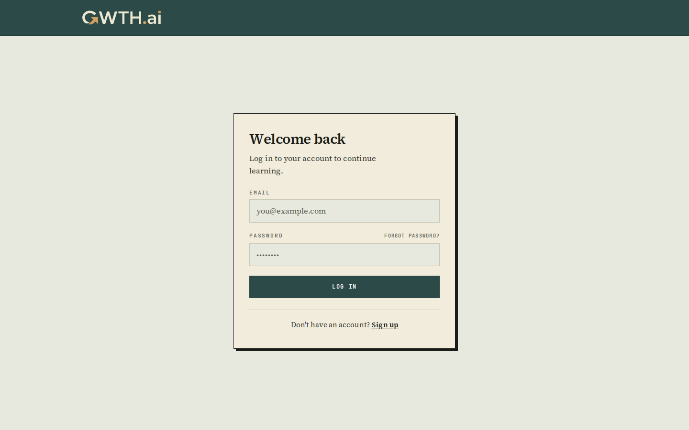
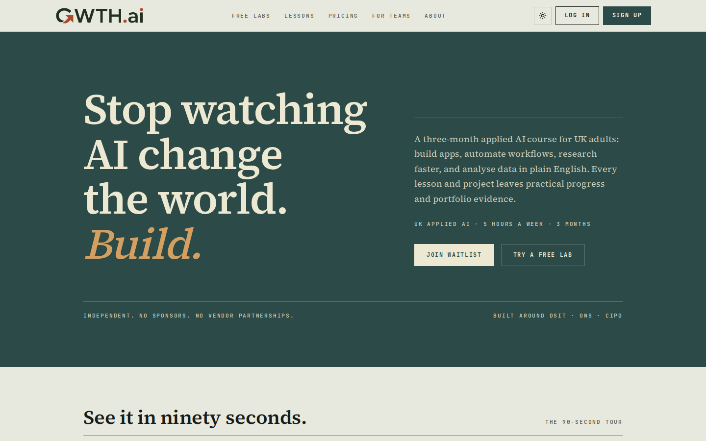
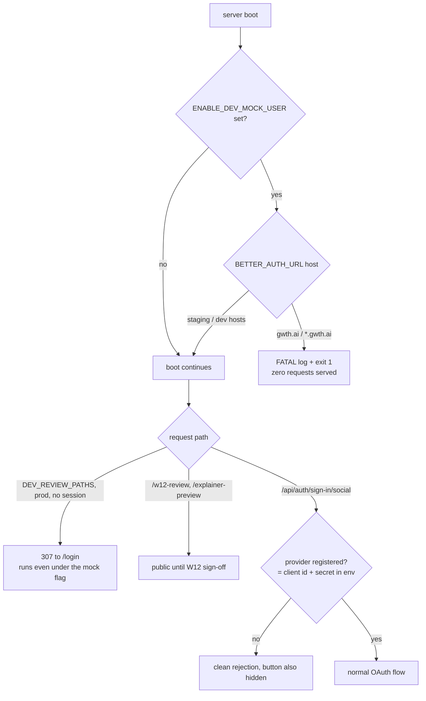

# Completion: W15 — Beta polish sweep (six bounded items from the 2026-07-04 bug sweep)

**Date:** 2026-07-05 · **Repo:** GWTH_V2 · **Commits (master):** `6eba5c7`, `b7b8be7`, `2632e90`
**Staging deploy:** branch `claude/w15-staging` merge `73f92cc` (= master W15 + the W13/W14 staging line), image `gwth-v2:staging-w15-73f92cc` live on :3001
**Test URL:** http://192.168.178.50:3001/login · **Status:** verified

## What changed

1. **OAuth guard:** `/login` only renders a social button for providers whose `*_CLIENT_ID` + `*_CLIENT_SECRET` are both set ([src/lib/oauth-providers.ts](../src/lib/oauth-providers.ts), wired in [src/app/(auth)/login/page.tsx](../src/app/(auth)/login/page.tsx)). Better Auth likewise only registers configured providers ([src/lib/better-auth.ts](../src/lib/better-auth.ts)), so the 500-on-click path from the never-registered apps (COMPLETION_W11 residual) is gone server-side too. Reversible by env alone: set the two vars for a provider and its button returns untouched.
2. **Dev/review routes gated:** `/demo`, `/logo_picker`, `/redesign`, `/redesign_v2`, `/old-design`, `/score-card-variants` now bounce anonymous production traffic to `/login` (307), even under the staging `ENABLE_DEV_MOCK_USER` flag ([src/proxy.ts](../src/proxy.ts), `DEV_REVIEW_PATHS`). The stale password-gate exemptions ("removed at promotion" but never were) are deleted. **Kept until W12 sign-off:** `/w12-review` and `/explainer-preview` stay public (noindex under the pre-launch header); remove them from the app or add them to `DEV_REVIEW_PATHS` once David approves W12.
3. **Mock-user fail-fast:** [src/instrumentation.ts](../src/instrumentation.ts) + [src/lib/mock-user-guard.ts](../src/lib/mock-user-guard.ts) refuse server boot (exit 1 inside 1s, zero requests served) when `ENABLE_DEV_MOCK_USER` is set while the `BETTER_AUTH_URL` host is gwth.ai or a subdomain. Staging (hlab.taila51191.ts.net), the LAN origin, and localhost never trip (unit-tested). The runbook §2 env checklist now carries the "assert ENABLE_DEV_MOCK_USER is absent" line for W6 ([docs/runbook-go-live.md](../docs/runbook-go-live.md)).
4. **Em-dash sweep:** all 12 em dashes in [src/components/marketing/data.ts](../src/components/marketing/data.ts) replaced with commas, colons, parentheses, or sentence splits; every fact and the copy voice kept. A new drift sentinel in [data.test.ts](../src/components/marketing/data.test.ts) pins U+2014 out of every exported copy collection (same commit `b7b8be7`).
5. **Certificates copy honest:** `/progress` now says "Certificates are coming after the beta." instead of promising a feature that does not exist ([src/app/(dashboard)/progress/page.tsx](../src/app/(dashboard)/progress/page.tsx)).
6. **Housekeeping:** the 11 March/April 2026 leftovers plus the phase-1b screenshots folder moved from `kanban/2_testing/` to `kanban/3_done/`; `2_testing` is now empty.

## UI

Login without OAuth buttons (provider env unset), light + dark, desktop + mobile:




Gated dev route: anonymous `/demo/dashboard` lands on `/login` (screenshot taken at the redirect target):



Homepage (swept copy) still renders clean, light + dark:




Test it:
- http://192.168.178.50:3001/login (no social buttons, email/password works)
- http://192.168.178.50:3001/demo/dashboard (bounces to /login)
- http://192.168.178.50:3001/w12-review (still up, deliberately)

## Backend



Safe because: no schema or data change; the OAuth guard is pure env-driven configuration; the dev-route gate only adds redirects for six internal pages; the fail-fast can only trip on the exact misconfiguration it exists to block (unit tests cover staging/LAN/localhost/unset/malformed-URL cases); rollback is `IMAGE=gwth-v2:staging-w7dyn-e89588f bash deploy/run-staging.sh`.

## Verification commands and outputs

- `npm test` (master, after all changes): **354 passed | 11 skipped**; merged staging tree: **367 passed | 13 skipped**. Zero failures.
- `npm run build`: clean (full route table emitted, no errors).
- Fail-fast proof against the deployed image:
  ```
  $ docker run --rm -e ENABLE_DEV_MOCK_USER=true -e BETTER_AUTH_URL=https://gwth.ai gwth-v2:staging-w15-73f92cc
  Error: FATAL: ENABLE_DEV_MOCK_USER is set while BETTER_AUTH_URL points at the production host (gwth.ai). [...]
  container exited after 1s with rc=1
  ```
  Same image with the staging host boots normally (health 200).
- Route checks on live :3001 (full output in the run log):
  ```
  /demo -> 307 location=http://192.168.178.50:3001/login
  /demo/dashboard -> 307 location=http://192.168.178.50:3001/login
  /logo_picker -> 307 location=http://192.168.178.50:3001/login
  /redesign -> 307 location=http://192.168.178.50:3001/login
  /redesign_v2 -> 307 location=http://192.168.178.50:3001/login
  /redesign/v-e-2 -> 307 location=http://192.168.178.50:3001/login
  /old-design -> 307 location=http://192.168.178.50:3001/login
  /score-card-variants -> 307 location=http://192.168.178.50:3001/login
  /w12-review -> 200
  /explainer-preview -> 200
  / -> 200        /login -> 200        /api/health -> 200
  ```
- `curl -s :3001/login | grep -ci "continue with"` returns **0** (no OAuth markup served at all).
- Playwright CLI (`deploy/shot-w15.mjs`): /login + / at 1440/768/412, light + dark, all HTTP 200, `oauth-buttons=0` on every shot, **console errors: 0**.
- Em dashes in data.ts: `grep -c '—' src/components/marketing/data.ts` returns **0**; sentinel test green.

## What David should verify

- [ ] Open http://192.168.178.50:3001/login : no Google/GitHub/LinkedIn buttons, and email/password login still works for your account.
- [ ] Open http://192.168.178.50:3001/demo/dashboard anonymously (private window): you land on /login, not the mock dashboard. Same for /logo_picker and /redesign.
- [ ] Skim the homepage journey cards and pricing (http://192.168.178.50:3001/): the swept copy should read naturally with no em dashes and no changed facts.

## Follow-ups

- After W12 sign-off: delete `/w12-review` + `/explainer-preview` routes (or add them to `DEV_REVIEW_PATHS` in src/proxy.ts) and stop the :3013 review dev server.
- When David registers the OAuth apps: set `GOOGLE_/GITHUB_/LINKEDIN_CLIENT_ID` + `_SECRET` in the target env; buttons and providers return with no code change.
- `fm/w14-real-progress` (PR #35) is still awaiting David's merge to master; staging runs the combined line via `claude/w15-staging`.
