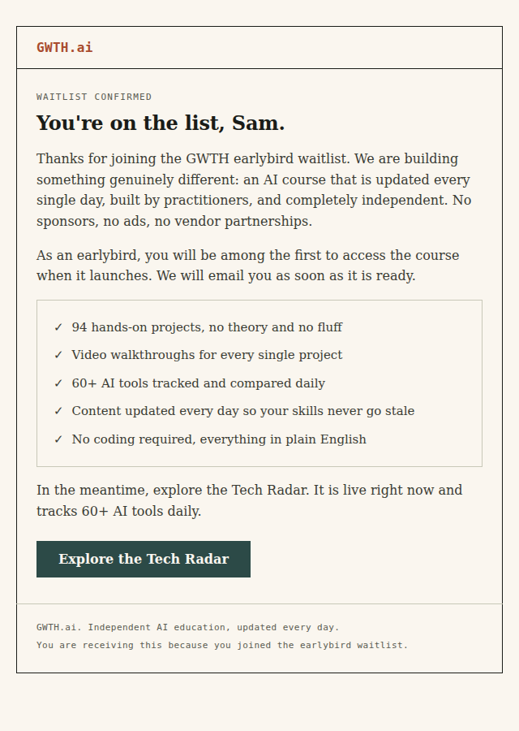
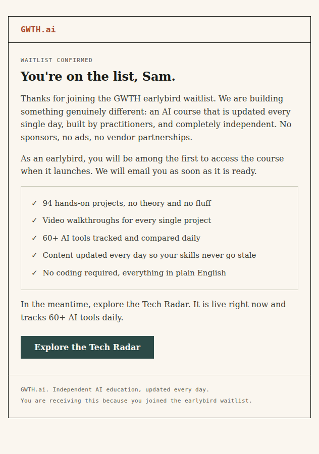
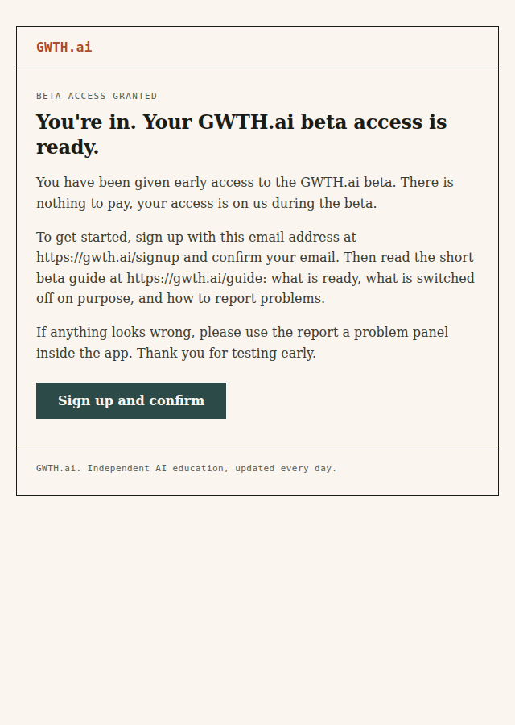
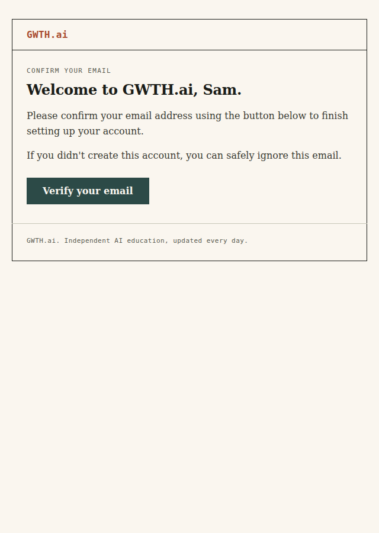
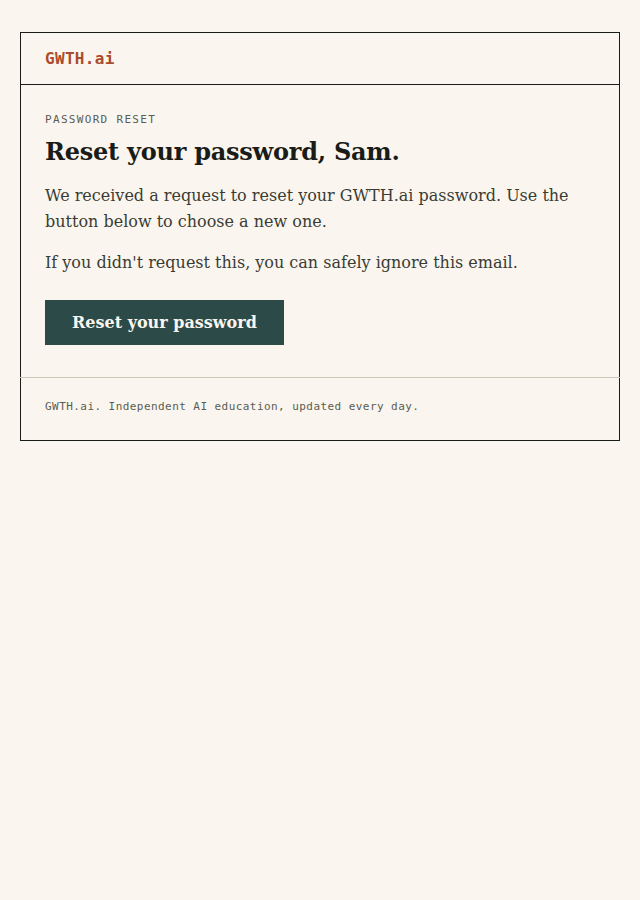
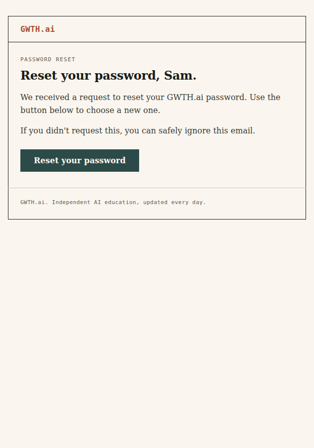
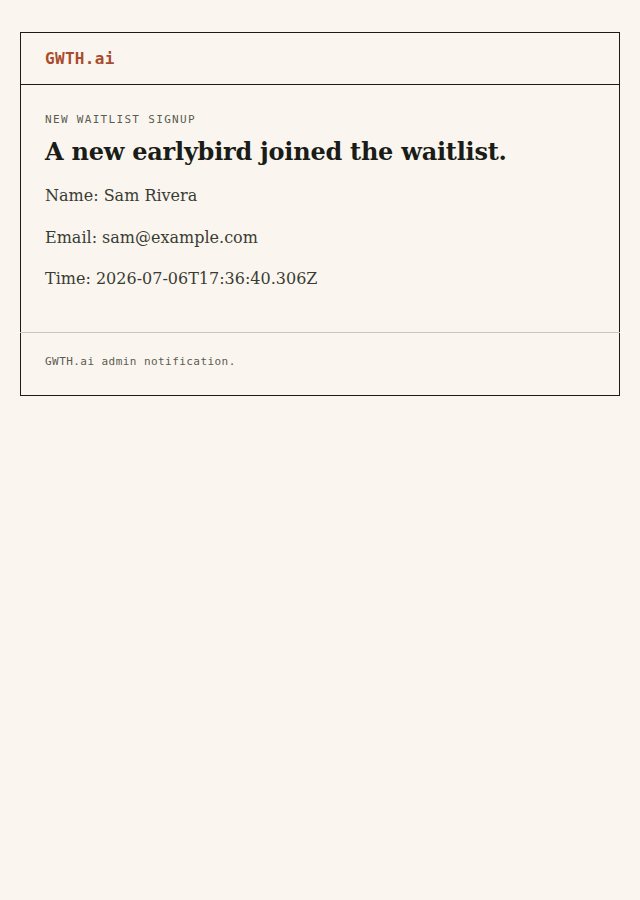
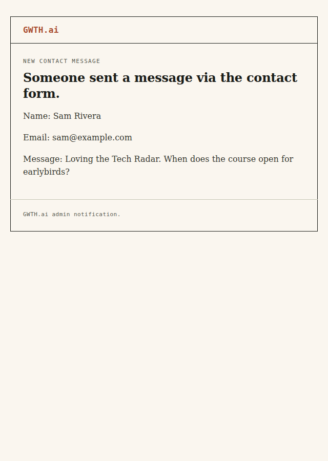

# Completion: W17 — Rebuild transactional email to the FDE email register

**Date:** 2026-07-06 · **Repo:** GWTH_V2 · **Commit:** `<HASH>` (parent `998f516`)
**Bible item:** `email-register` — status `pending` (DRAFT for review), no entry in `bible_progress.yaml` and no `changes_requested` verdict. Per the W17 gate, proceeded with the recipe exactly as written (David chose the FDE direction 2026-07-06).
**Status:** implemented; typecheck + lint + tests all green; screenshots below show correct FDE rendering at 600px and a narrow mobile width, light client.

The only live email template (`buildWaitlistEmailHtml` in `src/lib/data/email.ts`) was the old brand: gradient teal→blue header, 12px rounded corners, drop shadow, sans-serif, blue rounded CTA. The four other transactional emails (beta invite, email verification, password reset, admin notifications) were bare unstyled `
` bodies with no plain-text part. Every one of them is now rebuilt onto **one shared FDE email layout helper** with a matching plain-text part.

## What changed

- **New shared helper** [src/lib/email/fde-layout.ts](../src/lib/email/fde-layout.ts) — `renderFdeEmail()` returns `{ html, text }`. Email-safe FDE recipe: 600px single-column table on paper-cream `#faf6ef`, 1px ink border, terracotta `#a94c2e` mono `GWTH.ai` text logo, mono uppercase kicker, Georgia serif headline + body, hairline-boxed ticked list blocks, ONE bulletproof solid-teal `#2c4a47` square-corner table-button CTA in sentence case, mono footer. No gradients, no shadows, no border-radius, no images required to read. British English, no emojis, no em dashes. A plain-text part is generated for every send.
- **`sendPlunkEmail` + `sendEmail` both take an optional `text` part** ([src/lib/email/plunk.ts](../src/lib/email/plunk.ts), [src/lib/data/email.ts](../src/lib/data/email.ts)) and forward it to Plunk's `/v1/send` (`I3 owns deliverability` — Plunk/SES config untouched).
- **Every template moved onto the helper** (see the per-template list below).
- **DESIGN_FDE.md §5.12** — new "Transactional email" recipe section documenting the helper, palette, and the retired violation.

## Every template moved (6 total, across 3 files)

| Template | Send site | File | Was |
|----------|-----------|------|-----|
| Waitlist confirm | `subscribeToWaitlist` | `src/lib/data/email.ts` (`buildWaitlistEmail`) | gradient header, rounded, sans-serif, blue CTA |
| Admin waitlist notify | `subscribeToWaitlist` | `src/lib/data/email.ts` (`buildAdminNotification`) | plain white rounded card, sans-serif |
| Contact form notify | `submitContactForm` | `src/lib/data/email.ts` (inline) | plain sans-serif `
` |
| Beta invite | `sendBetaInviteEmail` | `src/app/api/admin/beta-access/route.ts` | bare `
`/`<ol>`, no styling, no text part |
| Email verification | `sendVerificationEmail` | `src/lib/better-auth.ts` | bare `
`, no text part |
| Password reset | `sendResetPassword` | `src/lib/better-auth.ts` | bare `
`, no text part |

## Files changed

- `src/lib/email/fde-layout.ts` (new — the shared helper)
- `src/lib/email/plunk.ts` (optional `text` part)
- `src/lib/data/email.ts` (waitlist + admin + contact rebuilt onto helper; `sendEmail` takes `text`)
- `src/app/api/admin/beta-access/route.ts` (beta invite rebuilt)
- `src/lib/better-auth.ts` (verification + reset rebuilt)
- `DESIGN_FDE.md` (§5.12 email recipe)
- `scripts/render-emails-w17.mts` · `scripts/shoot-emails-w17.mts` (packet render/screenshot helpers)

## Tests / lint

- `npm run typecheck` — **0 errors**.
- `npm run lint` — **0 errors**.
- `npm run test` — **391 passed, 13 skipped** (skipped = pre-existing DB-gated tests). No email test regressions; the existing `auth.test.ts` / `admin.test.ts` suites stay green.
- No dev-send performed: a live send needs `PLUNK_SECRET_KEY` (I3/deliverability territory), which is intentionally not exercised from this box.

## Rendered templates (HTML + plain-text part)

Each template rendered to `completion/W17/<name>.html` and `.txt`, screenshotted at desktop (640px, showing the 600px table) and mobile (390px).

### Waitlist confirm

### Beta invite

### Email verification

### Password reset

### Admin: waitlist signup

### Admin: contact message

Plain-text parts: [waitlist-confirm.txt](W17/waitlist-confirm.txt) · [beta-invite.txt](W17/beta-invite.txt) · [verify-email.txt](W17/verify-email.txt) · [reset-password.txt](W17/reset-password.txt) · [admin-waitlist.txt](W17/admin-waitlist.txt) · [admin-contact.txt](W17/admin-contact.txt)

## What to verify (3 bullets)

- **FDE register:** every email is cream `#faf6ef` ground, terracotta mono `GWTH.ai` logo, Georgia serif, mono kicker, 1px ink hairlines, square corners, and exactly one solid-teal sentence-case CTA. No gradient/shadow/rounded remnants.
- **Plain-text part ships:** each `.txt` mirrors the HTML content (no HTML tags, no em dashes, British English), and `sendPlunkEmail`/`sendEmail` now forward it to Plunk.
- **Deliverability untouched:** no change to Plunk/SES config, from-address, or `PLUNK_SECRET_KEY` handling (I3 owns that). No new dependencies added.
