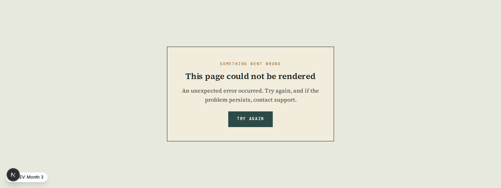
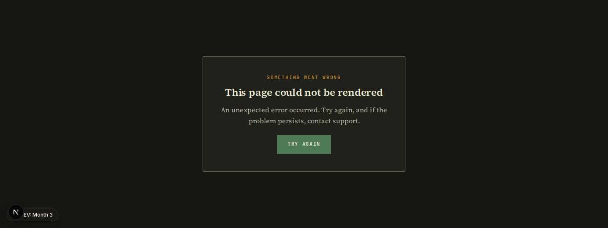
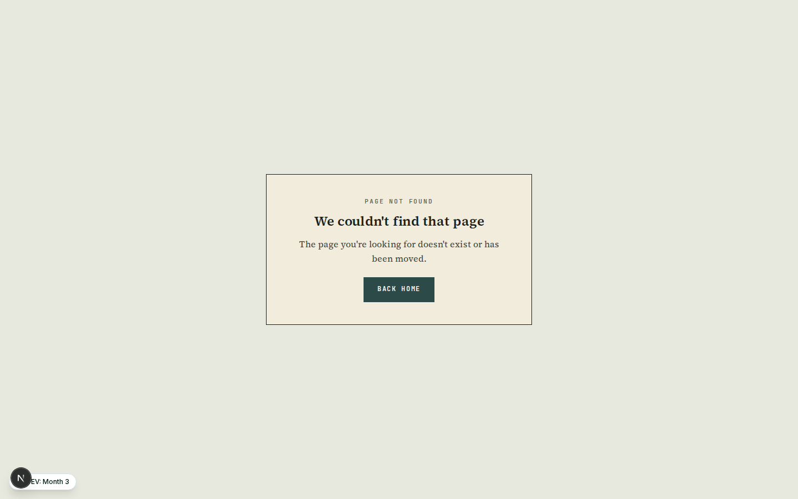
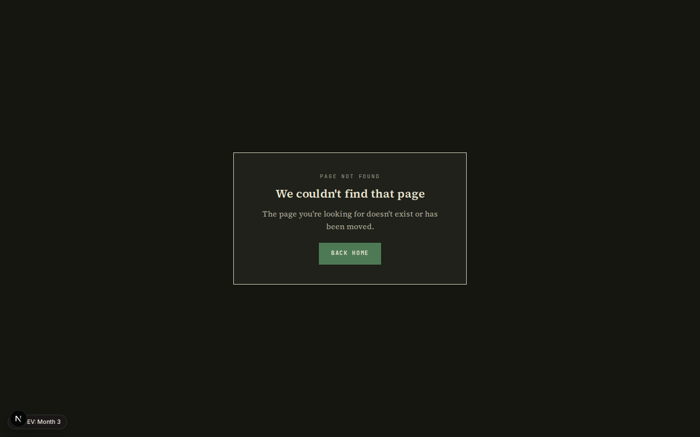
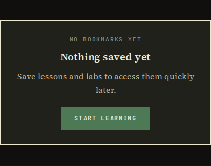
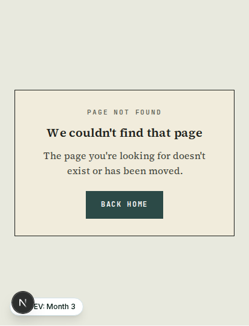

# Completion: W18 — FDE empty / error / 404 states + code-page recipe

**Date:** 2026-07-06 · **Repo:** GWTH_V2 · **Commit:** `1f21d7d` (parent `5cd6a90`)
**Bible item:** `empty-error-states` — status `pending` (DRAFT), no `changes_requested` verdict. Per the W18 gate, proceeded with the draft recipe.
**Status:** implemented; tests + lint + typecheck green; screenshots below show correct FDE rendering in light + dark at 1440 / 768 / 412.

The shared empty-state component and the whole error / not-found set were still on the old Stone & Sage shadcn tokens (`rounded-full`, `bg-muted`, icons-in-circles, a giant ghost "404"). They are now on one FDE recipe: a centred paper panel with a 1px ink border, a mono kicker stating the state, a serif one-line explanation, and at most one §5.3 solid button as the way out.

## What changed (4 bullets)
- **New shared recipe module** [src/components/shared/state-fde.module.css](../src/components/shared/state-fde.module.css) — FDE `--v-*` palette (light + `:global(.dark)` override), square corners, hairlines-not-shadows, mono kicker (`.kicker` / rust `.kickerFault` for faults), serif title/body, one solid button. Two frames: `.inline` (inside a page measure, for empty lists) and `.page` / `.pageTall` (owns the viewport, for errors + 404).
- **`empty-state.tsx` rebuilt** to the recipe: mono `kicker` prop (default "Nothing here yet"), serif title, body, one optional button. The old `icon` prop is kept as a deprecated no-op for back-compat; the FDE register drops icons-in-circles.
- **Every error / not-found rebuilt** to the same recipe: `app/error.tsx`, `not-found.tsx`, `(dashboard)/error.tsx`, `(public)/error.tsx`, and the four scoped 404s (course, lesson, lab, news). Consistent kickers — `SOMETHING WENT WRONG` (rust) / `PAGE NOT FOUND`. Dev-only `error.message` digest gated on `NODE_ENV === "development"`. Admin's own `admin-fde` error card was already on-register and left as-is (§6 functional-priority surface).
- **DESIGN_FDE.md §5 gains two recipes** — §5.10 "Empty / error states" (the recipe above) and §5.11 "Lesson code page" (mono code block on `--v-surface` paper, 1px ink border, square corners, no new highlighter dep / imported theme; optional mono file/lang caption).

## Files changed
- `src/components/shared/state-fde.module.css` (new)
- `src/components/shared/empty-state.tsx`
- `src/components/shared/empty-state.test.tsx`
- `src/app/error.tsx` · `src/app/not-found.tsx`
- `src/app/(dashboard)/error.tsx` · `src/app/(public)/error.tsx`
- `src/app/(dashboard)/course/[slug]/not-found.tsx`
- `src/app/(dashboard)/course/[slug]/lesson/[lessonSlug]/not-found.tsx`
- `src/app/(dashboard)/labs/[slug]/not-found.tsx`
- `src/app/(public)/_news/[slug]/not-found.tsx`
- Call sites: `src/app/(dashboard)/bookmarks/page.tsx`, `src/app/(dashboard)/notifications/page.tsx`, `src/app/(public)/news/page.tsx` (dropped `icon`, added `kicker`)
- `DESIGN_FDE.md` (§5.10 + §5.11)
- `scripts/w18-shots.mjs` (packet screenshot helper)

## Tests / lint
- `npm run test` — **391 passed, 13 skipped** (skipped = pre-existing DB tests). The rewritten `empty-state.test.tsx` (6 tests) passes: default + custom kicker, no illustration icon, single CTA, no CTA when omitted.
- `npm run lint` — **0 errors**. `npm run typecheck` — **0 errors**.

## UI — the three states, light + dark

### Empty state (shared component, e.g. bookmarks)

### Error boundary (rust mono kicker)

### 404 — live `not-found.tsx` at a bogus URL

### Responsive — 768 + 412 (empty / error / 404, light + dark)
768: `empty-{light,dark}-768.png`, `error-{light,dark}-768.png`, `notfound-{light,dark}-768.png`, `live404-{light,dark}-768.png`
412: `empty-{light,dark}-412.png`, `error-{light,dark}-412.png`, `notfound-{light,dark}-412.png`, `live404-{light,dark}-412.png`
(All 24 PNGs in `completion/W18/`.)

## What to verify (3 bullets)
- **On-register:** paper panel + 1px ink border, mono kicker (rust for errors), serif title, exactly one solid button, square corners, no icon-in-circle, no ghost "404" — in both light and dark.
- **Recipe write-up:** DESIGN_FDE.md §5.10 (empty/error) and §5.11 (lesson code page) read correctly and match what shipped.
- **No regressions:** the three empty-state call sites (bookmarks, notifications, news filters) render the new panel; the real 404 (any bogus route) and the dev error digest gate behave as expected.
