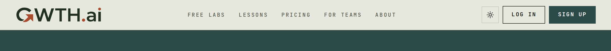
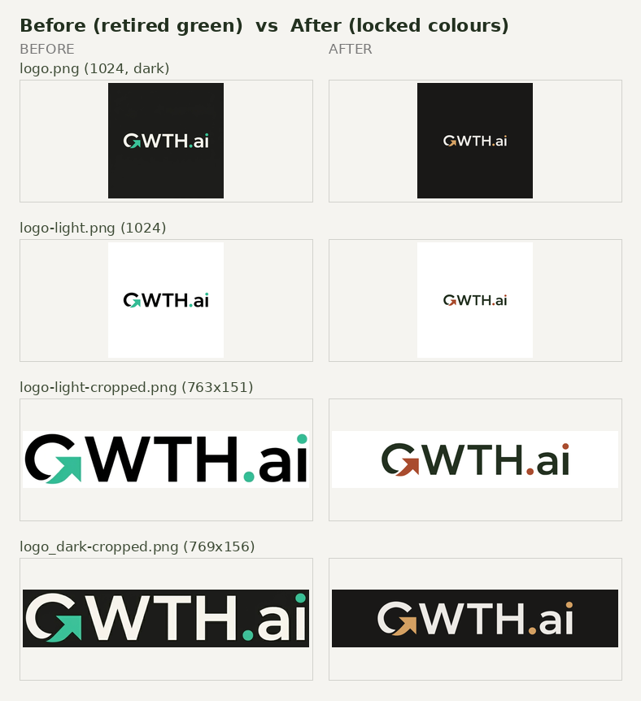
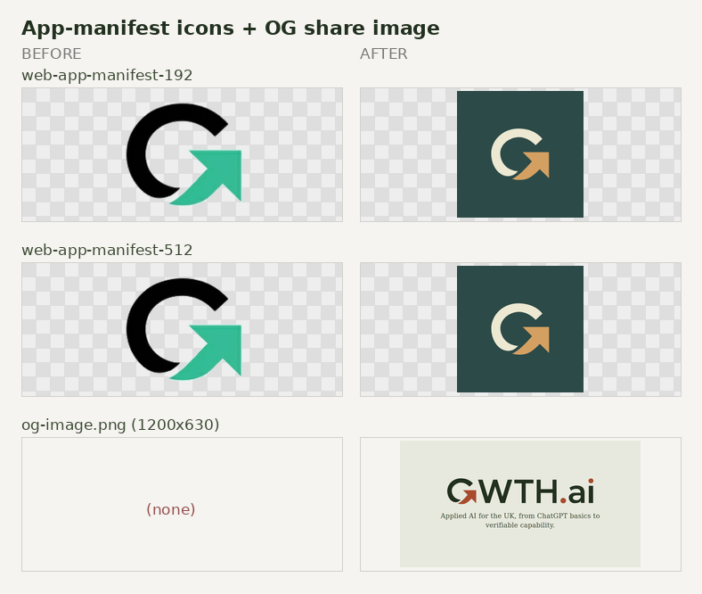
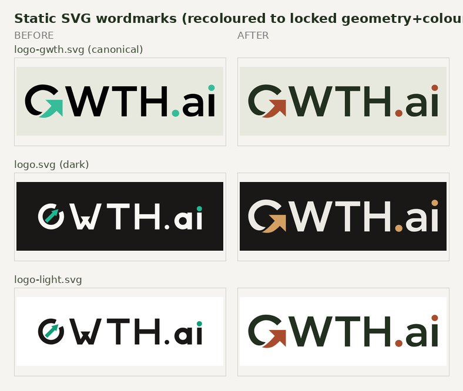
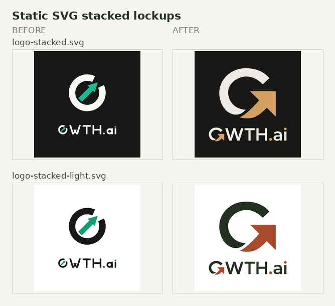

# Completion: W19 — Regenerate stale-green static brand assets to the locked colours

**Date:** 2026-07-07 · **Repo:** GWTH_V2 · **Commit(s):** <sha>
**Test URL:** http://hlab.taila51191.ts.net:3001/ (live nav = ground truth) · **Status:** verified

## What changed
- Every stale **#36bc99 green** static brand asset in `public/` regenerated from the
  **authoritative `LogoGwth` geometry** (`src/components/marketing/redesign/logo-gwth.tsx`,
  viewBox `0 0 578.07 101.64`) in the **locked colours**: light ground wordmark `#22301f`
  / accent `#a94c2e`; dark ground wordmark `#edeae6` / accent `#d4a062`. Colours + geometry
  match the live nav (which matches the shipped `public/logo-email.png`).
- Rasters (dims preserved): `logo.png` (1024², dark), `logo-light.png` (1024², white),
  `logo-light-cropped.png` (763×151), `logo_dark-cropped.png` (769×156),
  `web-app-manifest-192x192.png`, `web-app-manifest-512x512.png` (maskable G-mark on the
  masthead teal ground `#2c4a47`, matching `favicon.ico`/`icon.svg`).
- SVGs recoloured to the authoritative geometry: `logo-gwth.svg` (canonical, light colours
  per the bible), `logo.svg` (dark), `logo-light.svg`, `logo-stacked.svg`,
  `logo-stacked-light.svg`, plus the source vector `assets/logo/Vector.svg`.
- **`og-image.png` (1200×630) created** — it was referenced by `layout.tsx` but MISSING
  (social share card was a 404). New card uses the locked light wordmark on the FDE cream ground.
- `public/site.webmanifest`: fixed placeholder name `MyWebSite`/`MySite` → `GWTH.ai`, theme
  colours → masthead teal / charcoal to match the regenerated icons.
- Doc comment in `logo-gwth.tsx` updated (it previously called `/logo-gwth.svg` "original
  brand colours"; now documents the locked light colours).

**Already correct, left untouched (locked colours since David's 2026-07-03 pick):**
`favicon.svg`, `favicon.ico`, `favicon-96x96.png`, `icon.svg`, `icon-light.svg`,
`icon.png`, `icon-light.png`, `apple-touch-icon.png`.
**Out of scope, intentionally left:** `logo-spiral*.svg` / `logo-linkedin.*` are the decorative
**aperture-spiral** motif (aqua/blue pinwheel, `#33BBFF`/`#5B9BF5`), not the GWTH wordmark and
not `#36bc99`; they drive the live hero animation, so recolouring them was not authorised here.

## Live nav ground truth (light + dark)



## Before → after

### Wordmark rasters


### App-manifest icons + OG share image


### Static SVG wordmarks


### Static SVG stacked lockups


## What David should verify
- [ ] Open `public/og-image.png` — the social share card now exists and shows the correct
      terracotta-accent wordmark (was a broken 404 reference before).
- [ ] Compare `completion/W19/live-nav-light.png` against `logo-light-cropped.png` in the
      grid — the regenerated crop should be pixel-faithful to the live nav logo.
- [ ] Confirm the app icons (`web-app-manifest-192/512`) read correctly as the teal-ground
      G-mark (matching `favicon.ico`/`apple-touch-icon.png`), no green arrow.

## Verification run
```
grep -rniE "36bc99" public/                     → PUBLIC CLEAN: zero #36bc99 in public/
grep -rniE "36bc99" (shipped code/assets)        → only logo-explorer.tsx swatch label
                                                   ("Original teal", a functional comparison tool)
npx tsc --noEmit                                 → exit 0 (clean)
npx eslint src/.../logo-gwth.tsx                 → exit 0 (clean)
```
