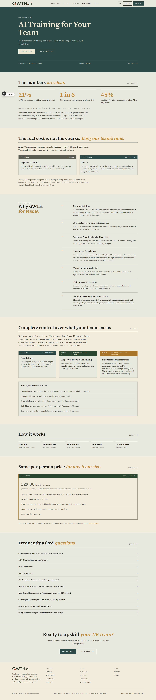
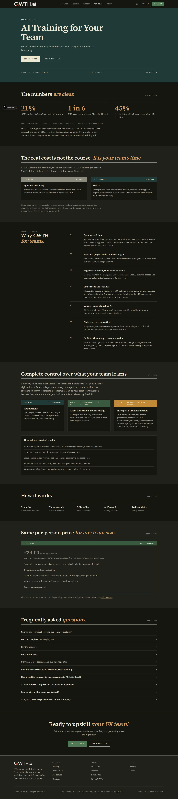
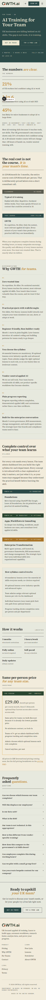
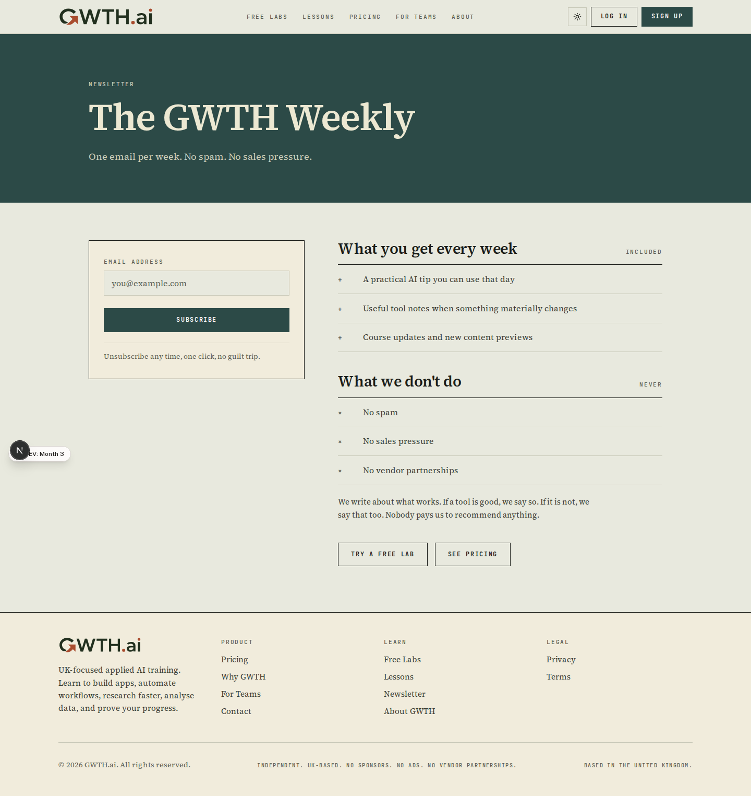
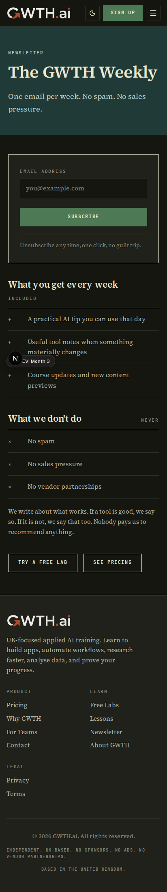
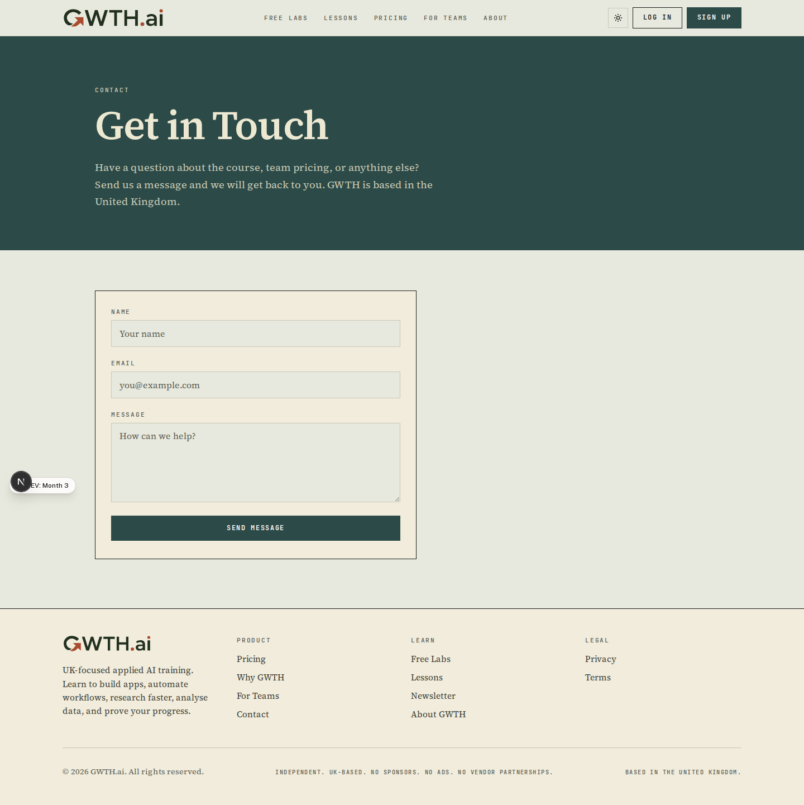
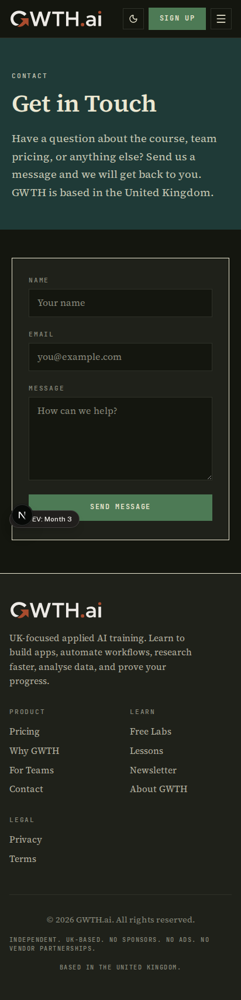

# Completion: W2 — Marketing pages editorial copy (close-out)

**Date:** 2026-06-23 · **Repo:** GWTH_V2 · **Commit(s):** _see RECORD note_
**Test URL:** http://192.168.178.50:3001/for-teams · **Status:** verified

W2 was the last open slice of the marketing work: the *editorial copy*. The FDE
visual re-skin already shipped in **W10** (2026-06-13) — this task touched copy
only, with **no visual rework** and **no layout changes**. The old monolithic
marketing pages no longer exist; copy was edited in the `*-fde` components and
the `(public)` wrappers, never via stale line numbers.

## What changed (copy only)

- **/for-teams CTAs → FDE register + sentence-case.** The closing-band CTAs were
  title-case ("Get in Touch" / "Try Free Labs"), violating the sentence-case
  HARD RULE. Now sentence-case and unified to the exemplar's labs voice:
  masthead + closing both read **"Get in touch"** and **"Try a free lab"**
  (CSS renders them uppercase — the sanctioned source of uppercase).
- **/newsletter** — read first; already on-register (drenched-teal masthead,
  paper signup panel, hairline +/× lists). Only fix needed: one title-case CTA
  **"Try a Free Lab" → "Try a free lab"**. Left the rest untouched.
- **/contact** — read first; already on-register and reads well (teal masthead,
  paper form panel, square hairline inputs). The masthead H1 "Get in Touch" is
  title-case **intentionally consistent** with the shipped for-teams masthead
  ("AI Training for Your Team"), so it was left as-is. No copy change.
- **Em-dash sweep of marketing UI copy.** Replaced every em-dash in
  student-facing copy under `src/app/(public)` with a restructured sentence
  (not a comma): terms body → parentheses + a full-stop split; terms & privacy
  `metadata.description` → colon. The 3 remaining em-dashes in `(public)` are
  **JSDoc comments** (code docs), correctly excluded per the rule.
- **Test updated** to match the corrected for-teams CTA copy
  (`for-teams.test.tsx`).

Files: [for-teams-fde.tsx](../src/components/marketing/for-teams-fde/for-teams-fde.tsx),
[newsletter-fde.tsx](../src/components/marketing/newsletter-fde/newsletter-fde.tsx),
[terms/page.tsx](../src/app/(public)/terms/page.tsx),
[privacy/page.tsx](../src/app/(public)/privacy/page.tsx),
[for-teams.test.tsx](../src/app/(public)/for-teams/for-teams.test.tsx).

## UI

Playwright-CLI, local production-parity dev build, full-page, **no console or
page errors** across all 3 pages × light/dark × 1440/412.

### /for-teams (closing CTAs corrected)




### /newsletter (CTA casing corrected; otherwise on-register)



### /contact (confirmed already on-register — no copy change)



Test it live (after deploy of this commit):
- http://192.168.178.50:3001/for-teams
- http://192.168.178.50:3001/newsletter
- http://192.168.178.50:3001/contact

## What David should verify
- [ ] /for-teams closing band: both CTAs read "GET IN TOUCH" / "TRY A FREE LAB"
      (uppercase is CSS; source is sentence-case). No "Get in Touch" / "Try Free
      Labs" title-case anywhere.
- [ ] /newsletter footer CTAs read "TRY A FREE LAB" / "SEE PRICING"; the lists,
      panel, and masthead are unchanged from the W10 ship.
- [ ] /terms and /privacy body + SEO descriptions contain no em-dashes (the
      "All content on GWTH.ai (…) is the intellectual property…" sentence now
      uses parentheses).

## Out-of-scope observation (flagged, not changed)
The homepage journey/pricing copy in
[`src/components/marketing/data.ts`](../src/components/marketing/data.ts)
(lines ~123–333) still contains em-dashes. These render on the homepage, so they
are technically a §7.4 register exception — but they are **shipped & locked
homepage copy** (W10/W8) with a drift-sentinel test (`data.test.ts`), and they
sit **outside the W2 grep scope** the task defined (`(public)` + `*-fde`).
Rewriting locked, test-guarded homepage copy was deliberately not done here;
worth a small dedicated follow-up if David wants the homepage strings swept too.

## Verification run
```
npm run typecheck            → clean (tsc --noEmit, no output)
npm test (vitest run)        → 42 files passed, 2 skipped; 287 tests passed, 11 skipped, 0 failed
Playwright CLI (12 shots)    → NO console or page errors across for-teams/newsletter/contact × light/dark × 1440/412
grep "—" src/app/(public)    → only 3 JSDoc comments remain (code docs, excluded); 0 in UI copy
```
