# Completion: W20 — Four lesson-viewer / dashboard correctness bugs (pre-CIPD-demo)

**Date:** 2026-07-22 · **Repo:** GWTH_V2 · **Commit (master):** `37b71da`
**Staging:** `gwth-v2:staging` (HEAD build) live on hlab `:3001`
**Prod:** gwth.ai, Coolify app `tw0cc8oc0w4scwoccs0cw0go`, deploy `j8c4swk8okw8s8ccookww8o4` (finished)
**Status:** verified on staging AND production

Fixes the four website P0/P1 items from the 2026-07-10 pre-invite review
(`GWTH-launch-plan/completion/launch-fix-2026-07-10/FIX_BRIEF.md`): beads
`gwth-launch-5vh`, `26b`, `qar`, `a0k`. FDE register only, British English, no
em dashes, no new dependencies, labs untouched (W22 owns them).

## What to verify (3 bullets)

- **Lesson bodies + quiz render markdown**: open any lesson, page to a section
  with a `> blockquote` (e.g. welcome lesson page 4 shows the styled
  "AI suggests. Humans decide." rule, no literal `> `); the end-of-lesson Q&A
  renders `**bold**` as bold, not raw asterisks.
- **Dashboard reads the live content**: a Month-1 beta account shows "Month 1
  of 3", lessons in syllabus order (Welcome first), and Continue points at the
  first incomplete lesson — never "Month 3 of 3" or a scrambled list.
- **Outline is real + rail is clean**: the outline rail differs per lesson
  (derived from each lesson's `##` headings) and CONTINUE advances the body;
  the global "Report a problem" launcher no longer overlaps the viewer's own
  FEEDBACK/NOTES rail (it is suppressed on lesson routes, still present
  elsewhere).

## URLs

Staging (log in first; LAN origin is Better-Auth-trusted):
- Dashboard: http://192.168.178.50:3001/dashboard
- Blockquote: http://192.168.178.50:3001/course/applied-ai-skills/lesson/welcome-to-gwth-six-ways-ai-can-give-you-superpowers
- Different outline: http://192.168.178.50:3001/course/applied-ai-skills/lesson/ai-efficiency-better-results-for-less-cost

Production:
- Dashboard: https://gwth.ai/dashboard
- Blockquote: https://gwth.ai/course/applied-ai-skills/lesson/welcome-to-gwth-six-ways-ai-can-give-you-superpowers
- Quiz bold: https://gwth.ai/course/applied-ai-skills/lesson/welcome-to-gwth-six-ways-ai-can-give-you-superpowers?surface=qa

---

## Bug 1 — `gwth-launch-5vh` (P0): blockquotes + quiz bold rendered as raw markdown

**Root cause.** `markdown-renderer.tsx` ran `DOMPurify.sanitize()` on the
markdown SOURCE string before react-markdown. DOMPurify parses the source as
HTML and, whenever the body contains any `<` (every lesson carries
`<!-- VERIFY -->` authoring comments), re-serialises `>` to `&gt;`, so every
`> blockquote` stopped being a blockquote. Separately, the end-of-lesson Q&A
rendered its prompt / option labels / feedback as plain JSX with no markdown
pass, so stored `**bold**` showed literal asterisks.

**Fix.** Removed the pre-parse sanitise (content is all first-party;
`rehype-raw` still strips the comments at the hast layer). Added an
`InlineMarkdown` pass (remark-gfm, `p` → Fragment, no rehype-raw) for the three
quiz strings. `src/components/shared/markdown-renderer.tsx`,
`src/app/(dashboard)/course/[slug]/lesson/[lessonSlug]/editorial-lesson-viewer.tsx`.

Before:

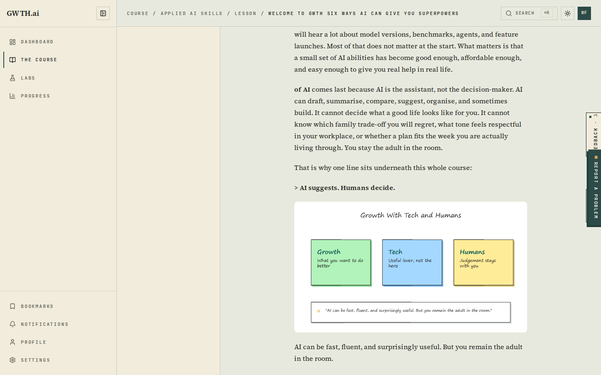
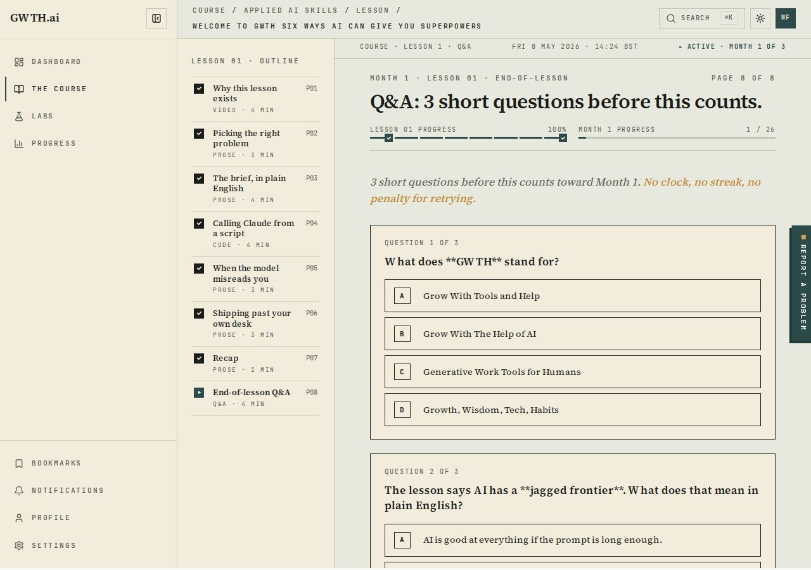

After (prod — styled blockquote; quiz "GWTH" / "jagged frontier" bold):

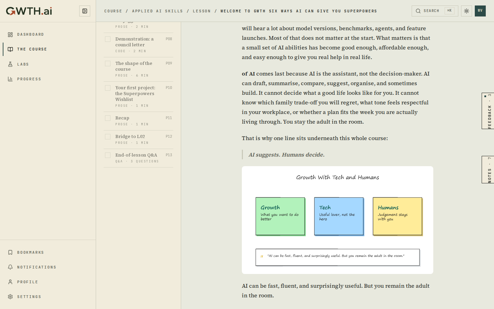
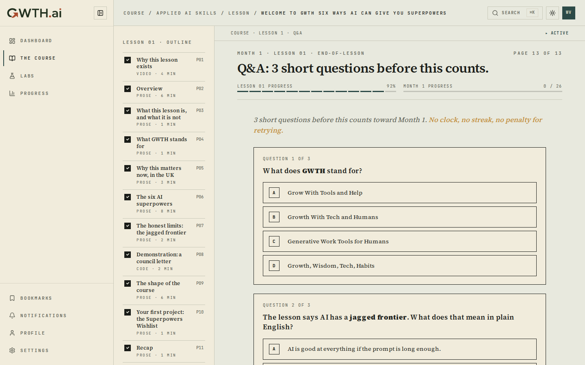

Rendered HTML confirmed: `<blockquote>
<strong>AI suggests. Humans decide.</strong>
</blockquote>`.

## Bug 2 — `gwth-launch-26b` (P0): "Month 3 of 3", scrambled order, wrong Continue

**Root cause.** Two data defects surfaced by the derivation logic. (1) The
dashboard ordered lessons by `(section.order, lesson.order)`, but the `sections`
rows tie at `order=0` with scrambled ids, so the flatten was arbitrary. (2) The
display month read `subscriptionMonth`, which defaults to 3 for manual beta
grants although only Month 1 is live.

**Fix (code, account-independent).** `deriveLessonPlan` now flattens across
sections and sorts by the authoritative per-lesson `order` (1..N); the display
month derives from the section month of the content the student is actually on
(their next incomplete lesson), not the grant. Seeding defaults corrected too
(`access.ts` `|| 3` → `|| 1`, `beta_access_grants` schema default 3 → 1).
**Fix (data).** `UPDATE user_access / beta_access_grants SET subscription_month=1`
(state month1) for the month>1 grants on staging AND prod, so future logins are
right. `src/app/(dashboard)/dashboard/page.tsx`, `src/lib/billing/access.ts`,
`drizzle/schema.ts`.

Before:

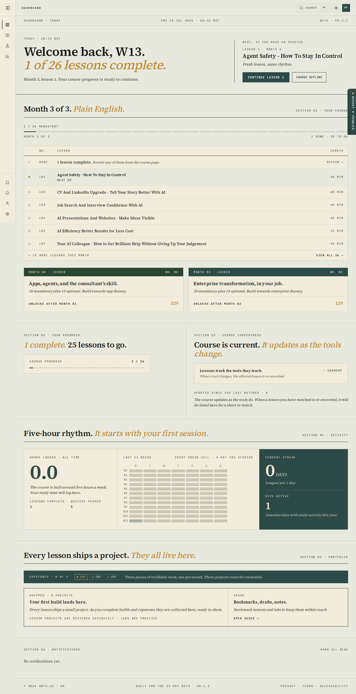

After (prod, zero-progress account — Month 1 of 3, Welcome first, Start Lesson 1):

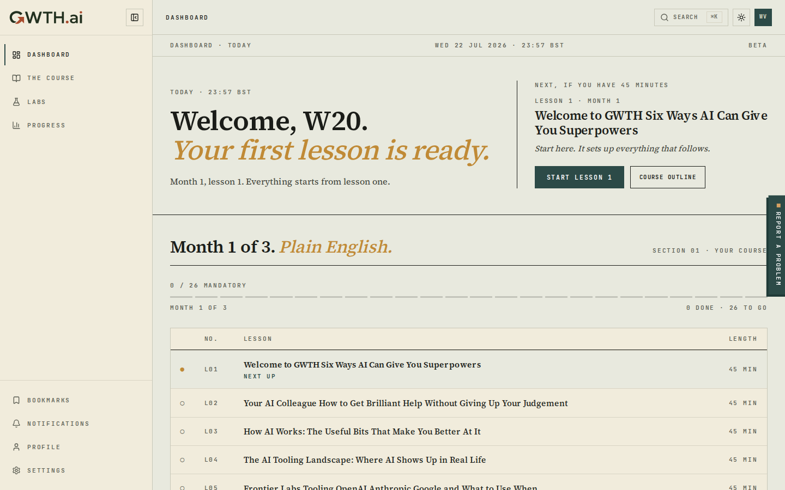
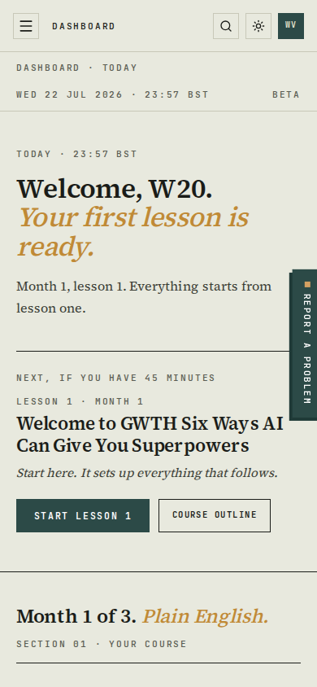

## Bug 3 — `gwth-launch-qar` (P1): lesson outline + pagination was a hardcoded placebo

**Root cause.** The viewer used a fixed seven-item outline for every lesson
("Picking the right problem / … / Calling Claude from a script · CODE"),
identical on the no-code welcome lesson, and the prose surface rendered the
whole body on one page so CONTINUE only moved a counter.

**Fix.** New `src/lib/lessons/lesson-outline.ts` derives the outline from the
lesson's real `##` headings (one page per section, `###` stays inside its
parent, fenced-code aware, code-fence sections labelled CODE, reading-time
estimate). The viewer renders one section per page, so CONTINUE advances the
actual content. `page.tsx` builds the outline; the viewer renders the current
page's slice.

Before (welcome lesson showing the generic placebo outline):

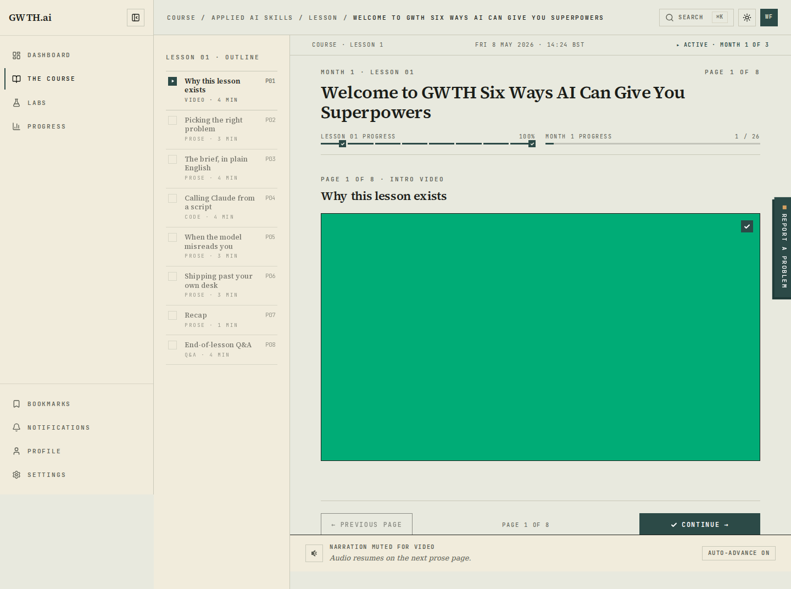

After — two lessons, two genuinely different outlines derived from their headings:

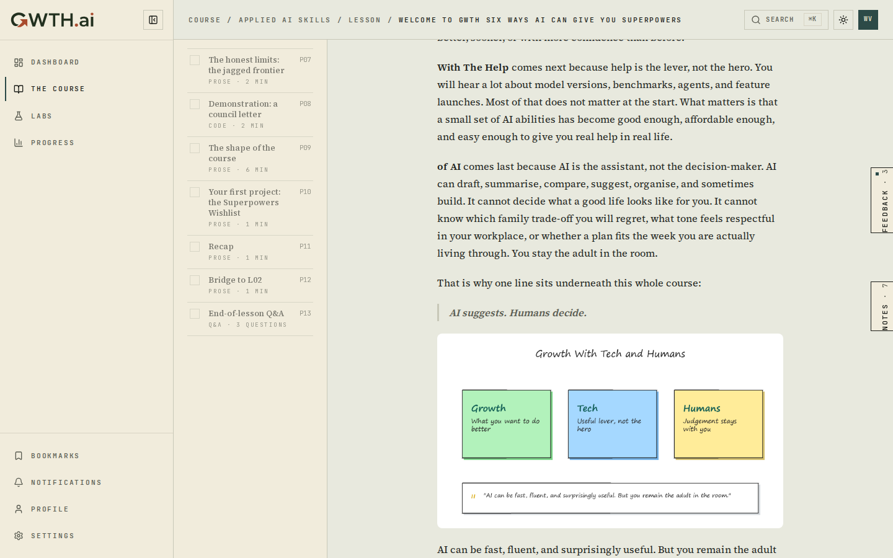
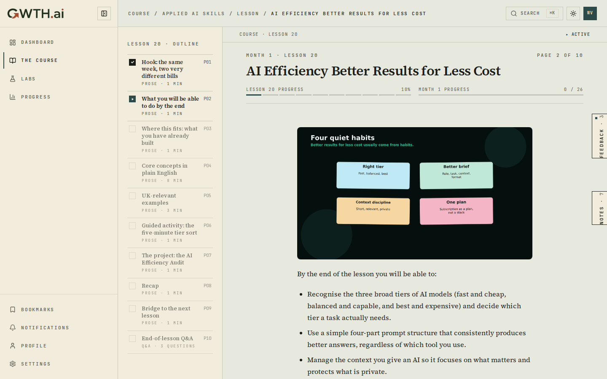

(Welcome: Overview / What GWTH stands for / Demonstration: a council letter · CODE
/ … · PAGE 13. Efficiency: Hook / Core concepts in plain English · 8 MIN / UK-relevant
examples / … · PAGE 10.)

## Bug 4 — `gwth-launch-a0k` (P1): "Report a problem" launcher overlapped the viewer rail

**Root cause.** The global `.launchButton` (fixed, right:0, top:50%, z-40),
mounted on all authenticated pages, collided with the lesson viewer's own
right-edge FEEDBACK/NOTES rail (z-30) at the vertical centre, on desktop and
mobile.

**Fix.** The launcher is redundant on lesson routes (the viewer's FEEDBACK tab
is the same W5 channel), so it is suppressed there via a pathname test
(`/course/[slug]/lesson/[lessonSlug]`). It stays on every other authenticated
page. `src/components/feedback/report-problem-launcher.tsx`.

Before:

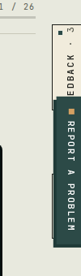
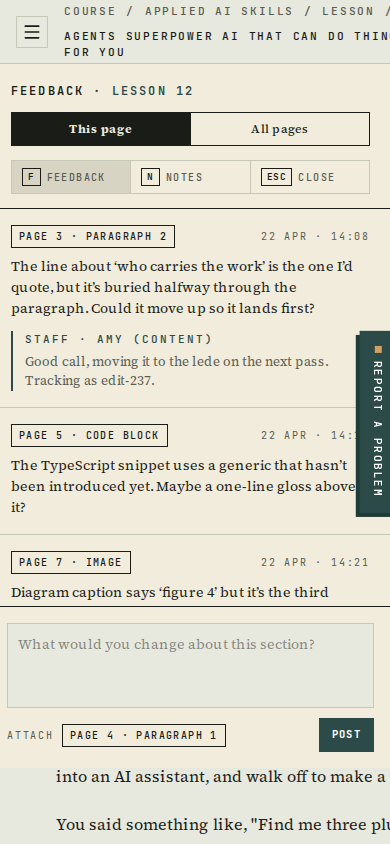

After (prod — rail tabs clear on desktop; open panel on mobile with no launcher over text):

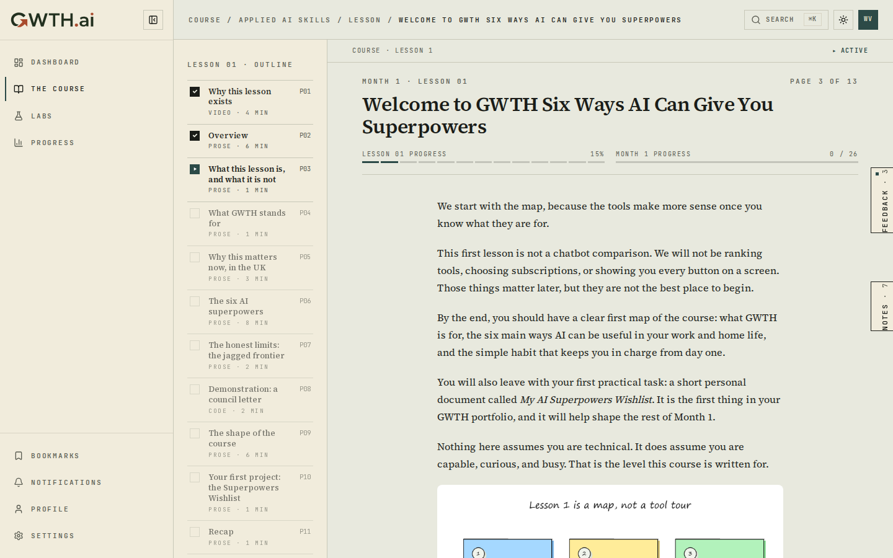
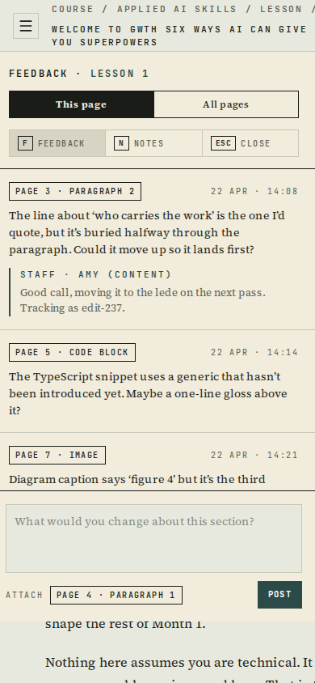

---

## Tests

- New: `src/lib/lessons/lesson-outline.test.ts` (7) — heading split, fence
  safety, per-lesson difference, code labelling, fallback.
- New: `src/components/shared/markdown-renderer.test.tsx` (2) — blockquote
  renders as `<blockquote>` even with HTML comments present; no `&gt;` leak.
- Extended: `src/app/(dashboard)/dashboard/page.test.tsx` (+2) — scrambled
  sections still order by lesson.order; display month is the live content month,
  not the defaulted grant.
- Full suite: `npm test` → 402 passed / 13 skipped (DB-gated). `npx tsc
  --noEmit` clean, `npx eslint src` clean.

## Verification method

Playwright CLI (`completion/W20/verify-w20.mjs`, `shot-blockquote.mjs`) logged
into a real beta account on each environment and asserted: dashboard month is 1
not 3, blockquote renders with no `> ` leak, welcome vs efficiency outlines
differ, the global launcher count on a lesson page is 0, and the quiz has no
`**` leak. Both staging (w13-fresh) and a fresh zero-progress prod account
(w20-verify) passed all checks, desktop 1440 + mobile 390.
