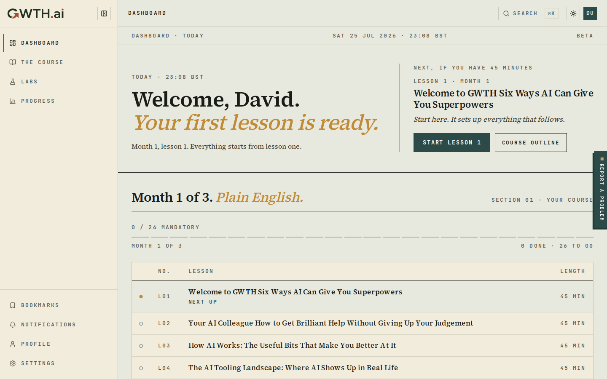
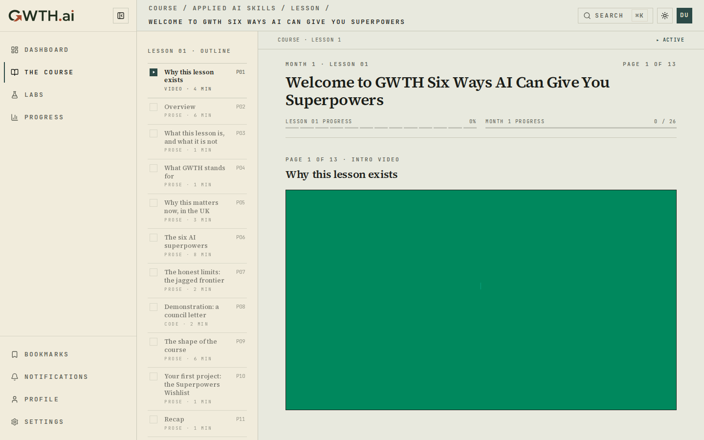
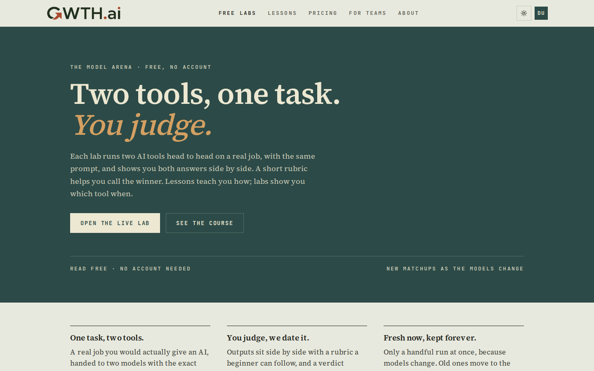
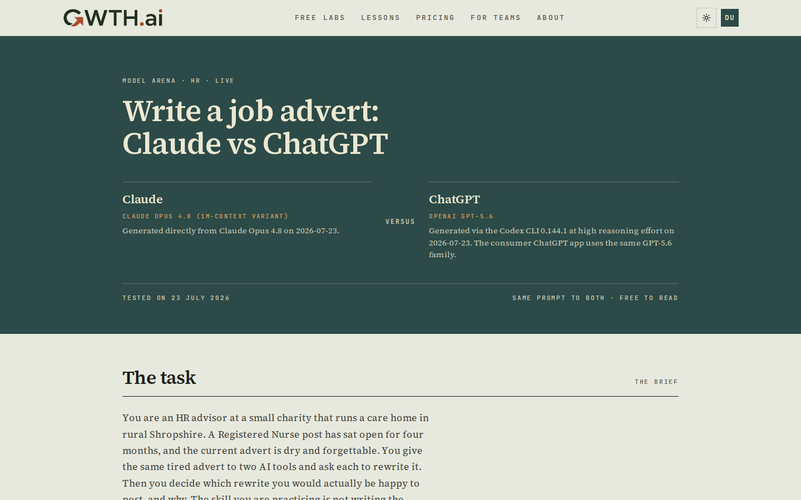
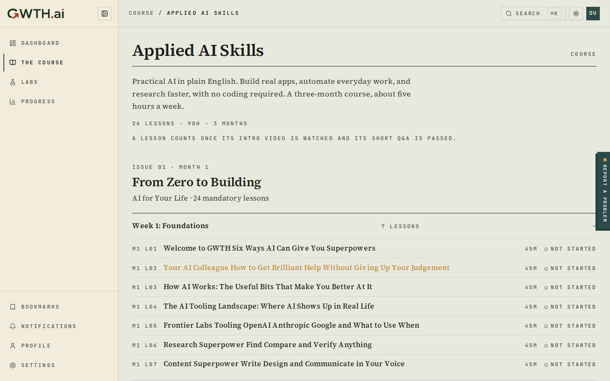
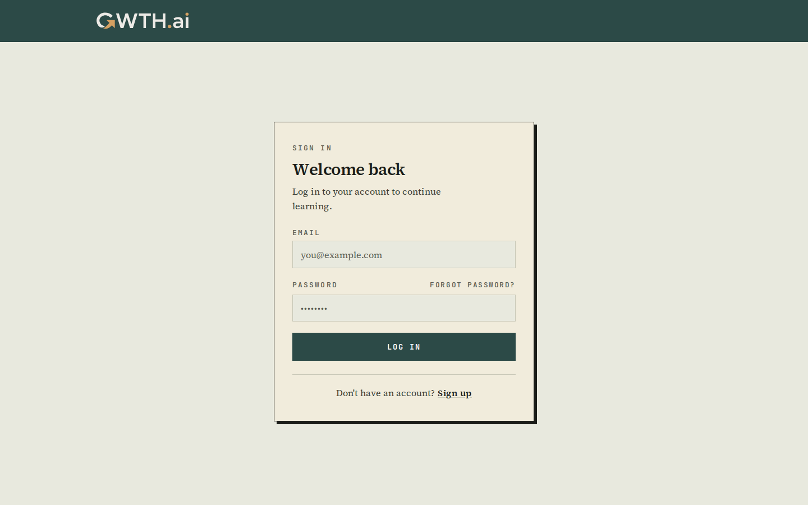
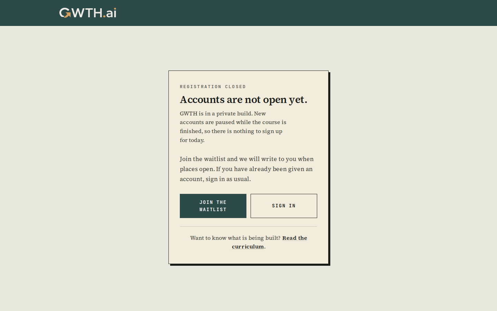
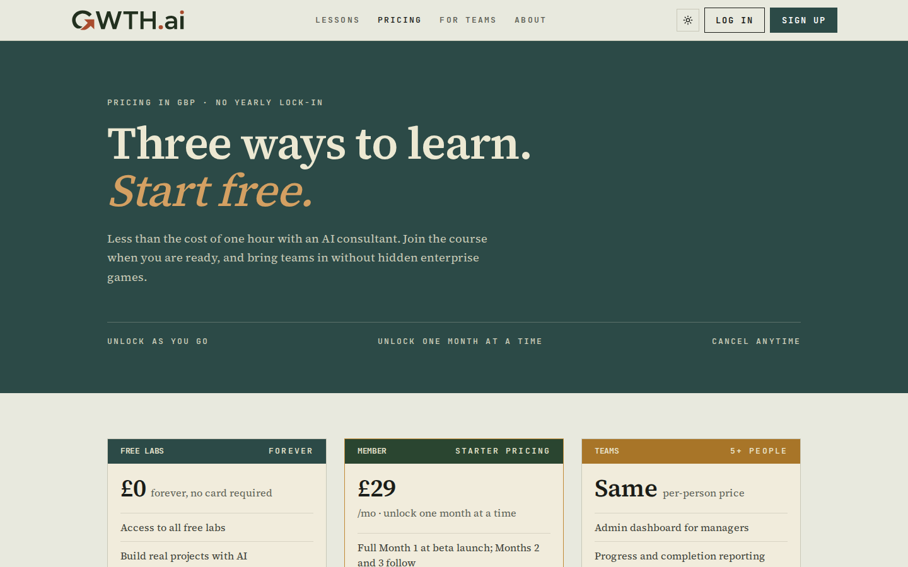

# Completion: W25 — private content gate on production

**Date:** 2026-07-25 (night run)
**Repo:** GWTH_V2
**Commits (master):** `9e27acc` → `985af92` (five commits, 152 files, +1,875 / −7,633)
**Prod:** https://gwth.ai · Coolify `tw0cc8oc0w4scwoccs0cw0go` @ `985af92`, deployed and verified
**Local proof image:** `gwth-v2:w25` (`sha256:52afd41aaa43`), built once and run twice
**Status:** DONE, awaiting your verdict

Labs, lesson bodies, the syllabus and the dashboard are now visible only to the
two accounts on `CONTENT_ALLOWED_EMAILS`. The marketing site stays anonymously
readable so the CIPD pair can research it after Monday. Signup is closed at the
API. The gate fails closed, is evaluated per request, and lifts with one env
change. Guardrails held: FDE register on the new UI, British English, no em
dashes, no eyebrow pills, no new dependencies.

## What to verify (3 bullets)

- **You can still walk the whole demo.** Sign in at https://gwth.ai/login as
  `familyuccelli@gmail.com` and open the dashboard, the L1 lesson, and a lab.
  All three are proven working in `completion/W25/student-*.png`, but this is
  the thing that would ruin Monday, so please click it yourself.
- **A stranger sees the marketing site and nothing else.** In a private window,
  https://gwth.ai/, /lessons, /pricing, /about and /score/c67sg all open;
  /labs and any lesson URL bounce to /login.
- **One line turns it off at launch.** Set `PRIVATE_CONTENT_MODE=off` in
  Coolify and redeploy. Removing the variable does the OPPOSITE and re-locks
  the site, which is deliberate.

## Env vars to confirm in Coolify

App `tw0cc8oc0w4scwoccs0cw0go`, both added 2026-07-25 as **runtime-only**
(`is_buildtime=false`, `is_runtime=true`). Do not tick "Build Variable?" on
either: a build that saw an opening value could not be re-locked at runtime.

| Variable | Value | Why |
|---|---|---|
| `PRIVATE_CONTENT_MODE` | `on` | The master switch. `off` at launch. |
| `CONTENT_ALLOWED_EMAILS` | `david@agilecommercegroup.com,familyuccelli@gmail.com` | **Both** addresses. The demo is walked as the student. |

Confirmed still ABSENT, as required: `SITE_PASSWORD`, `ENABLE_DEV_MOCK_USER`,
`ALLOW_INDEXING`. `ADMIN_EMAILS` is also unset on production (pre-existing, not
touched by this task, so `/admin` admits nobody).

**Launch off-switch, one line:**

```
PRIVATE_CONTENT_MODE=off        # in Coolify, then redeploy
```

## Acceptance evidence

### 1. Runtime proof — the one that matters

A curl matrix alone cannot pass this task, because a redirect baked in at build
time and a working runtime gate both return 307. So: the image was built ONCE
with no `PRIVATE_CONTENT_MODE` (exactly as the Dockerfile does, which takes a
single build arg), then that SAME image was run twice with different env and no
rebuild between them.

```
IMAGE      sha256:52afd41aaa433e45a99...
:3031  ->  same image, -e PRIVATE_CONTENT_MODE=on
:3032  ->  same image, -e PRIVATE_CONTENT_MODE=off
```

| Path (anonymous) | MODE=on | MODE=off |
|---|---|---|
| `/`, `/lessons`, `/pricing`, `/about`, `/for-teams`, `/waitlist`, `/why-gwth`, `/newsletter` | 200 | 200 |
| `/score/c67sg` | 200 | 200 |
| `/course/applied-ai-skills` (teaser) | 200 | 200 |
| `/signup` | 200 ("Registration closed") | 200 (signup form) |
| **`/labs`** | **307 → /login** | **200** |
| **`/labs/job-advert-claude-vs-chatgpt`** | **307 → /login** | **200** |
| `/dashboard`, `/progress`, `/bookmarks`, the L1 lesson | 307 → /login | 307 → /login |
| `/w12-review`, `/explainer-preview`, `/w12-embed-demo`, `/api/w12-take-review` | 404 | 404 |
| `/access` | 307 → / | 307 → / |
| `/gwth-handoff/*`, `/scorecards/*`, `/explainer/takes/*` | 404 | 404 |

Live `href="/labs"` anchors on the anonymously readable marketing pages, same
image, same run: **0 while locked, present once open** on `/`, `/pricing`,
`/about`, `/for-teams`, `/lessons`, `/why-gwth`, `/newsletter`.

The gate is not baked. **This is the acceptance criterion the original design
would have failed.**

### 2. Gated routes are out of the prerender manifest

`.next/prerender-manifest.json` went from **54 prerendered routes to 31**.

```
/labs                                prerendered=False   (was True)
/labs/job-advert-claude-vs-chatgpt   prerendered=False
/signup                              prerendered=False   (was True)
/lessons                             prerendered=False   (was True)
/bookmarks                           prerendered=False   (was True)
/                                    prerendered=False   (was True)
```

Two independent mechanisms, deliberately: `force-dynamic` + `revalidate 0` on
every gated route, and `await headers()` as the FIRST, unconditional statement
in both gate helpers, before any early return. The second makes prerendering
structurally impossible rather than merely configured away.

### 3. Anonymous curl matrix against live https://gwth.ai (after deploy)

| Path | Status | Redirect |
|---|---|---|
| `/`, `/lessons`, `/pricing`, `/about`, `/for-teams`, `/waitlist`, `/why-gwth`, `/newsletter`, `/contact` | 200 | — |
| **`/score/c67sg`** | **200** | — (the homepage QR code points here) |
| `/course/applied-ai-skills`, `/login`, `/signup` | 200 | — |
| `/labs`, `/labs/job-advert-claude-vs-chatgpt` | 307 | `/login` |
| `/dashboard`, `/progress`, `/bookmarks`, `/courses`, `/guide`, `/settings`, `/profile`, `/notifications`, `/admin`, L1 lesson | 307 | `/login` |
| `/w12-review`, `/w12-review/takes`, `/explainer-preview`, `/w12-embed-demo`, `/api/w12-take-review` | 404 | — |
| `/access` | 307 | `/` |
| `/demo/lesson-v4`, `/score-card-variants`, `/redesign` | 307 | `/login` |
| `/gwth-handoff/mp8g6bol-lesson-m1_l01.json` | **404** | — (was 200, 51 KB of lesson) |
| `/gwth-handoff/audio/kokoro_main.wav`, `/gwth-handoff/images/fig-01.png` | **404** | — |
| `/scorecards/index.html`, `/explainer/takes/*.wav` | **404** | — |
| `/explainer/explainer.mp4`, `/robots.txt` | 200 | — (homepage assets, kept) |

`X-Robots-Tag: noindex, nofollow, noarchive, nosnippet, noimageindex` is now
stamped on production. Before this it was not: the header hung off
`SITE_PASSWORD`, which was removed on 2026-07-05.

### 4. Both allowed accounts

Run against live https://gwth.ai with `deploy/verify-w25-prod.mjs`.

**`familyuccelli@gmail.com` — the demo student. 7/7 checks passed.**

| Step | Result | Screenshot |
|---|---|---|
| Sign in | 200, landed on `/dashboard` | — |
| `/dashboard` | 200 | `completion/W25/student-dashboard.png` |
| L1 lesson, full body + 13-page outline | 200 | `completion/W25/student-lesson-l1.png` |
| `/labs` | 200, Model Arena renders | `completion/W25/student-labs.png` |
| `/labs/job-advert-claude-vs-chatgpt` | 200 | `completion/W25/student-lab-detail.png` |
| `/progress` | 200 | `completion/W25/student-progress.png` |
| `/course/applied-ai-skills` full syllabus | 200 | `completion/W25/student-syllabus.png` |

The nav still shows FREE LABS to this account, because the nav link is keyed on
the VIEWER rather than on the flag. An anonymous visitor does not see it; the
demo does. That is a deliberate improvement on the design, which would have
hidden it from you as well.

**`david@agilecommercegroup.com` — stated plainly rather than skipped silently:
this account does not exist on production.** The prod `user` table holds four
accounts and none is David's (see
`completion/W25/prod-user-20260725T213217Z.csv`); production has only ever held
three throwaway test accounts plus the demo student. Every "log in as David"
instruction was never actually possible, which is why the demo runs as the
student.

What IS proven for that address: it is parsed into the allowlist and would be
admitted the moment an account exists. The parse is unit-tested for exactly
this two-address list, case-insensitively and with whitespace
(`src/lib/content-mode.test.ts`), and was exercised end to end against the
built image with a third address added in MIXED CASE with padding
(`"david@agilecommercegroup.com, familyuccelli@gmail.com ,W25-Allowlisted@Example.com"`),
which reached `/labs`, the lesson, the dashboard and the syllabus. **A
single-value implementation would have failed those tests.**

#### Screenshots

**The demo student, signed in on production.** Dashboard, the L1 lesson with
its full 13-page outline, Labs, and a lab detail:











**Anonymous.** /labs bounces to the login page, /signup shows an honest closed
notice, and /pricing no longer offers a Labs button it cannot honour:







### 5. Fail-closed unit tests

`src/lib/content-mode.test.ts` (17) and `src/lib/content-access.test.ts` (14).

- LOCKED for unset, `""`, `"   "`, `on`, `ON`, `yes`, `true`, `1`, `of`,
  `offf`, `private`, `Publi`, `"off"` (quoted), `'off'`, `off,public`.
- LOCKED for `0`, `false`, `FALSE`, `no`. These are deliberately NOT opening
  values even though every other flag here reads truthy-means-more, because a
  `${PRIVATE_CONTENT_MODE:-0}` template default would otherwise open the site.
- OPEN only for `off`, `OFF`, `" off "`, `Off`, `public`, `"PUBLIC "`.
- Empty allowlist on both variables admits nobody, including a valid address.
- `CONTENT_ALLOWED_EMAILS` falls back to `ADMIN_EMAILS`; both empty means
  nobody; both set prefers the former.
- The gate awaits `headers()` on every branch, including the ones that return
  early. This is what makes the route unprerenderable.
- A forged session cookie is treated exactly like anonymous traffic.
- A signed-in but unlisted account goes to `/`, not `/login` (going to `/login`
  would ricochet them to `/dashboard` via the proxy's auth-path rule).

### 6. Signup blocked at the API, not hidden in the UI

Against live production:

```
POST https://gwth.ai/api/auth/sign-up/email
-> 400 {"message":"Email and password sign up is not enabled",
        "code":"EMAIL_PASSWORD_SIGN_UP_DISABLED"}
```

Before this change, `/signup` rendered invite-only copy while the API happily
created real accounts for anyone. The `/signup` page now renders an honest
"Registration closed" panel (`completion/W25/anon-signup-closed.png`) and its
`<title>` branches with it. Sign-IN is untouched.

### 7. Gates

```
npm run typecheck   clean
npm run lint        clean
npm test            456 pass, 13 pre-existing DB skips, 0 fail
npx knip            1 finding (isomorphic-dompurify, pre-existing)
```

`src/proxy.test.ts:203` is the deliberately updated assertion: it required
`/w12-review` and `/explainer-preview` to answer 200 "until W12 closes". W12 has
closed, and the routes were deleted rather than gated, so it now asserts the
proxy has no opinion about paths that no longer exist. Two other assertions were
deliberately updated the same way and say so in the test name: the `(bbg)` lab
guardrail now proves the launch off-switch restores public labs, and the pricing
page's free-tier CTA test now expects the waitlist while locked and the free-lab
link once open.

## The three things the design got wrong, and what shipped instead

The design document carried an adversarial review that returned **flawed** from
all three reviewers. The corrected design was implemented, so for the record:

1. **The original would have baked the gate at build time**, locking you out of
   Labs during your own demo while leaving a genuine fail-open path. Fixed by
   `force-dynamic` + `revalidate 0` + an unconditional `await headers()`, and
   proved by the build-once-run-twice test above rather than by a curl matrix
   that cannot tell the two apart.
2. **The original left content no gate can reach.** A complete Month-1 lesson
   was downloadable from `public/` and real lab prose shipped in a client JS
   chunk. Both deleted at the source.
3. **The original gated four routes with the forgeable proxy check alone.**
   Deleted instead, because deletion is the only closure a forged cookie cannot
   undo.

## Two defects the running image found that reading the code did not

Both were caught by probing the built container, not by review:

- **The dashboard layout leaked the search index.** A layout renders in
  PARALLEL with its page, so the page gate protects nothing the layout builds.
  A request with `Cookie: better-auth.session_token=forged` got an empty
  dashboard page and a full index of 30 lab titles plus the syllabus. Now gated;
  re-verified at 0 lab titles and 0 lesson slugs for a forged cookie and for a
  signed-in account holding a live `manual_beta` grant that is not allowlisted.
- **Seven "Try a free lab" buttons dead-ended at a login wall.** Hiding the nav
  and footer links covered about a fifth of the surface; the primary filled
  button on `/pricing` and `/about` still pointed at gated Labs, on exactly the
  pages CIPD will browse. All withdrawn and the surrounding copy softened
  (`completion/W25/anon-pricing-no-labs-cta.png`).

## Production grant audit (reversible)

Amended step 16: expire every grant that is not one of the TWO demo accounts.

- Dumped first: `completion/W25/prod-{user,user_access,beta_access_grants}-20260725T213217Z.csv`.
- Expired (not deleted, so the rows stay auditable), scoped by explicit email
  and user_id, never by a negation: `w6-prodcheck-1783281150@example.com`,
  `w16-smoke@gwth.ai`, `w20-verify@gwth.ai`.
- **`familyuccelli@gmail.com` survived untouched**: `manual_beta`, month 1,
  `valid_until` NULL. Verified after the change, and again by signing in.
- Rollback written before the change and committed alongside:
  `completion/W25/restore-grants-20260725T213217Z.sql`. Turning the env var off
  does NOT undo expired grants, which is why this file exists.

## Known and accepted

- **A forged session cookie on `/labs` returns HTTP 200, not 307.** The body
  contains only page metadata and a client-side redirect to `/login` — no lab
  content, verified live. This is Next's behaviour when `redirect()` is called
  after the response shell has flushed, and it is identical to the pre-existing
  `/admin` gate. Anonymous traffic with no cookie gets a clean 307 from the
  proxy. Security holds; the status code is cosmetic.
- **`media.gwth.ai` (Cloudflare R2) is a public origin outside any app gate.**
  Anyone holding a direct media URL can still fetch lesson audio, video and
  images. Not fixable before Monday without risking the demo's own media. The
  URLs are no longer enumerable now that the lesson pages, the syllabus and the
  search index are all gated.
- **The L1 intro video area renders as a flat green block** in
  `student-lesson-l1.png`. That is bead `gwth-launch-akt`, W26's job, not a gate
  effect: the page and body render correctly around it.
- **Cloudflare rate-limits brisk automated probing** of gwth.ai. The
  verification script now paces its requests and reports a 429 as inconclusive
  rather than as a pass or a false failure.

## Changes

- `src/lib/content-mode.ts` (NEW) — pure, dependency-free switch and allowlist,
  safe for the edge proxy, instrumentation and the auth builder.
- `src/lib/content-access.ts` (NEW) — the request-scoped gate, and the real
  boundary. Awaits `headers()` first on every path.
- `src/lib/auth.ts` — added `getSessionEmail()`, cached, deliberately not built
  on `getCurrentUser()` so a lapsed grant cannot lock an allowlisted account out.
- `src/proxy.ts` — anonymous bounce for `/labs` outside the NODE_ENV condition;
  noindex decoupled from `SITE_PASSWORD`; `/access` redirected home when no
  password gate is configured.
- `src/lib/better-auth.ts` — `disableSignUp` for email/password and per provider.
- `src/instrumentation.ts` + `assertContentGateConfigured` — crash-loop at boot
  if private mode is on with an empty allowlist, so a misspelt variable NAME
  cannot lock everyone out silently. Inert without `BETTER_AUTH_URL`, so it
  cannot break a build.
- 14 route files — `requireContentAccessOrRedirect()` as the first await, plus
  `force-dynamic` and `revalidate 0`.
- `src/lib/data/search-index.ts` (NEW) + `search-palette.tsx` — content out of
  the client bundle.
- `src/lib/labs-cta.ts` (NEW) + six marketing components — no dead-end CTAs.
- `src/components/auth/signup-closed-notice.tsx` (NEW) — FDE register.
- Deleted: `public/gwth-handoff/`, `public/scorecards/`, `public/explainer/takes|motion`,
  `src/app/w12-review/`, `/explainer-preview`, `/w12-embed-demo`,
  `/api/w12-take-review`, `/demo/lesson-v1..v11`, `(dashboard)/demo/`, and the
  nine files those orphaned. `public/` drops 377 MB → 42 MB.
- `docs/runbook-go-live.md` §2a, `.env.local.example`, `deploy/run-staging.sh`
  (staging stays LOCKED too, so there is no open mirror over Tailscale).

## Rollback

- **Content gate:** `PRIVATE_CONTENT_MODE=off` in Coolify + redeploy. No code
  change. Restores public Labs and open signup together, in one decision.
- **Grants:** `ssh hetzner 'docker exec -i zo0gkcwoo0o4gow0go4cwk0o psql -U gwth -d gwth_v2' < completion/W25/restore-grants-20260725T213217Z.sql`
- **Whole change:** the five commits revert cleanly; `9e27acc` restores every
  deleted file.

## URLs

- Production: https://gwth.ai (demo student sign-in at https://gwth.ai/login)
- Screenshots: `completion/W25/*.png`
