# Completion: W4 — Admin dashboard (monitor and support students)

**Date:** 2026-07-03 · **Repo:** GWTH_V2 · **Commit(s):** this packet's commit (code: fc0a377, c536114 + fixes)
**Test URL:** http://192.168.178.50:3001/admin (sign in as an `ADMIN_EMAILS` account first) · **Status:** verified

## What changed

- **`/admin`** — the SUMMARY-FIRST dashboard David chose (2026-06-17): opens on
  cohort health (active / stalled ≥3d / unread feedback / waitlist metric cards)
  plus a "needs attention" table with a per-tester nudge (mailto) action. The
  full roster, M1 funnel and feedback inbox live one click deeper; the grant
  form is the header action. FDE journal register throughout (DESIGN_FDE.md;
  denser tables per §6 "functional priority"), light + dark, 412px-safe.
- **Access gate** — server-side, reusing the W11 auth seam (`getCurrentUser()`
  from [src/lib/auth.ts](../src/lib/auth.ts)) + the **`ADMIN_EMAILS` env
  allowlist** ([src/lib/admin.ts](../src/lib/admin.ts) — unset = nobody is
  admin, fail closed; nothing hardcoded). The gate runs in the
  [layout](../src/app/admin/layout.tsx) **and at the top of every /admin
  page** (`requireAdminOrRedirect()`): App Router renders pages IN PARALLEL
  with their layout, so a layout-only redirect still streams the page's data
  to a raw curl — caught during verification, fixed, and re-proven (anonymous
  body now contains zero cohort strings). Anonymous → `/login`; signed-in
  non-admin → `/dashboard` (never a 500). **No middleware.ts** — `/admin` was
  only added to the proxy's optimistic no-cookie bounce
  ([src/proxy.ts](../src/proxy.ts)).
  The W5 feedback-inbox admin check (`isFeedbackAdmin`) now delegates to the
  same env allowlist — its hardcoded email set is gone.
- **Panels against real Postgres (D2)** — Panel 1 roster (users + waitlist +
  derived granted/waitlist/revoked/registered state, sortable via URL params);
  Panel 2 per-student M1 funnel from W7's `lesson_progress` (dash-progress
  strip, stall point = last completed lesson + days idle, stalled ≥3d or
  never-started); Panel 3 feedback inbox from W5's `feedback` table (newest
  first, student + source page + **new read/unread marker**, unread filter);
  Panel 4 manual grant form. All four have empty states; DB-unreachable renders
  a graceful fallback, not a crash.
- **Gated admin APIs** — `POST /api/admin/grant` (session+allowlist gated,
  REUSES the existing key-gated beta-access handler in-process; the API key
  never reaches the client) and `PATCH /api/admin/feedback` (read marker).
  Both deny non-admins with 401 — the UI gate is mirrored at the API level.
- **Build fix (pre-req)** — `next build` was broken by a tailwindcss 4.1.18
  scanner bug (`Invalid code point 16707002` — a `\feedba…` Windows path in an
  old kanban handoff decoded as a CSS escape). Upgraded `tailwindcss` +
  `@tailwindcss/postcss` to 4.3.2, which scans the same tree cleanly.

## STEP 1 note — mockup gate

David picked the summary-first direction on 2026-06-17; this headless run could
not pause for the interim shell sign-off, so the sheet below (all four panels,
light AND dark, desktop AND 412px) **is** that sign-off sheet — reject via
"Request changes" on the verify queue and the layout re-runs with the feedback.
Mono labels carry real data only (counts, states, lesson ids); no decorative
kickers.

## UI — live on :3001, real seeded cohort

Overview (cohort health + needs attention), desktop light / dark:

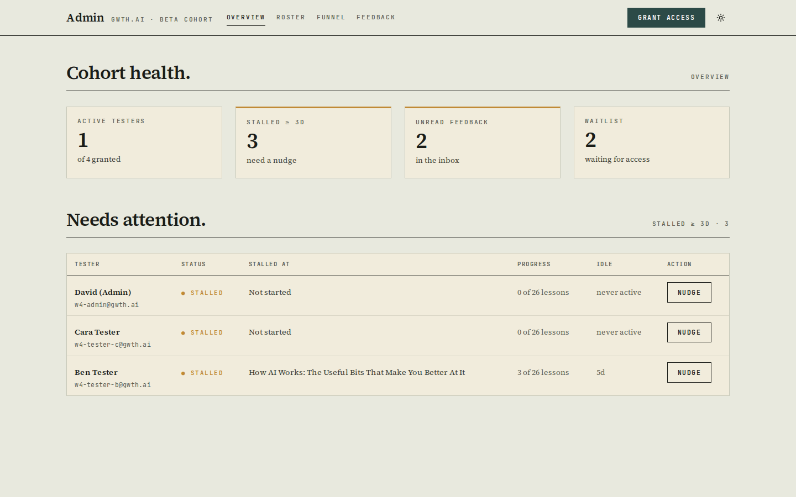
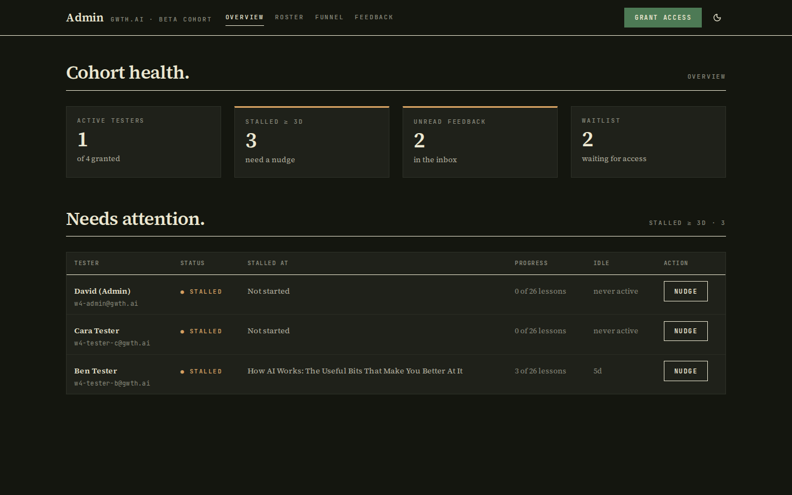

Roster + grant form (all four access states visible), desktop dark / light:

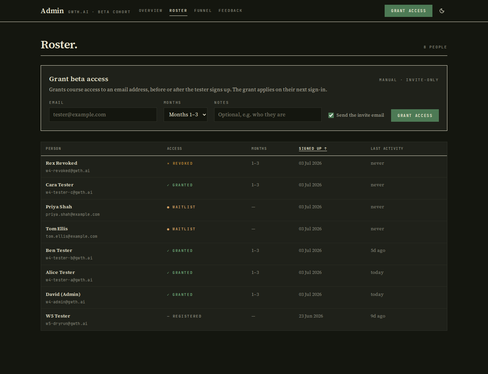
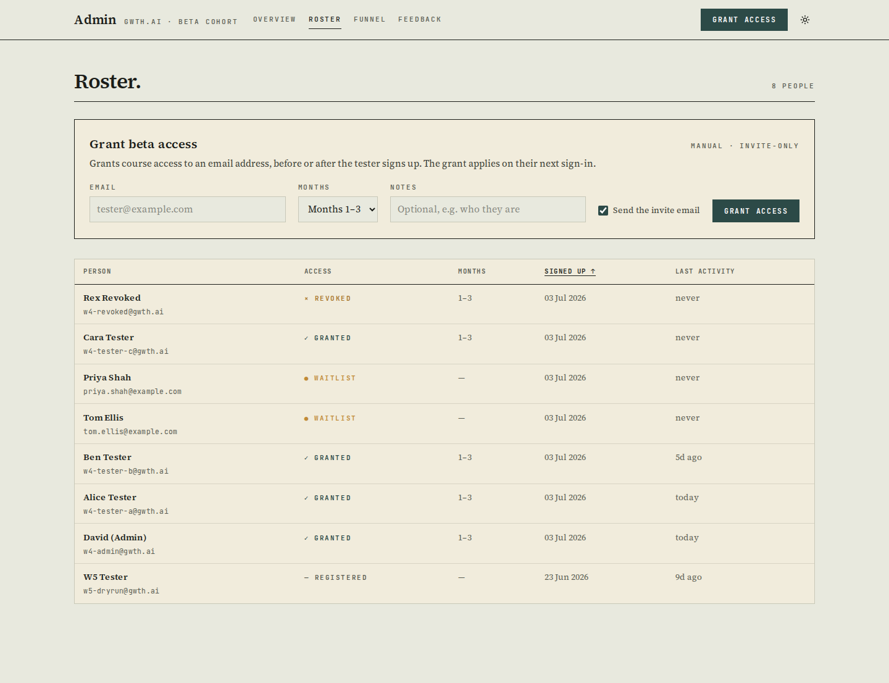

M1 funnel (dash-progress, stall points), desktop light / dark:

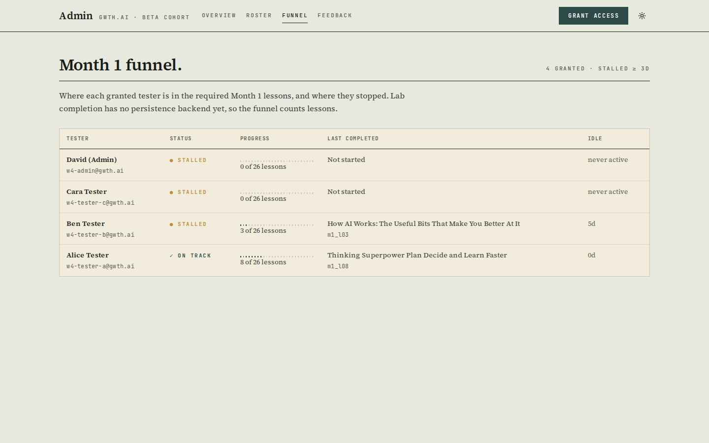
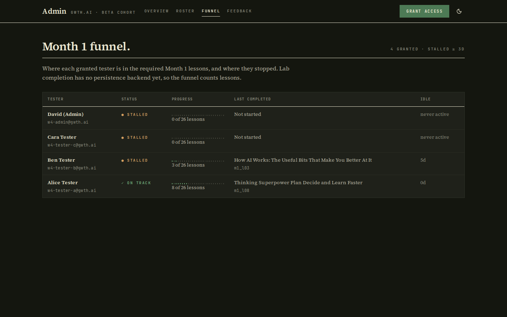

Feedback inbox (unread markers, source page, category), desktop light / dark:

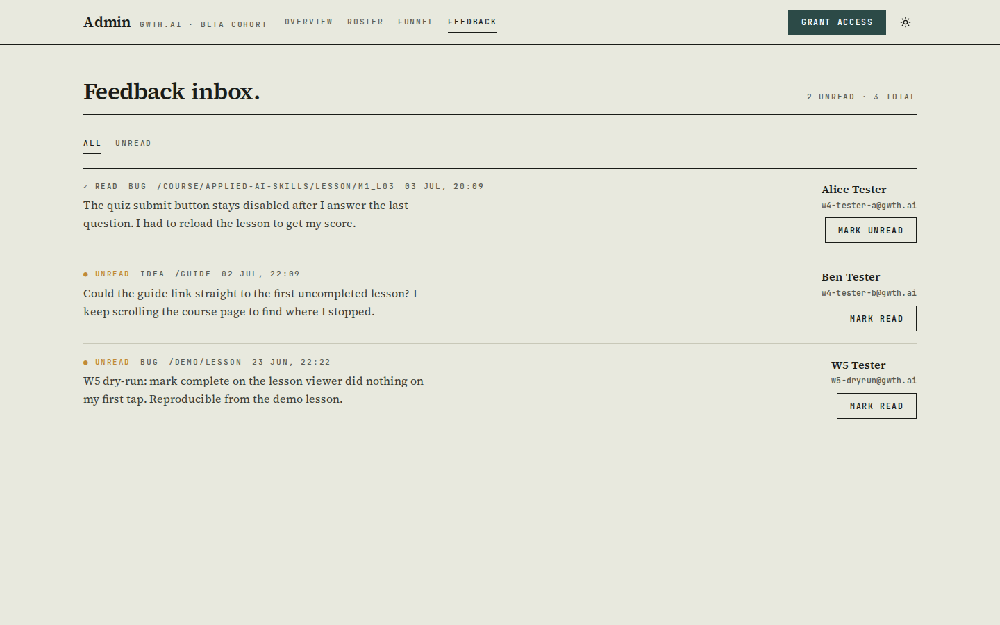
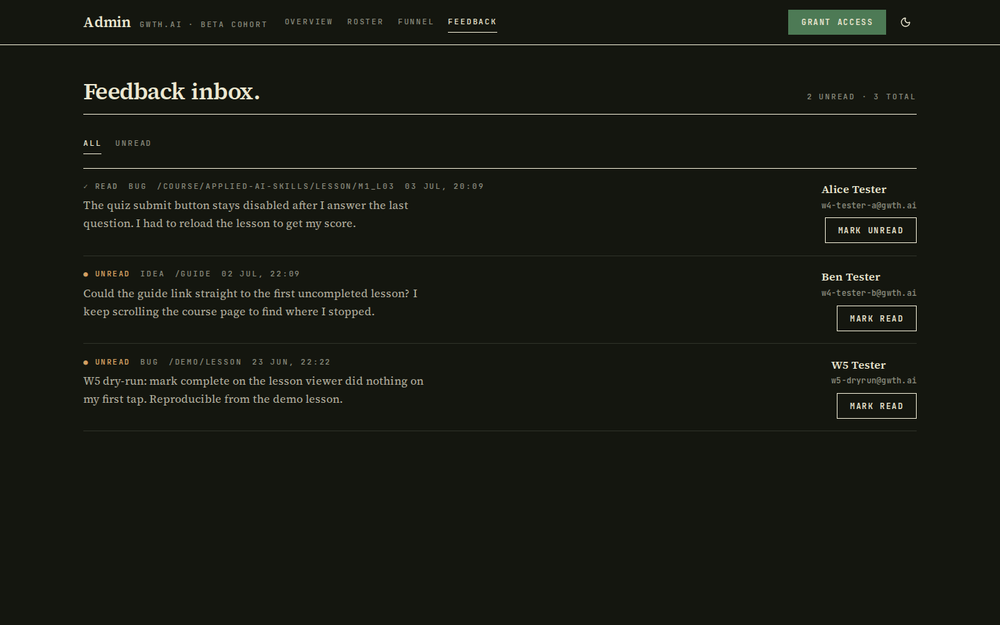

412px (mobile) — overview, roster, funnel, feedback (light; dark twins in
[completion/W4/](W4/)):

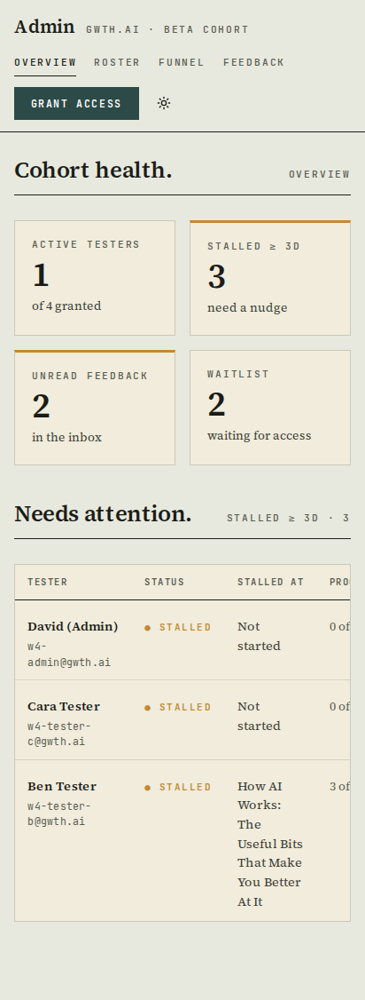
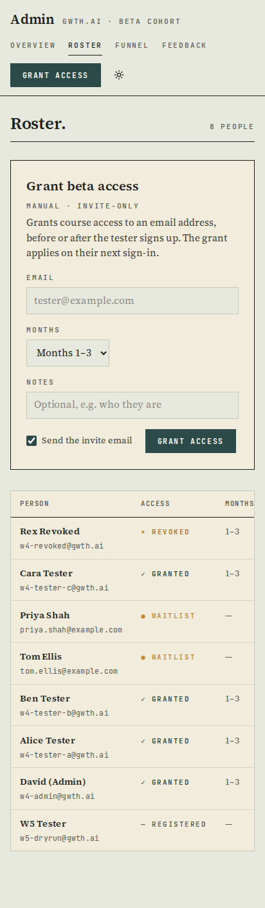
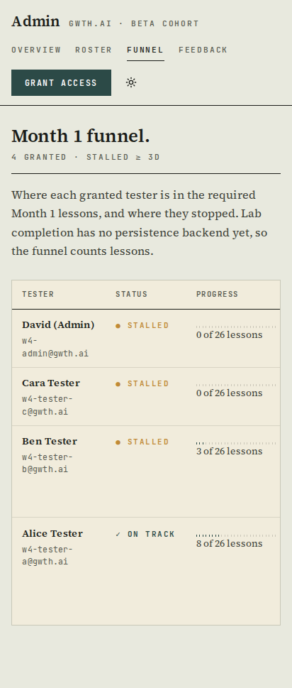
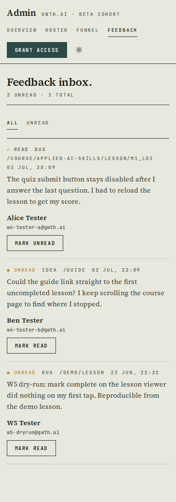

Grant round-trip (form → toast → roster shows `w4-grant-target@example.com`
granted without a manual refresh) and the non-admin redirect landing:

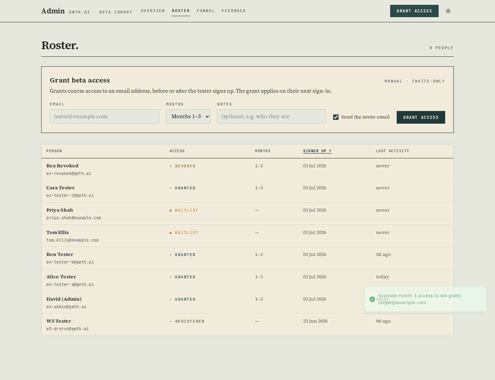
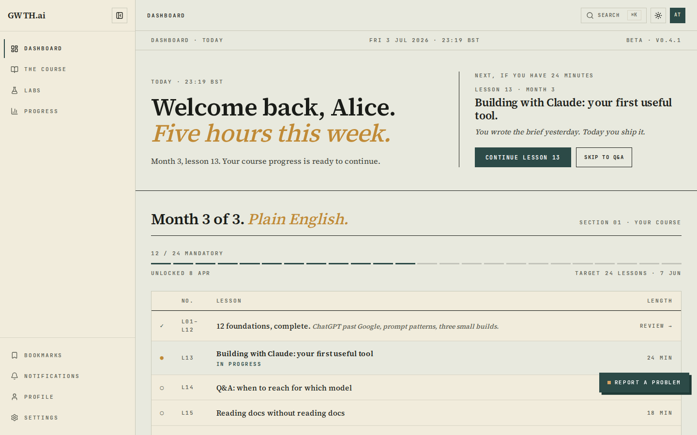

Test it:
- Admin view: sign in at http://192.168.178.50:3001/login as `w4-admin@gwth.ai`
  (password in the seed script note below, or add your own email to
  `ADMIN_EMAILS` in `deploy/secrets.staging.env` and redeploy), then open
  http://192.168.178.50:3001/admin
- Non-admin redirect: sign in as `w4-tester-a@gwth.ai` (same password) and open
  http://192.168.178.50:3001/admin → lands on `/dashboard`
- Seed credentials: `deploy/shot-w4.mjs` + the seed script used
  `Test-W4-Admin-9281!` for all `w4-*@gwth.ai` accounts (staging only)

## Backend / schema

One additive migration — [supabase/migrations/012_feedback_read.sql](../supabase/migrations/012_feedback_read.sql)
(applied to the live `l08k8g` PG 17.10 **and** the dev PG on :5443; Drizzle
column hand-patched per the documented convention). Nullable column + partial
index; no data touched, fully backwards-compatible (W5's insert path is
unchanged — new rows are simply unread). Rollback = drop column + index.

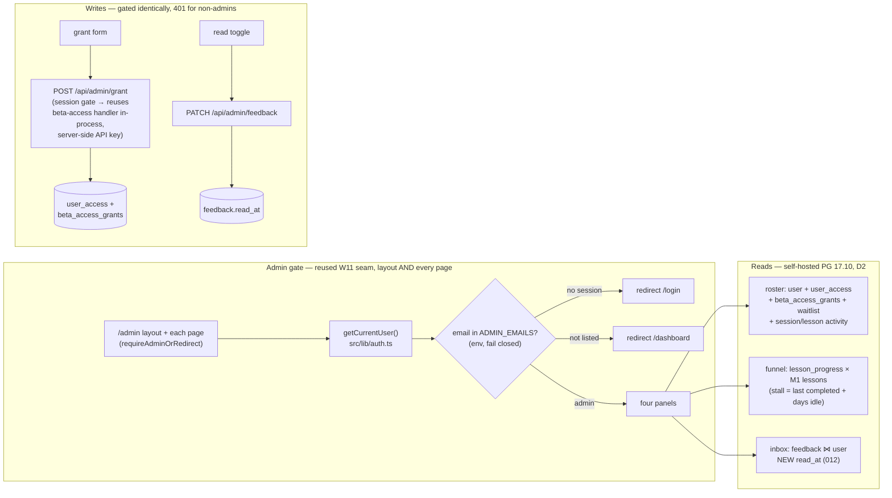

## Verification actually run

- `npm test` — **318 passed, 11 skipped** (46 files; includes new suites:
  allowlist parsing, grant-route gating + key injection, feedback-read gating,
  proxy `/admin` bounce).
- `npm run build` + Docker image rebuild — green (post Tailwind 4.3.2 fix);
  redeployed via `deploy/run-staging.sh` with `ADMIN_EMAILS` added to the SOPS
  secrets.
- `node deploy/shot-w4.mjs` against http://192.168.178.50:3001 —
  **18 passed, 0 failed**: zero console errors across all four pages in
  light+dark × desktop+412; roster/funnel/inbox row counts; grant round-trip
  (toast + roster update, no manual refresh); non-admin → `/dashboard`;
  anonymous → `/login`; API parity (anon PATCH 401, non-admin PATCH 401, anon
  grant 401, admin PATCH 200).
- Raw-stream leak check (curl, no JS): before the per-page gate an anonymous
  `GET /admin` 200-streamed cohort markup alongside the layout's
  `NEXT_REDIRECT`; after the fix the anonymous and non-admin bodies contain
  **zero** cohort strings ("Cohort health", metric markup, tester emails all
  0 matches) while the admin body still renders — re-run:
  `curl -s http://192.168.178.50:3001/admin | grep -c "Cohort health"` → 0.

## What David should verify

- [ ] Open http://192.168.178.50:3001/admin as `w4-admin@gwth.ai` — the
  overview reads at a glance (this doubles as the STEP 1 design sign-off:
  reject via Request changes if the summary-first layout isn't right).
- [ ] Grant a real tester email from the header "Grant access" action (tick
  "send the invite email") and confirm the invite arrives and the roster row
  flips to `✓ granted` without a refresh.
- [ ] On http://192.168.178.50:3001/admin/feedback, mark Alice's quiz bug read,
  reload — the overview's unread count drops to match.

Known limits: lab completion has no persistence table yet, so the funnel counts
lessons only (noted on the page); "last activity" is the later of session
refresh and lesson touch; the seeded `w4-*` accounts are staging-only test data.
