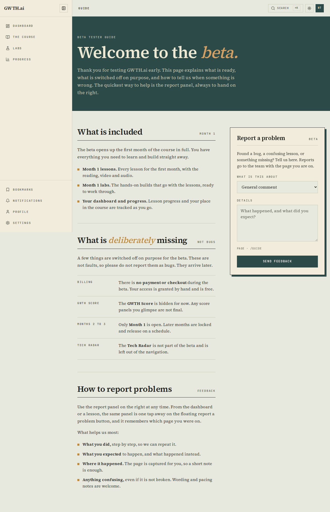
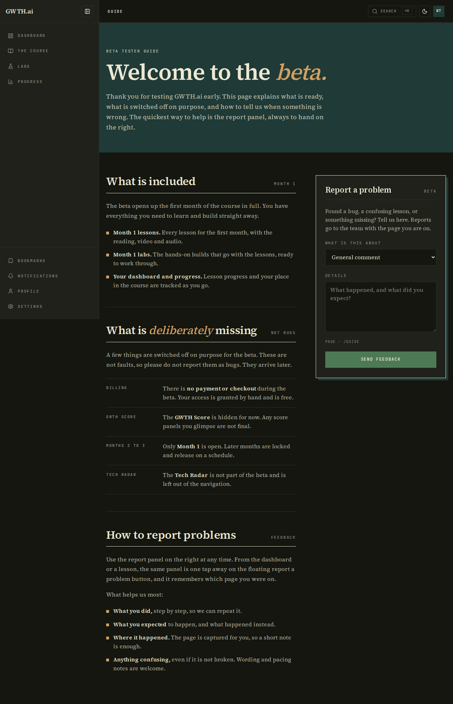
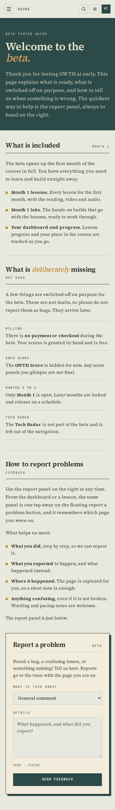
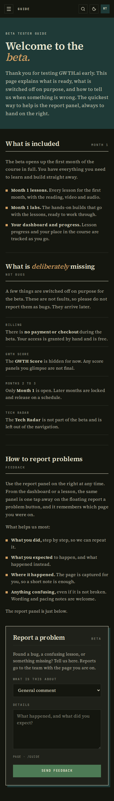
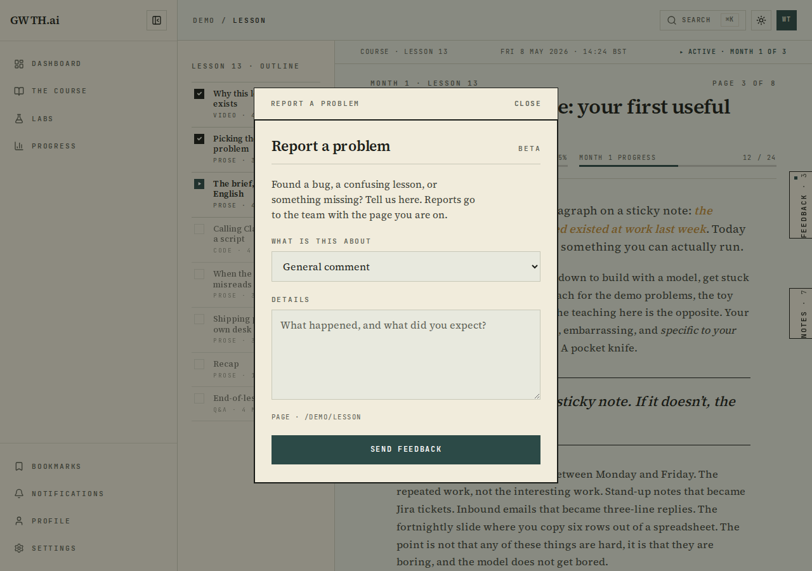
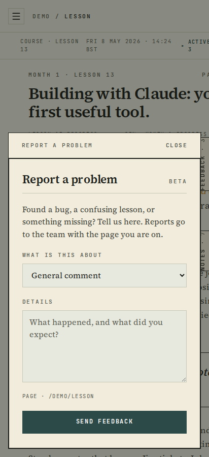
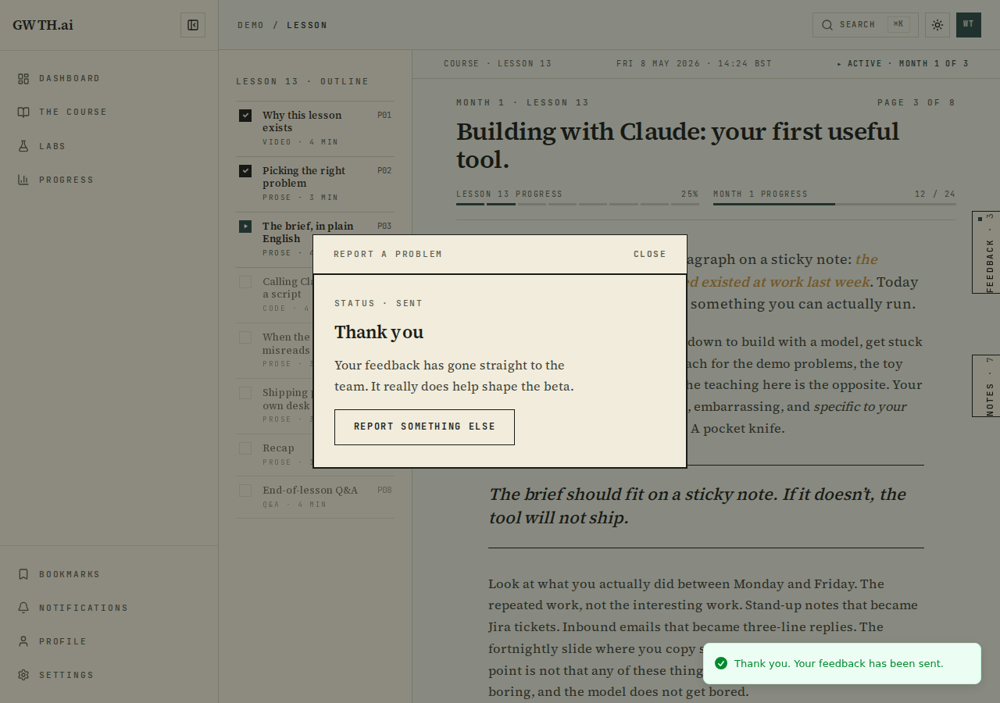
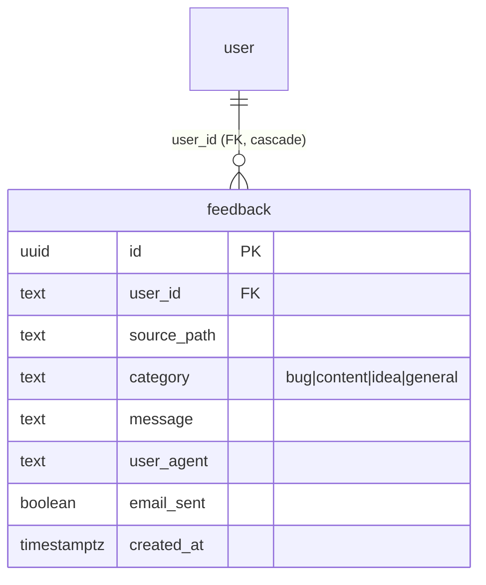

# Completion: W5 — tester onboarding for the gwth.ai beta

**Date:** 2026-06-23 · **Repo:** GWTH_V2 · **Commit(s):** see this packet's commit
**Test URL:** http://192.168.178.50:3001/guide (log in first) · **Status:** verified

## What changed

- **`/guide`** — a new authenticated two-column tester guide (FDE register):
  what the beta includes, what is deliberately switched off (billing, GWTH
  Score, Months 2–3, Tech Radar — so cut features are not reported as bugs), and
  how to report problems, with the **report a problem** panel pinned always-in-view
  on the right (collapses to one column on mobile).
- **Feedback channel** — one `ReportProblemPanel` shown inline on `/guide` and via
  a floating launcher on the dashboard and every lesson (captures the source
  page). Persists to a new Drizzle-backed `feedback` table via `POST /api/feedback`,
  then best-effort emails `david@gwth.ai`. **The row is saved even if Plunk fails.**
- **Grant runbook** — [docs/tester-onboarding.md](../docs/tester-onboarding.md):
  grant (with an opt-in invite email), the emails a tester receives, first-login
  steps, and revoke. Every command tested for real.
- **Security fix** — `/guide` was statically prerendered as public; it is now in
  the proxy's protected paths and `force-dynamic`, so anonymous traffic is
  redirected to `/login`.

## UI

`/guide` — desktop (guide left, report panel with the FDE hard-offset shadow right):




`/guide` — 412px (single column, panel stacked below):




The same panel launched from a lesson (source page captured as `/DEMO/LESSON`),
and the success state:





Test it: log in at http://192.168.178.50:3001/login, then open
http://192.168.178.50:3001/guide and http://192.168.178.50:3001/demo/lesson
(click "report a problem"). Light + dark via the header toggle.

## Backend / data

New `feedback` table (migration `supabase/migrations/011_feedback.sql`,
regenerated into `drizzle/schema.ts` via `drizzle-kit pull`). No RLS (D2);
per-user scoping is enforced in the API. Submission flow:

```mermaid
flowchart LR
  P[ReportProblemPanel<br/>guide / dashboard / lesson] -->|POST /api/feedback| R[route.ts]
  R --> S{Better Auth<br/>session?}
  S -->|no| U[401]
  S -->|yes| C[createFeedback<br/>INSERT row FIRST]
  C --> DB[(feedback table)]
  C --> E[sendPlunkEmail<br/>david@gwth.ai]
  E -->|ok| F[markEmailSent=true]
  E -->|throws or false| K[row kept, emailSent=false]
  F --> DB
```



**Why it is safe:** additive migration only (a new table; no existing table
touched). FK to `public."user"(id)` with `ON DELETE CASCADE`; applied to both the
dev (5443) and staging Coolify Postgres. The beta-access change is purely
additive (opt-in `sendInvite`, default false → existing callers unchanged). The
row-survives-Plunk-failure guarantee is covered by automated tests.

## What David should verify

- [ ] Open http://192.168.178.50:3001/guide (logged in): copy reads right, panel
      sits on the right on desktop and stacks on mobile, light + dark both clean.
- [ ] On http://192.168.178.50:3001/demo/lesson click **report a problem**, send
      one — you should get a "Thank you" and an email at `david@gwth.ai`.
- [ ] Confirm the three onboarding emails landed in `david@gwth.ai` (beta invite,
      email verification, and the feedback notification) — Plunk accepted all three.

## Verification run

```
npx tsc --noEmit                         → exit 0
npx vitest run                           → 296 passed | 11 skipped (45 files)
  src/app/api/feedback/route.test.ts     → 9 passed (incl. Plunk-throws + Plunk-false survive)
npx eslint (new files)                   → exit 0
drizzle-kit pull                         → feedback table regenerated into drizzle/schema.ts

# Dry-run loop (staging :3001)
grant tester (sendInvite:true)           → success:true, inviteSent:true
sign up + verify + log in                → landed on /dashboard
GET /guide anon                          → 307 → /login   (gated)
submit feedback from /demo/lesson (UI)   → "Thank you" + success toast
feedback row in staging Postgres         → source_path=/demo/lesson, email_sent=t
revoke (delete grant + user_access)      → access_rows=0, grant_rows=0, feedback kept=1
```
