# COMPLETION_W6 — gwth.ai is LIVE: pre-flight re-run, cutover deploy, smoke invite sent

**Date:** 2026-07-05 (night run r2) · **Repo:** GWTH_V2 · **Commits:** `40e09b1` (/signup fix, the deployed head), `16b5957` + `ff1607c` (prod verification harnesses + evidence), plus this packet commit
**Test URL:** https://gwth.ai (LIVE) · staging http://192.168.178.50:3001 · **Status:** deployed + verified; invites: smoke SENT, batch READY and HELD on David's list

> Refreshes the morning packet that held at the I3 gate; I3 finished at 100%
> the same evening (board 2026-07-05 19:18 UTC), so this run went all the way:
> full adversarial pre-flight re-run, production cutover deploy, post-deploy
> verification, Month 1 content import to prod, and the one authorized smoke
> invite. Canonical checklist with all evidence:
> [docs/runbook-go-live.md](../docs/runbook-go-live.md).

## What happened (chronological, all 2026-07-05 UTC evening)

1. **Pre-step:** no open W13/W14/W15 gate PRs existed (W13 = PR #36 and
   W14 = PR #35 already merged; W15 on master). The 25 open PRs are nm-trial
   leftovers, dependabot bumps and a kanban demo; nothing merged.
2. **I3 gate re-checked live:** done at 100%. Reproduced: gwth.ai NS on
   Cloudflare (diana/dilbert), site proxied HTTP/2 200, media.gwth.ai serving
   R2 (lesson video 200, 6.2 MB; audio 200, 92.7 MB).
3. **Pre-flight re-run from scratch on staging :3001** (image
   `staging-i3-17bbfae`): vitest 380/0, tsc clean, build clean; browser sweep
   30/0 checks with zero console errors (7 surfaces, light+dark, 1280+412);
   fresh-account UI persistence round-trip (video past 80%, audio, quiz 100%,
   sign-out/sign-in, DB row `is_completed=t`); honest zeros; Stripe 503; dev
   routes 307; OAuth hidden; FDE PASS on 10 surfaces; backups fresh (03:00
   dump, R2 uploaded, dead-man heartbeat 03:30).
4. **Launch blocker found by adversarial re-verification and FIXED
   (`40e09b1`):** `/signup` rendered invite-only copy with NO form, pointing
   at OAuth buttons the W15 guard hides. The invite email sends testers to
   /signup, where they could not register. Fix renders the real registration
   form under the invite-only framing (course access stays grant-gated, so
   the open form does not open the beta). Verified end to end on rebuilt
   staging: grant, UI signup, verify, login, Month 1 access, grant auto-attach.
5. **Prod env finalized:** media CDN vars confirmed set (NEXT_PUBLIC one as a
   build arg); `ENABLE_DEV_MOCK_USER` absent; zero SUPABASE_*;
   **SITE_PASSWORD removed** (decision executed: testers must reach /signup;
   value preserved in SOPS `deploy/secrets.production.env`; site stays
   noindex via robots.txt + meta since ALLOW_INDEXING is unset).
6. **Rollback re-verified BEFORE deploying:** last-known-good image
   `tw0cc8oc0w4scwoccs0cw0go:376d4342…` (the then-running container, healthy)
   plus retained `6eedc7ca…`; the Coolify deployment-history API is empty so
   the image tag is the anchor; full procedure in runbook §6.
7. **DEPLOYED:** Coolify API, queued 19:48:30 UTC, deployment
   `qgk44skg44skoo8ok8oc4c04`, finished 19:51 UTC, commit `40e09b1`.
8. **Post-deploy gap found and fixed:** prod content tables were EMPTY (the
   W3 import only ever ran on staging) so the lesson viewer 404'd. Copied the
   exact verified staging content (1 course / 4 sections / 26 lessons /
   78 quiz questions / 30 labs) in one transaction after a byte-identical
   schema diff. Counts match staging exactly; no user/auth/progress/feedback
   tables touched.
9. **Post-deploy verification GREEN (17/17 checks):** auth round-trip via the
   fixed /signup, real lesson renders and plays from media.gwth.ai, 30 labs,
   feedback form round-trips into the prod DB, dev routes closed, Stripe 503,
   honest zeros, zero console errors.
10. **Smoke invite SENT (the one David authorized):** familyuccelli@gmail.com,
    20:09:48 UTC, Plunk accepted (`inviteSent:true`), grant row in
    `beta_access_grants` (month 1). **Full batch READY and HELD: no tester
    list exists**, so David was Telegrammed (msg 1882) for the list instead
    of inventing one.

## Changed UI + exact test URLs

The only product code change this run is the /signup fix (`40e09b1`):

- **Prod (live):** https://gwth.ai/signup
- **Staging:** http://192.168.178.50:3001/signup

| Desktop (1280) | Mobile (412) |
|---|---|
| 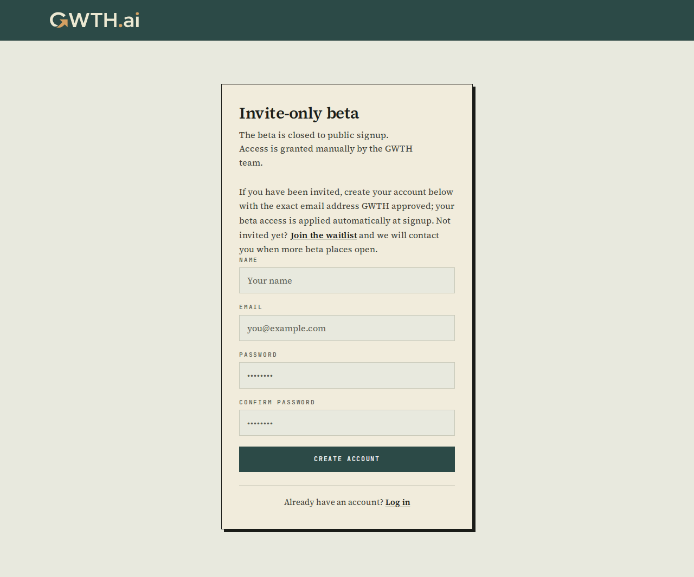 | 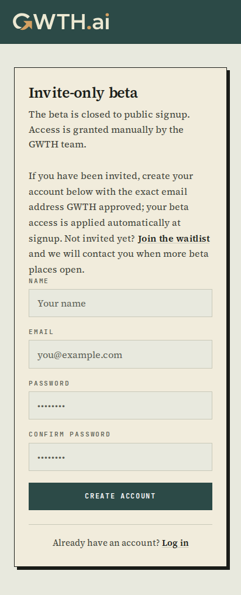 |
| 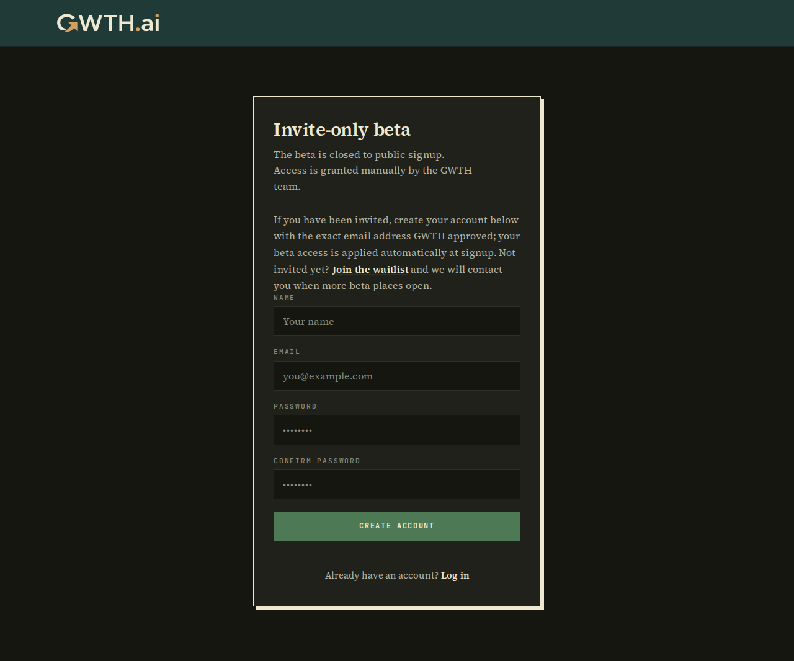 | 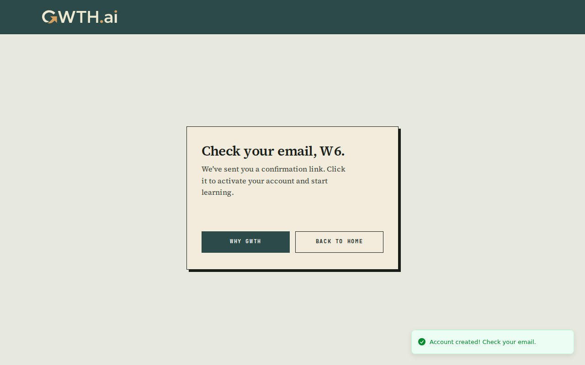 |

Production surfaces after cutover (test URLs: https://gwth.ai, /dashboard,
/course/applied-ai-skills/lesson/welcome-to-gwth-six-ways-ai-can-give-you-superpowers,
/labs/build-your-prompt-cheat-sheet, /guide):

| | |
|---|---|
| 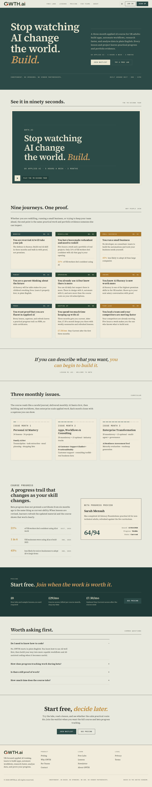 | 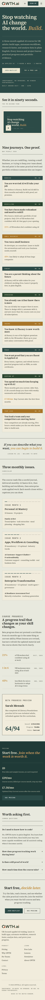 |
|  | 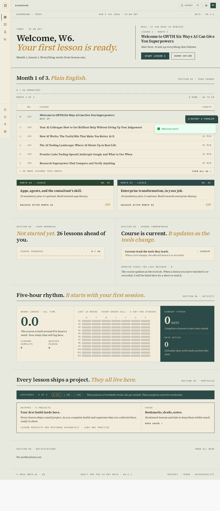 |
| 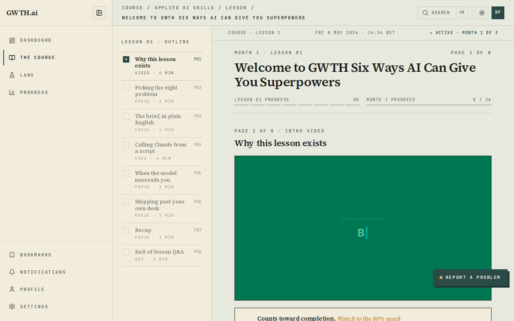 | 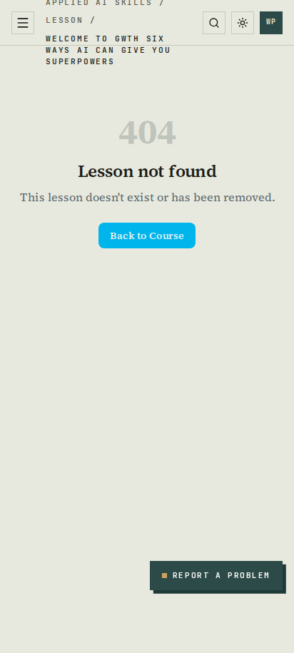 |
| 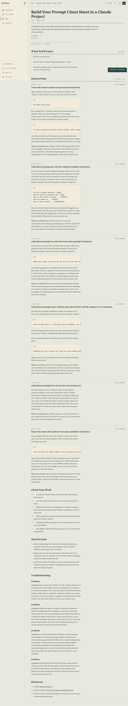 | 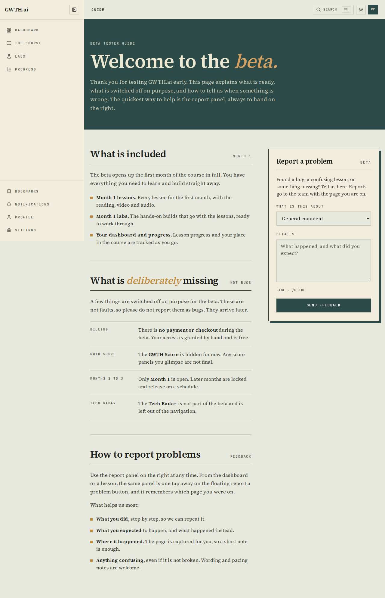 |

Staging pre-flight evidence (fresh this run): the full light/dark x 1280/412
sweep for home/login/dashboard/lesson/lab/guide/admin/progress plus the
persistence round-trip shots live in [completion/W6/](W6/)
(`preflight-sweep.json` 30/0, `preflight-media.json`,
`prod-content-verify.json` 17/17).

## Deploy / rollback path

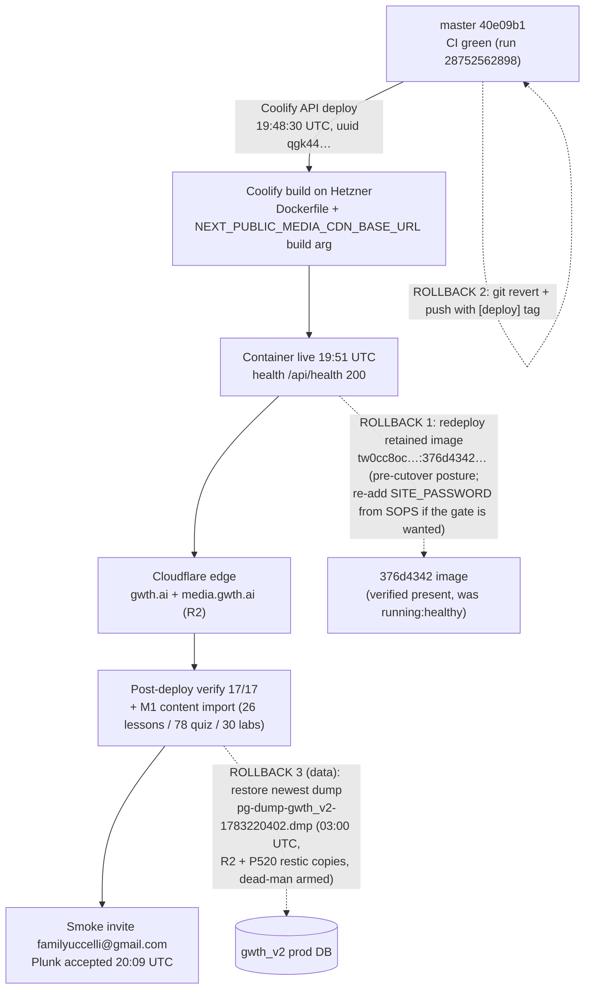

## What David should verify (3 bullets)

- **Open https://gwth.ai in a normal browser:** no password gate, the new FDE
  build serves; /signup shows the "Invite-only beta" panel WITH a working
  registration form (tonight's fix; testers land there from the invite email).
- **Check the familyuccelli@gmail.com inbox:** the smoke invite "You're in:
  your GWTH.ai beta access" should be there (Plunk accepted at 20:09 UTC);
  ideally follow it end to end: sign up with that address, verify email,
  reach the Month 1 lesson and confirm video/audio play from media.gwth.ai.
- **Reply with the beta tester email list** (Telegram msg 1882): the batch is
  one command away (`deploy/testers.txt` + `deploy/invite-testers.sh`) and was
  deliberately NOT invented. Sign-off table: [docs/runbook-go-live.md](../docs/runbook-go-live.md),
  every gate green.

## Known limitations / notes

- Only lesson m1_l01 has produced media; the other 25 lessons show the honest
  "not available yet" state by design (content-production gap, not a site bug).
- OAuth stays hidden until David registers provider apps for https://gwth.ai
  and sets CLIENT_ID/SECRET pairs in the Coolify env (no code change needed).
- The site remains noindex (robots.txt + meta) until ALLOW_INDEXING=1 at
  public launch; the removed SITE_PASSWORD value is preserved in SOPS.
- Prod test artifacts left behind: account w6-prodcheck-1783281150@example.com
  (honest-zero, one test feedback row "W6 post-deploy feedback round-trip
  test"). Delete or ignore.
