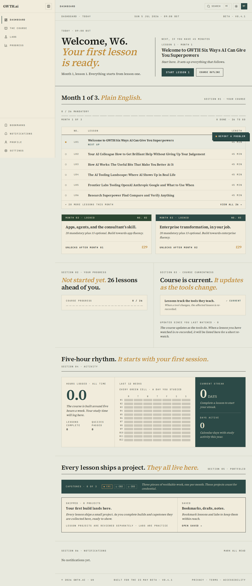
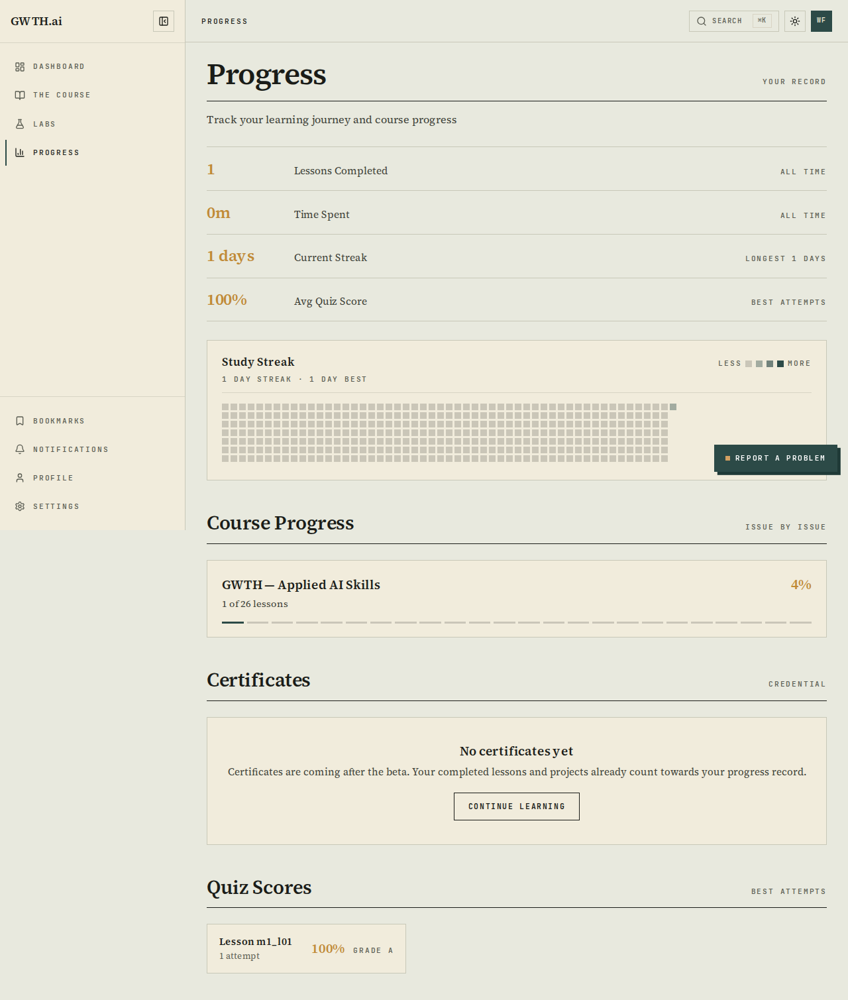
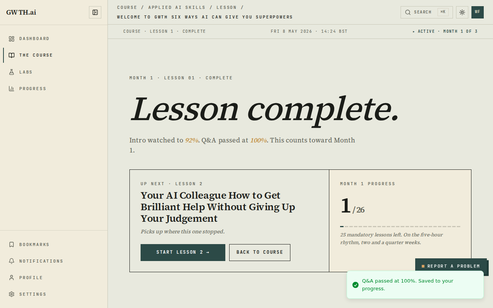
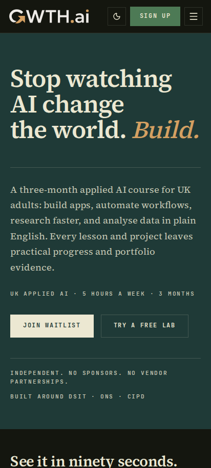
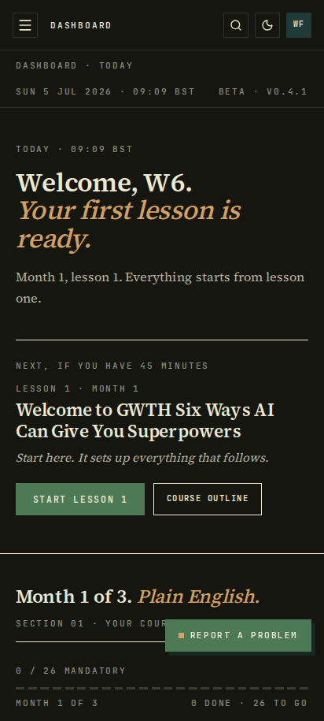
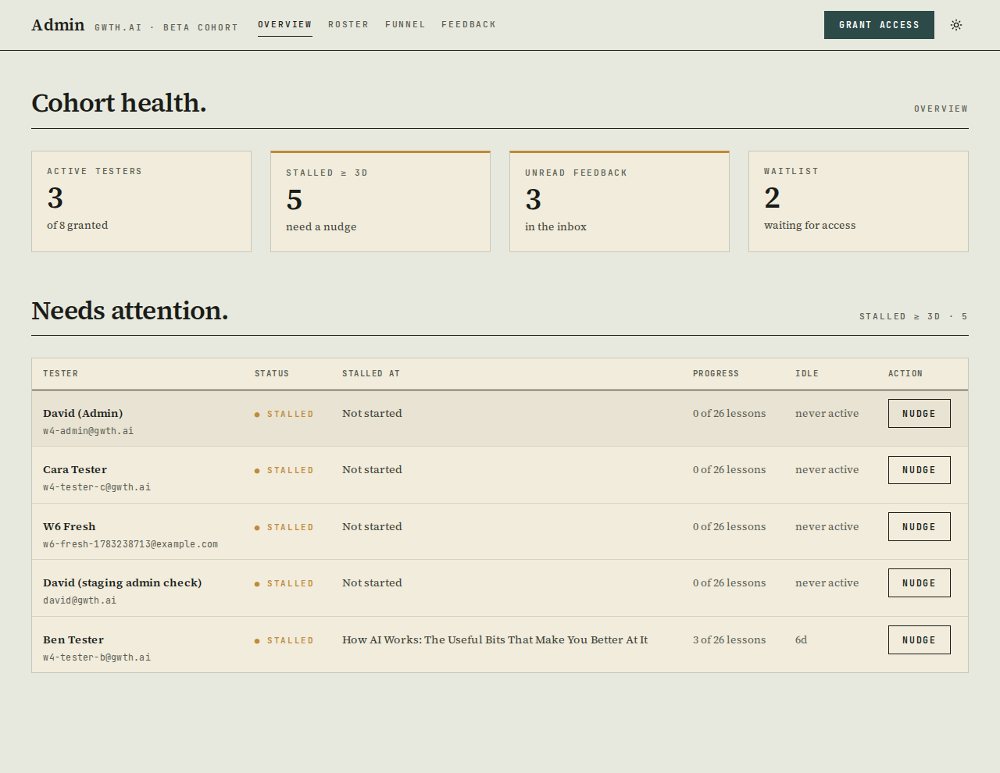
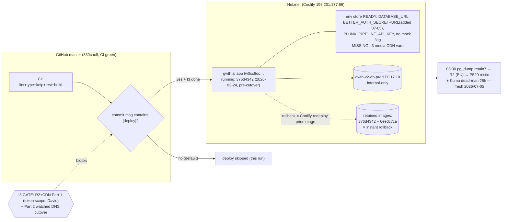

# Completion: W6 — Pre-live checklist + go live on gwth.ai

**Date:** 2026-07-05 · **Repo:** GWTH_V2 · **Commit(s):** `40355be` (green-master fixes + CI deploy gate), `f854e18` (merge PR #36 / W13), `830cac8` (merge PR #35 / W14), plus this packet commit
**Test URL:** http://192.168.178.50:3001 (staging on the exact go-live candidate `830cac8`) · **Status:** verified — **pre-flight fully GREEN; production deploy HELD at the I3 gate**

## What changed (4 bullets)

- **W13 + W14 gate PRs brought green and merged.** Both no-mistakes PRs (#36 real-media lesson viewer, #35 honest-zero progress) had red CI. Root causes fixed on master (`40355be`): the w12-review theme-toggle lint error that had broken EVERY master CI run for days, two ProcessEnv typecheck errors in the W15 tests, and knip failures (beta-dormant components + the I3 pre-cutover R2 client now ignored). Critical catch: **the W13 real-media viewer existed only in PR #36** — master, the W14 branch and the previous :3001 build all still had the demo viewer, despite the board showing W13 done. Merge order (master fixes → PR #36 → PR #35, staging-tree-adjudicated conflict resolutions, plus the `/settings`+`/notifications` force-dynamic cherry-pick that only lived on the staging branch) ended with **master CI fully green on `830cac8`** and the src tree byte-identical to the locally verified merge.
- **CI auto-deploy gated.** `.github/workflows/ci.yml` deployed to Hetzner prod on every green master push; with master newly green mid-I3-hold that was an accidental-prod-deploy footgun. Both deploy jobs now require `[deploy]` in the head commit message (documented in runbook §3).
- **Full pre-flight re-verified on the rebuilt staging** (`gwth-v2:staging-w6-830cac8`): tests 380/0 + build clean (CI + local); 0 console errors across 32 page renders (7 surfaces + /progress, light+dark, 1280+412); W8 cuts (Stripe 503, no checkout CTA, no score widget, invite-only); FDE conformance PASS; the item-5 UI round-trip (real video past 80%, real audio, quiz 100% via clicks, Finish, UI sign-out/sign-in, progress persisted); honest zeros on a brand-new account; 7a/7b/7c/7d all pass. Prod env store confirmed via Coolify API, **BETTER_AUTH_URL was missing and added** (boot-blocker for the cutover deploy); backups spot-checked fresh (2026-07-05 03:00 dump, R2 leg on, dead-man heartbeat); rollback anchor recorded (prod image `376d4342…`, 2026-03-24).
- **Deploy HELD, invites PREPARED AND HELD.** I3 is 55% (Cloudflare token scope blocks Part 1; Part 2 is the watched DNS/edge cutover with David) — prod would serve lesson media from LAN-only :8088 URLs today. Invite pack ready as one action: `deploy/testers.txt` + `deploy/invite-testers.sh`. No invite sent, no DNS touched, no prod deploy executed.

## UI

The go-live candidate on staging — fresh-account honest zeros, the persistence round-trip, and the mobile pass:









Test it: http://192.168.178.50:3001 (all 41 evidence shots + `preflight-*.json` verdicts in `completion/W6/`)

## Backend / infra — deploy and rollback path



What changed and why it is safe: nothing was deployed to production. The only prod-side mutations were additive env-store writes (`BETTER_AUTH_URL=https://gwth.ai`, which the RUNNING container does not read until the next deploy) — everything else was verification. The merged master is the deploy candidate, proven on a staging container built from that exact commit, and rollback is a one-click Coolify redeploy of the retained pre-cutover image.

Open PRs left untouched (not W13/W14/W15 gates): 12 small no-mistakes side PRs (#22-#34: test coverage, a11y nits, PR #31's remotion-typecheck CI change) and 12 dependabot bumps — none blocks go-live; review post-beta.

## What David should verify

- [ ] Open http://192.168.178.50:3001/course/applied-ai-skills/lesson/welcome-to-gwth-six-ways-ai-can-give-you-superpowers — the intro video and audio narration play for a signed-in granted account (the W13 viewer is now on master, not just in a PR).
- [ ] Read [docs/runbook-go-live.md](../docs/runbook-go-live.md) — the sign-off table: pre-flight all green 2026-07-05, HOLD is on I3 only, and two decisions are flagged for you in §2 (`SITE_PASSWORD` on prod would block testers at /signup, and the I3 media CDN vars must be set before the cutover deploy).
- [ ] Confirm the held invite pack does what you want: [deploy/testers.txt](../deploy/testers.txt) + [deploy/invite-testers.sh](../deploy/invite-testers.sh) (grants Month 1 + Plunk invite per email, idempotent, prod API key resolved from Coolify — nothing sent).

## Verification run

```
CI master 830cac8 → success (Lint/Typecheck/Knip/Unit tests/Build; deploy jobs skipped by the new [deploy] gate)
npm test (merged tree) → 380 passed / 13 skipped / 0 failed (54 files)
deploy/shot-w6.mjs PHASE=sweep → 30 pass / 0 fail; console errors: 0 across 32 renders
deploy/shot-w6.mjs PHASE=media → video 85.3/89.5s (>80%), audio plays, quiz 100%, complete surface,
  UI sign-out/sign-in → /progress "1 Lessons Completed · 1 day streak · 100% · 1 of 26"
lesson_progress row → m1_l01 | is_completed=t | progress=1 | quiz_score=100 | intro_video_progress=0.92
Stripe POST /api/stripe/{checkout,webhook,portal} → 503 503 503
dev routes staging → 6x 307→/login ; prod (old build) → 6x 307→/access (no 200s)
Coolify prod env → DATABASE_URL(zo0gk…/gwth_v2), BETTER_AUTH_SECRET, PLUNK, PIPELINE_API_KEY,
  NEXT_PUBLIC_SITE_URL=https://gwth.ai, SITE_PASSWORD(!), ENABLE_DEV_MOCK_USER ABSENT,
  BETTER_AUTH_URL added 2026-07-05
backups → exec #4 success 2026-07-05 03:00 (69,877B), save_s3=true, P520 pull "newest 0h", dead-man heartbeat ok
rollback anchor → image tw0cc8oc…:376d4342… running:healthy (docker ps over ssh hetzner)
gwth.ai → SSL valid (CN=gwth.ai, to 2026-10-02), /api/health healthy
```
