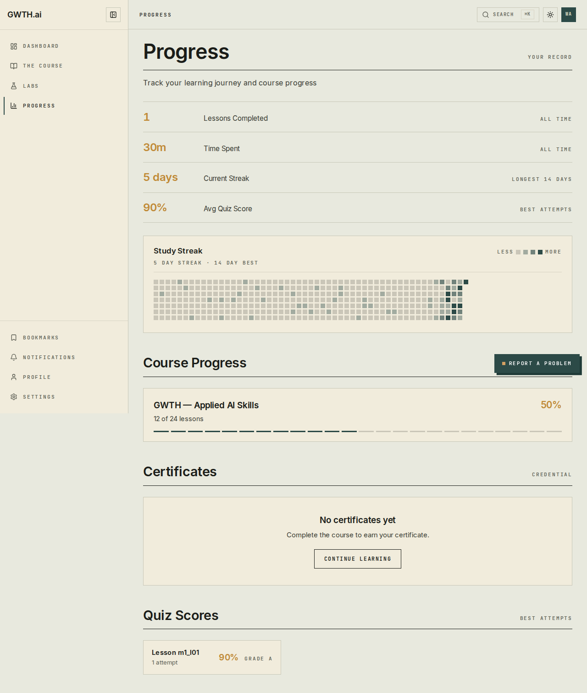
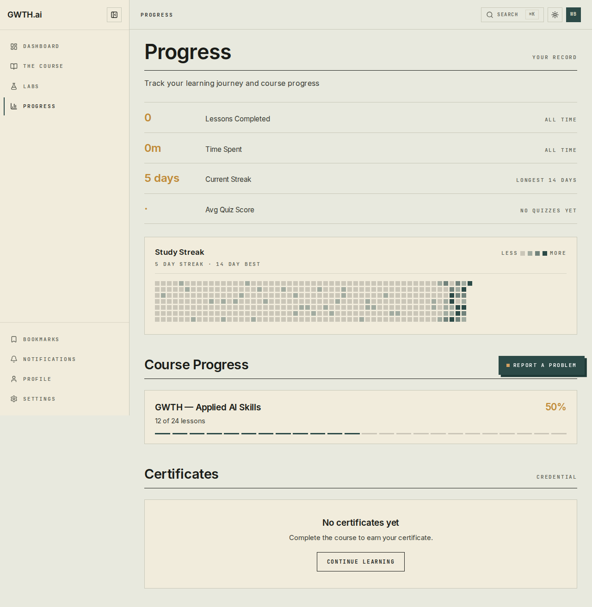
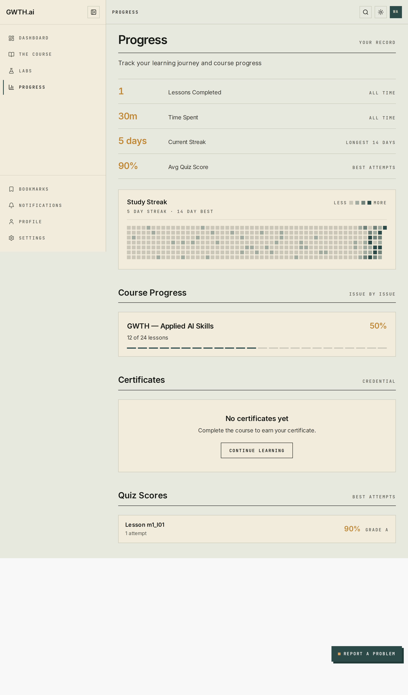
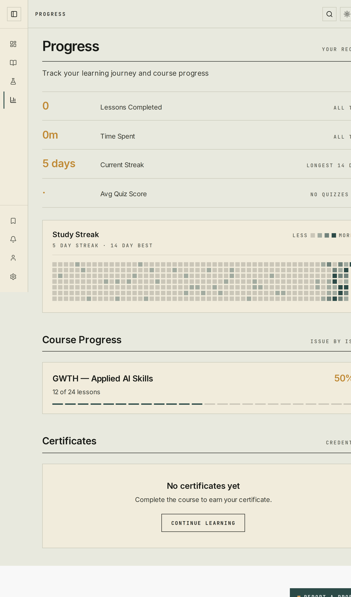

# Completion: W7 — Progress persistence backend (self-hosted Postgres, per-user)

**Date:** 2026-07-01 · **Repo:** GWTH_V2 · **Commit:** `81c6922` (go-live fix); data layer already at `f8cab60`
**Test URL:** http://192.168.178.50:3001/progress · **Status:** verified

The persistence BUILD was already done at `f8cab60` (Drizzle data layer + completion
rule + tests — untouched). This task was the thin go-live slice: confirm the schema is
loaded on the DB the live app actually uses, confirm `DATABASE_URL` is wired, and prove
real per-user progress survives reload / logout-login / container restart against that DB.

## What changed (this task)

- **Schema was already loaded on the live DB.** The running `:3001` app
  (`gwth-v2-w8-beta`) connects to Coolify PG 17.10 **`l08k8gwcscgssgwscoscwo8g`**, which
  already has `lesson_progress` with the correct Better-Auth FK
  `user_id → public."user"(id)` (cascade), `UNIQUE(user_id,lesson_id)`, 0..1 checks and
  indexes — **not** the retired Supabase `auth.users`. `DATABASE_URL` is already injected
  via `deploy/secrets.staging.env` (SOPS), so the app runs in DB mode (mock fallback off).
- **Prod-DB label reconciled.** The task named `p48owokokok0g4048cw4480g` as "prod
  gwth_v2", but that container has an **empty** `gwth_v2` and only a `postgres` role, and
  **nothing points at it**. `l08k8g` is the prod-class DB of record for the live app.
  Fully provisioning `p48owok` for a future public-prod (gwth.ai) cutover is a follow-up:
  it needs W11's auth tables + a role there first (see `drizzle/manual/W7_lesson_progress.sql`).
- **Fixed a latent static-prerender bug that hid all real progress** (the only code
  change): `/progress` and `/dashboard` were being **statically prerendered at build with
  mock data** and served from a shared cache to every user — because `getCurrentUser()`
  short-circuits before reading cookies when `DATABASE_URL` is unset (build time), so Next
  static-optimised these per-user routes. Added `export const dynamic = "force-dynamic"`
  to both so they read the signed-in user's real DB progress per request. Also excluded
  `remotion/` from `tsconfig` (the documented `next build` break). **No data-layer /
  schema / completion-rule / test changes.**

## UI — live `/progress`, real per-user DB data (post-fix, on `:3001`)

**User A** (completed lesson m1_l01, quiz 90%) vs **User B** (nothing) — the two together
are the per-user isolation proof. Same page, same build, different signed-in user.

| | User A (has progress) | User B (isolation) |
|---|---|---|
| Desktop |  |  |
| Mobile |  |  |

A shows **1 Lesson Completed · 30m Time Spent · 90% Avg Quiz Score** and a
**Lesson m1_l01 · 90% · Grade A** row. B shows **0 · 0m · "No quizzes yet"** and no Quiz
Scores section. (Current Streak and the 50% Course Progress bar are still **mock** —
`getStreak()` / `getAllCourseProgress()` have no tables yet; wiring those is a documented
follow-up. W7 persists **lesson** progress only.)

Test it: http://192.168.178.50:3001/progress (dynamic, per-user; `Cache-Control:
private, no-cache` — no shared prerender).

## Backend / infra

```mermaid
flowchart TD
  subgraph app["gwth-v2-w8-beta · :3001 · Next 16 standalone (image gwth-v2:staging-w7build)"]
    P["/progress<br/>force-dynamic (was static-mock)"]
    D["/dashboard<br/>force-dynamic"]
    AU["getCurrentUser()<br/>reads Better Auth session cookie"]
    DL["lib/data/progress.ts<br/>getAllLessonProgress / updateLessonProgress<br/>(scoped by user_id — D2, app-level, NO RLS)"]
  end
  subgraph db["Coolify PG 17.10 · l08k8gwcscgssgwscoscwo8g · db gwth_v2 (internal-only)"]
    U["public.\"user\" (Better Auth, W11)"]
    LP["lesson_progress<br/>user_id → user.id (FK cascade)<br/>lesson_id → lessons.id<br/>UNIQUE(user_id, lesson_id)"]
    L["lessons (m1_l01 … m1_l26)"]
  end
  P --> DL
  D --> AU
  DL --> AU
  AU --> U
  DL -->|"WHERE user_id = current user"| LP
  LP -.FK.-> U
  LP -.FK.-> L
```

**What changed & why it's safe:** no schema/DDL change — the table, FKs and data were
already present and intact (verified live; row survives a Postgres container restart). The
only code change is a render-mode flag on two pages (per-request instead of a shared static
cache) plus a `tsconfig` build exclude — both fully reversible. Rollback is one command:
`IMAGE=gwth-v2:staging-w1build bash deploy/run-staging.sh` (the prior image is retained).
Per-user isolation is app-level (D2, no RLS): every query filters by the authenticated
`user_id`; the FK to `public."user"` guarantees rows can only belong to a real user.

**Prod cutover command (documented):** load the table on a fresh prod DB *after* its
Better-Auth `user` table exists — `docker exec -i <pg> psql -U <role> -d gwth_v2 <
drizzle/manual/W7_lesson_progress.sql` (idempotent; user FK, no RLS).

## What David should verify

- [ ] Open http://192.168.178.50:3001/progress — it renders per request (not a cached
      snapshot); a fresh account shows 0 completed, and completing progress shows only
      *your* rows (the A vs B screenshots above prove isolation).
- [ ] Confirm you accept the **prod-DB reconciliation**: the live app uses `l08k8g`
      (already schema-complete), not the empty `p48owok` named in the brief. Provisioning
      `p48owok` is a gwth.ai-cutover follow-up (needs W11 auth tables there first).
- [ ] Note the two **follow-ups** surfaced: (a) the live FDE lesson viewer is still a
      static mockup — no UI writes progress yet, so students can't *generate* progress
      through the deployed viewer; (b) `/dashboard` streak + course-progress are still mock
      (no tables). Both are out of W7's persistence scope.

## Verification run

```
# 1. Real data layer (write+read+isolation+completion rule) vs the PROD DB l08k8g:
DATABASE_URL=<l08k8g> vitest run completion.test.ts progress.db.test.ts
  → 16 passed (10 completion + 6 DB user-isolation)

# 2. Real write for a real Better Auth user via updateLessonProgress (l08k8g):
  → W7-WRITE-OK user=JjLS… lesson=m1_l01 completed=true best=90
  DB row: m1_l01 | is_completed=t | best_quiz_score=90 | quiz_passed=t | intro_video=0.85 | time_spent=1800

# 3. Deployed app /progress (:3001), per-user + isolation:
  User A → Lessons-Completed=1, Avg Quiz Score 90%, "Lesson m1_l01" row
  User B → Lessons-Completed=0, "No quizzes yet", no m1_l01  (isolation holds)

# 4. Persistence:
  reload            → A completed=1
  logout (session→null) then re-login SAME user → A completed=1
  RESTART pg container l08k8g → row intact (m1_l01 completed=true best=90); app A completed=1

# 5. Build + suite:
  next build → ƒ /progress, ƒ /dashboard (Dynamic; were ○ Static)
  npm test   → 298 passed, 11 skipped (exit 0)  ·  no new Supabase deps (commit = 3 files)
```
