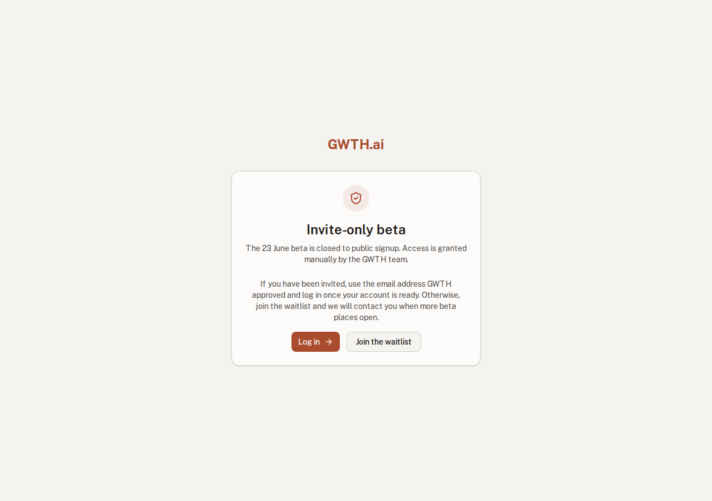
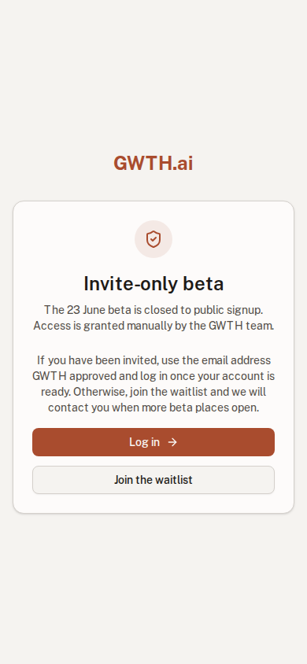
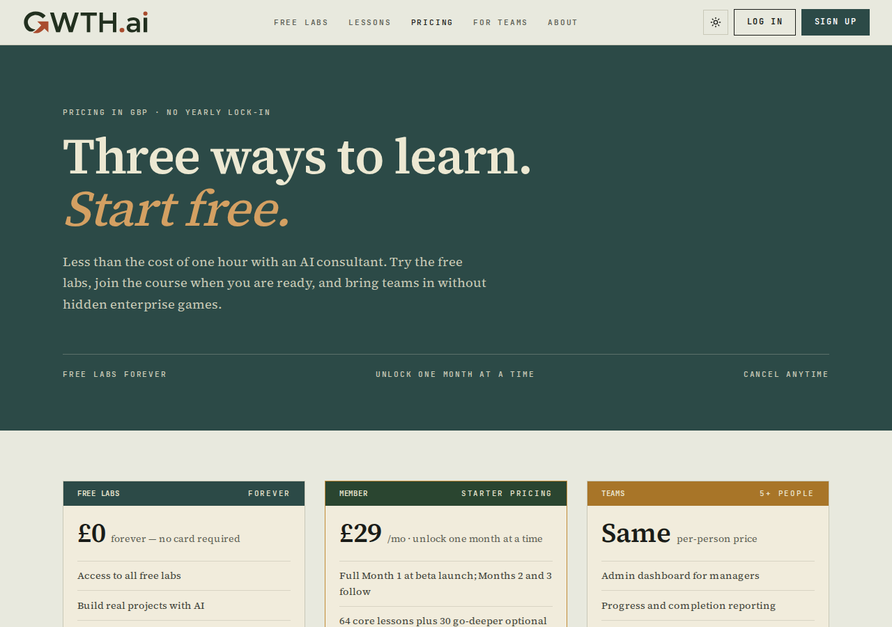
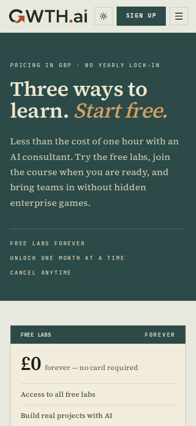

# Completion: W8 — Beta scope sweep (gate signup, disable Stripe, hide GWTH Score)

**Date:** 2026-06-17 · **Repo:** GWTH_V2 · **Commit(s):** `6b2e4f7` (feat(beta): enforce invite-only launch scope)
**Test URL:** http://192.168.178.50:3001/signup · **Status:** verified

The 12 June audit found the repo violating all three beta cuts (public signup, live Stripe, GWTH Score on student surfaces). This task enforces the cuts **without deleting post-beta code** — everything is behind flags that default OFF.

## What changed (3 bullets)
- **Signup gated to invite-only.** `/signup` now shows a waitlist/invite state, not a public form. The only way in is a manual grant (`POST /api/admin/beta-access`) recorded in a `beta_access_grants` allowlist; OAuth first-login only applies access if the email is already granted.
- **Stripe disabled.** A `BILLING_ENABLED` flag defaults OFF; `/api/stripe/checkout`, `/portal`, `/webhook` all return `503 {code:"billing_disabled_for_beta"}`. Pricing copy (£29/mo + £7.50/mo Stay Current) stays; checkout CTAs are gone (waitlist links instead).
- **GWTH Score hidden.** A `GWTH_SCORE_ENABLED` flag defaults OFF; every score render site (hero, dashboard, progress, marketing) falls back to plain progress. `src/lib/progress/gwth-score.ts` + its tests are kept for post-beta.

## UI — the gated state a student sees

### Signup gate (`/signup`)
The public form is gone; the page is an "Invite-only beta" card pointing invited users to log in and everyone else to the waitlist.




Test it: **http://192.168.178.50:3001/signup**

### Pricing (`/pricing`) — copy kept, no checkout button
FDE-skinned pricing with £0 free labs / £29 member / teams tiers and the "unlock one month at a time" + "Cancel anytime · Stay Current £7.50/mo" copy intact. No buy/checkout button anywhere — the CTAs route to the waitlist signup.




Test it: **http://192.168.178.50:3001/pricing**

> GWTH Score hidden is visible on the dashboard preview at http://192.168.178.50:3001/demo/dashboard — the dashboard shows plain "12 / 24 MANDATORY" dash-progress with **no score widget** (captured in the W10 packet, `completion/W10/dashboard-1280.png`).

## Code evidence (cite — the cuts cannot silently re-open)

**Cut 1 — signup gating**
- `src/app/(auth)/signup/page.tsx` + `src/components/auth/signup-form.tsx` — "Invite-only beta · The 23 June beta is closed to public signup. Access is granted manually by the GWTH team." Only CTAs: Log in + Join the waitlist. No account-creation fields.
- `src/app/api/admin/beta-access/route.ts` — `POST` manual grant, API-key authorized (`BETA_ACCESS_API_KEY` / `PIPELINE_API_KEY`), upserts into `beta_access_grants`.
- `src/lib/billing/access.ts` — `isEmailGrantedBetaAccess(email)` returns true only for an active grant; `src/lib/better-auth.ts` OAuth `after`-hook applies access only if `isEmailGrantedBetaAccess(user.email)` — ungranted OAuth accounts are created but denied entry.

**Cut 2 — Stripe disabled**
- `src/lib/config.ts`: `export const ENABLE_BILLING = envFlagEnabled(process.env.BILLING_ENABLED)` — defaults OFF (env unset → false).
- `src/app/api/stripe/{checkout,portal,webhook}/route.ts`: `if (!ENABLE_BILLING) return NextResponse.json(billingDisabledForBetaBody(), { status: 503 })`.
- `src/lib/billing/stripe.ts`: body `{ error: "Billing disabled for beta", code: "billing_disabled_for_beta" }`.
- Pricing copy preserved in `src/components/marketing/data.ts` (£29/mo member, £7.50/mo Stay Current); `pricing-fde.tsx` CTAs link to `/signup` (waitlist), not checkout.

**Cut 3 — GWTH Score hidden**
- `src/lib/config.ts`: `export const ENABLE_GWTH_SCORE = envFlagEnabled(process.env.GWTH_SCORE_ENABLED)` — defaults OFF.
- `src/lib/progress/gwth-score.ts` + `gwth-score.test.ts` **kept** (not deleted).
- Gated render sites fall back to plain progress: `src/components/marketing/hero/hero.tsx`, `src/app/(dashboard)/dashboard/page.tsx` (shows "Course progress  N/total" + Dashes, score-share buttons hidden), `src/app/(dashboard)/progress/page.tsx`, `product-pillars`, `editorial-homepage`.

## What's gated for beta (diagram)
```mermaid
flowchart TD
  subgraph SIGNUP["Signup — invite-only"]
    A["/signup public form"] -->|removed| B["Invite-only / waitlist card"]
    G["POST /api/admin/beta-access"] --> H[(beta_access_grants allowlist)]
    O["OAuth first login"] -->|email in allowlist?| H
    O -->|not granted| X["account created, access denied"]
  end
  subgraph BILLING["Stripe — BILLING_ENABLED=off"]
    C["/api/stripe/checkout"] --> R503["503 billing_disabled_for_beta"]
    P["/api/stripe/portal"] --> R503
    W["/api/stripe/webhook"] --> R503
    PR["/pricing copy £29 / £7.50"] -->|CTA| WL["waitlist signup, no checkout"]
  end
  subgraph SCORE["GWTH Score — GWTH_SCORE_ENABLED=off"]
    S["score widget (hero/dashboard/progress)"] -->|flag off| PP["plain progress display"]
    SRC["gwth-score.ts + tests"] -.kept for post-beta.-> SCORE
  end
```
**Why it is safe:** nothing is deleted — `gwth-score.ts`, the Stripe routes, and the score widgets all remain in the tree, hidden behind flags that default OFF. Flipping `BILLING_ENABLED` / `GWTH_SCORE_ENABLED` on (post-beta) restores them with zero code change. The 503 does not rely on the keys being absent — it is an explicit flag check, so the gate holds even if env keys reappear.

## What David should verify
- [ ] Open http://192.168.178.50:3001/signup — confirm the "Invite-only beta" card (no email/password form, only Log in + Join the waitlist).
- [ ] Open http://192.168.178.50:3001/pricing — confirm the £29 / £7.50 copy is intact and there is **no** checkout/buy button.
- [ ] Open http://192.168.178.50:3001/demo/dashboard — confirm plain "12/24 mandatory" progress and **no GWTH Score** widget.

## Verification run
```
git log --oneline -- src/app/api/admin/beta-access/route.ts src/app/api/stripe ...
  → 6b2e4f7 feat(beta): enforce invite-only launch scope
curl /signup  → 200   |  curl /pricing → 200   |  curl /demo/dashboard → 200
Targeted vitest (run by recon subagent):
  src/components/auth/signup-form.test.tsx   → 3 passed (invite-only messaging, no account fields)
  src/lib/billing/access.test.ts             → 10 passed (incl. checkout/portal/webhook → 503 billing_disabled_for_beta)
  src/lib/progress/gwth-score.test.ts        → 3 passed (score logic kept)
  src/components/marketing/hero/hero.test.tsx→ 5 passed (incl. "hides post-beta score device by default")
  Total: 16 passed
npx playwright screenshot → signup-gate-{1280,390}.png, pricing-{1280,390}.png (real renders, embedded above)
```

---
*GitHub blob (after push):*
```
https://github.com/David-ACG/gwth-v2/blob/master/completion/COMPLETION_W8.md
```
