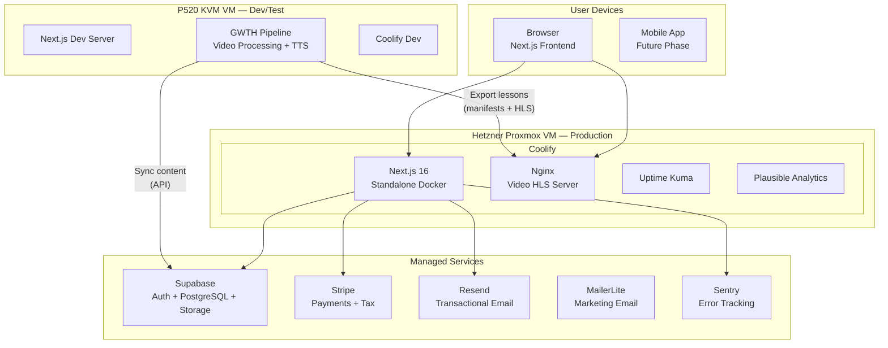
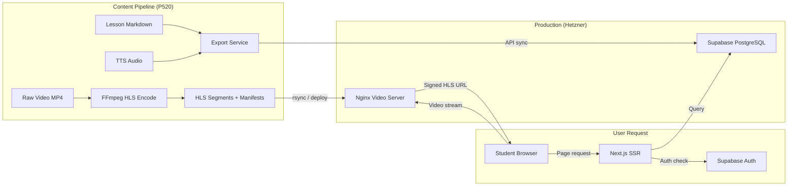
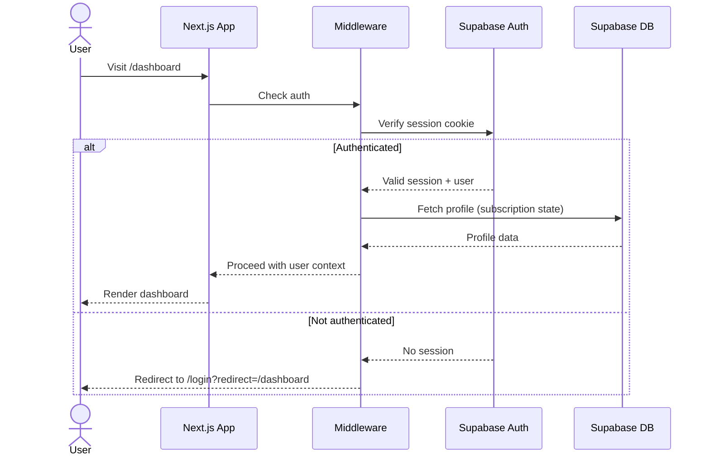
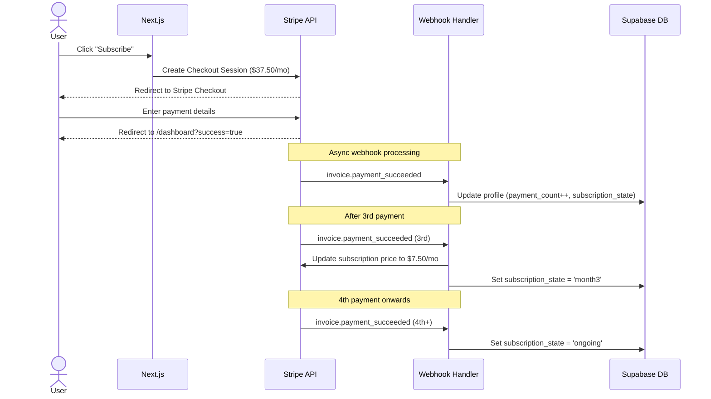

# GWTH v2 — Architecture Plan

> The complete backend architecture for the GWTH student learning platform.
> Complements the [Design Requirements](../design-requirements.md) (frontend spec) and [CLAUDE.md](../../CLAUDE.md) (project conventions).
>
> Last updated: 2026-02-19

---

## Table of Contents

1. [Architecture Principles](#1-architecture-principles)
2. [Technology Stack Summary](#2-technology-stack-summary)
3. [System Architecture](#3-system-architecture)
4. [Key Architectural Decisions](#4-key-architectural-decisions)
5. [Answers to Strategic Questions](#5-answers-to-strategic-questions)
6. [Related Documents](#6-related-documents)

---

## 1. Architecture Principles

Ordered by priority (from the founder's requirements):

| # | Principle | What It Means in Practice |
|---|-----------|--------------------------|
| 1 | **Extremely robust** | Battle-tested libraries. Error boundaries everywhere. Graceful degradation. No single points of failure. |
| 2 | **AI-coding native** | Every service must work exceptionally well with Claude Code and Claude. MCP servers where available. Excellent documentation that AI models can reason about. We teach this stack in the course — it must be a model of AI-assisted development. |
| 3 | **Fast** | Sub-2.5s LCP. HLS adaptive streaming for video. CDN for static assets. Server in Germany for UK/EU audience. |
| 4 | **Good value** | Under £50/month additional infrastructure cost at launch. Free tiers where possible. Self-host when the value proposition of managed services is unclear. |
| 5 | **Secure** | GDPR-compliant. Encrypted at rest and in transit. Row-level security on all user data. Signed URLs for video content. No secrets in code. |
| 6 | **Beautiful** | The frontend (already built) handles this. Backend must not constrain the frontend — fast APIs, real-time capabilities, flexible data model. |

### AI-Coding Requirement

This is both a development principle and a business requirement. GWTH teaches people to build with AI. The tools we use to build GWTH must be the same tools we recommend in the course. Every technology choice must satisfy:

- **Claude Code compatibility** — well-documented, widely adopted, extensive training data
- **MCP integration** — official or high-quality community MCP server, or a clean API that Claude Code can interact with via Bash/HTTP
- **Documentation quality** — comprehensive, up-to-date docs that AI models can reference

---

## 2. Technology Stack Summary

| Layer | Technology | MCP Server | Monthly Cost | Phase |
|-------|-----------|------------|-------------|-------|
| **Frontend** | Next.js 16, React 19, Tailwind v4, shadcn/ui | N/A (built-in) | Free | Done |
| **Auth** | Supabase Auth | Yes (`@supabase/mcp`) | Free tier | Phase 2 |
| **Database** | Supabase PostgreSQL | Yes (`@supabase/mcp`) | Free → $25 | Phase 2 |
| **File Storage** | Supabase Storage | Yes (`@supabase/mcp`) | Free (1 GB) | Phase 2 |
| **ORM/Queries** | Supabase JS client + generated types | Via Supabase MCP | Free | Phase 2 |
| **Payments** | Stripe | Yes (`stripe/agent-toolkit`) | Tx fees only | Phase 2 |
| **Video Delivery** | Self-hosted HLS (FFmpeg + Nginx) | N/A | Free | Phase 2 |
| **Video CDN** | Bunny CDN | No | ~£1-5 | Phase 3 |
| **Email (transactional)** | Resend | No (clean REST API) | Free (3,000/mo) | Phase 2 |
| **Email (marketing)** | MailerLite | No (clean REST API) | Free (<1,000 subs) | Phase 2 |
| **Error Tracking** | Sentry | Yes (`@sentry/mcp-server`) | Free (5K events) | Phase 2 |
| **Uptime Monitoring** | Uptime Kuma (self-hosted) | No | Free | Phase 2 |
| **Analytics** | Plausible (self-hosted) | No | Free | Phase 2 |
| **CI/CD** | GitHub Actions + Coolify webhooks | Yes (GitHub built-in) | Free (2,000 min) | Done |
| **Project Management** | Linear | Yes (`@linear/sdk`) | Free tier | Now |
| **Deployment** | Coolify (self-hosted) | No | Free | Done |

**MCP-enabled core services:** Supabase (auth + DB + storage), Stripe, Sentry, Linear, GitHub — 5 services with direct Claude Code integration.

---

## 3. System Architecture

### 3.1 High-Level Architecture

### 3.2 Data Flow

### 3.3 Authentication Flow

### 3.4 Payment Flow

---

## 4. Key Architectural Decisions

### 4.1 Supabase as the Core Backend (Auth + DB + Storage)

**Decision:** Use Supabase as a unified backend-as-a-service rather than assembling separate services (Auth.js + Prisma + MinIO).

**Why:**
- **One MCP for three services.** The Supabase MCP lets Claude Code manage auth, database, and storage from a single integration. This is a significant productivity multiplier for AI-assisted development.
- **Row Level Security.** RLS policies enforce access control at the database level — a user literally cannot read another user's notes or progress, even if there's a bug in the application code.
- **Type generation.** `supabase gen types typescript` auto-generates TypeScript types from the database schema, keeping the frontend in sync without manual type definitions.
- **Migration path.** Supabase is open-source. If costs become prohibitive, the entire stack can be self-hosted via Docker (Supabase provides `docker-compose` for self-hosting).
- **Course alignment.** Supabase is one of the most popular tools for AI-assisted app building. Teaching it in the course is natural.

**Alternatives considered:**
- **Auth.js v5 + Prisma + MinIO:** More flexible, no vendor lock-in, but three separate tools to configure and maintain. No unified MCP. More setup time.
- **Neon (database only) + Auth.js + S3:** Neon has its own MCP, but you'd still need separate auth and storage solutions.

**Risks and mitigations:**
- *Vendor lock-in:* Mitigated by keeping the `lib/data/` abstraction layer. All Supabase queries are in `lib/data/*.ts` files — never in components. Swapping to Prisma requires changing only the data layer.
- *Free tier limits (500 MB):* Sufficient for 5,000 users. Course content is in the filesystem (video) and markdown (synced from pipeline). Database stores user data, progress, and metadata — not content.

### 4.2 Self-Hosted HLS Video (Not a Managed Platform)

**Decision:** Encode videos to HLS on the P520 pipeline, deploy HLS segments to Hetzner, serve via Nginx with signed URLs.

**Why:**
- **£0/month.** Within the £50 budget. Managed platforms (Mux at ~$42/month for 8,000 minutes, Cloudflare Stream at ~$42/month) would consume almost the entire infrastructure budget.
- **Pipeline integration.** The P520 pipeline already uses FFmpeg. Adding HLS encoding is a natural extension (a few FFmpeg flags).
- **"Good enough" protection.** Signed URLs + CORS + no download button prevents casual copying. Not DRM, but adequate for the threat model.
- **UK/EU latency.** Server in Germany. Acceptable latency for UK/EU audience.

**Disk:** Both servers have 3.6 TB, with up to 2 TB allocatable. All 3 qualities (480p + 720p + 1080p) = ~720 GB, fitting comfortably from day one.

**Growth path:**
1. **Phase 2 (launch):** Self-hosted HLS on Hetzner with all 3 quality levels.
2. **Phase 3 (>1,000 users):** Add Bunny CDN (~£1-5/month) in front for edge caching.
3. **Phase 4 (global/mobile):** Evaluate Bunny Stream or Mux when revenue justifies it and mobile app needs a native SDK.

### 4.3 Stripe for Payments with Smart Retries

**Decision:** Stripe UK entity, charging in USD, with Stripe Tax and Stripe's built-in dunning for payment failures.

**Why:**
- **Most robust payment processor.** Handles the $37.50 × 3 → $7.50 ongoing pricing model cleanly.
- **Stripe MCP available.** Claude Code can interact with Stripe's API directly.
- **Stripe Tax.** Already used on v1. Handles VAT automatically. 0.5% per transaction is reasonable.
- **Smart Retries.** Stripe retries failed payments on optimal days using ML. Configure the retry window to 14 days to match the grace period.
- **No cheaper alternative.** Paddle/LemonSqueezy handle EU VAT as merchant of record but take a larger cut (5-8%) and have worse developer experience.

**Implementation approach:**
- Create subscription at $37.50/month via Stripe Checkout
- Track `payment_count` in the database, incremented by `invoice.payment_succeeded` webhook
- After 3rd successful payment, update subscription price to $7.50/month via API
- Map `payment_count` to `subscription_state`: 1→month1, 2→month2, 3→month3, 4+→ongoing
- Grace period: Stripe marks subscription as `past_due` on payment failure. After 14 days, cancel and set `subscription_state` to `lapsed`.

### 4.4 Resend for Transactional Email + MailerLite for Marketing

**Decision:** Split email into two providers optimised for their use case.

**Why:**
- **Resend:** React Email templates (JSX-based email authoring that integrates with the Next.js codebase), excellent deliverability, clean API. Free tier: 3,000 emails/month (covers password resets, payment receipts, study reminders for <500 active users).
- **MailerLite:** Purpose-built for newsletters and nurture sequences. Visual editor for marketing emails. Free tier: 1,000 subscribers, 12,000 emails/month. Already referenced in the existing `.env.local.example`.

**Alternatives considered:**
- **MailerSend** (also in `.env.local.example`): Good but Resend has better DX for developers using AI coding (JSX templates vs. HTML templates).
- **Postmark:** Excellent deliverability but no free tier.
- **Single provider for both:** Possible with Resend (it can do marketing too), but MailerLite's visual editor is better for crafting marketing campaigns.

---

## 5. Answers to Strategic Questions

### Q1: Should I use streaming for video?

**Yes. Use HLS streaming with signed URLs.**

Self-hosted on Hetzner, encoded by the P520 pipeline via FFmpeg. This gives you:
- **Adaptive bitrate** — 480p/720p/1080p variants, player auto-selects based on connection
- **Casual copy protection** — signed URLs expire after 4 hours, CORS restricts to your domain, no download button
- **Mobile-ready** — HLS is the native streaming format for iOS/Safari. When you build the mobile app, the same HLS streams work natively
- **£0/month** — no video platform fees

**What this does NOT do:** prevent someone with developer tools from downloading segments. For that, you'd need Widevine/FairPlay DRM (Mux or Bitmovin), which starts at ~$100+/month. Not justified at this stage.

### Q2: Should I use CodeRabbit?

**No. Not at this stage.**

You're a solo developer using Claude Code, which already provides AI code review. CodeRabbit ($12/month) adds a second AI reviewer on GitHub PRs. The marginal value for a solo developer is low:
- Claude Code catches issues during development (before the PR)
- ESLint + TypeScript strict mode catch static issues
- Vitest + Playwright catch runtime issues

**When to reconsider:** If you add a second developer, CodeRabbit becomes valuable as a consistent PR reviewer that catches things humans miss. At that point, $12/month is justified.

**Free alternative:** GitHub's built-in code scanning (CodeQL) for security vulnerabilities. Enable it in the repo settings — it's free for public and private repos.

### Q3: Should I use Linear?

**Yes. Continue using Linear on the free tier.**

You're already using it, found it helpful for prioritisation, and it has an MCP server for Claude Code integration. The free tier covers solo development. Benefits:
- **Structured work tracking** — epics for architecture phases, issues for individual tasks
- **Linear MCP** — Claude Code can read/create issues, which means your AI assistant understands your project backlog
- **Audit trail** — when things go wrong, you can trace decisions back to the issue that spawned them
- **Course alignment** — Linear is a tool you can recommend in the GWTH course for AI-assisted project management

---

## 6. Related Documents

| Document | What It Covers |
|----------|---------------|
| [Technology Decisions](./technology-decisions.md) | Detailed rationale for every technology choice, alternatives considered, MCP availability |
| [Infrastructure & Deployment](./infrastructure-and-deployment.md) | Server topology, VM configuration, Coolify setup, networking, backups, monitoring |
| [Implementation Roadmap](./implementation-roadmap.md) | Phased rollout plan with cost projections at each phase |
| [Design Requirements](../design-requirements.md) | Frontend spec — pages, components, user flows, content model |
| [CLAUDE.md](../../CLAUDE.md) | Project conventions, coding standards, design system |
