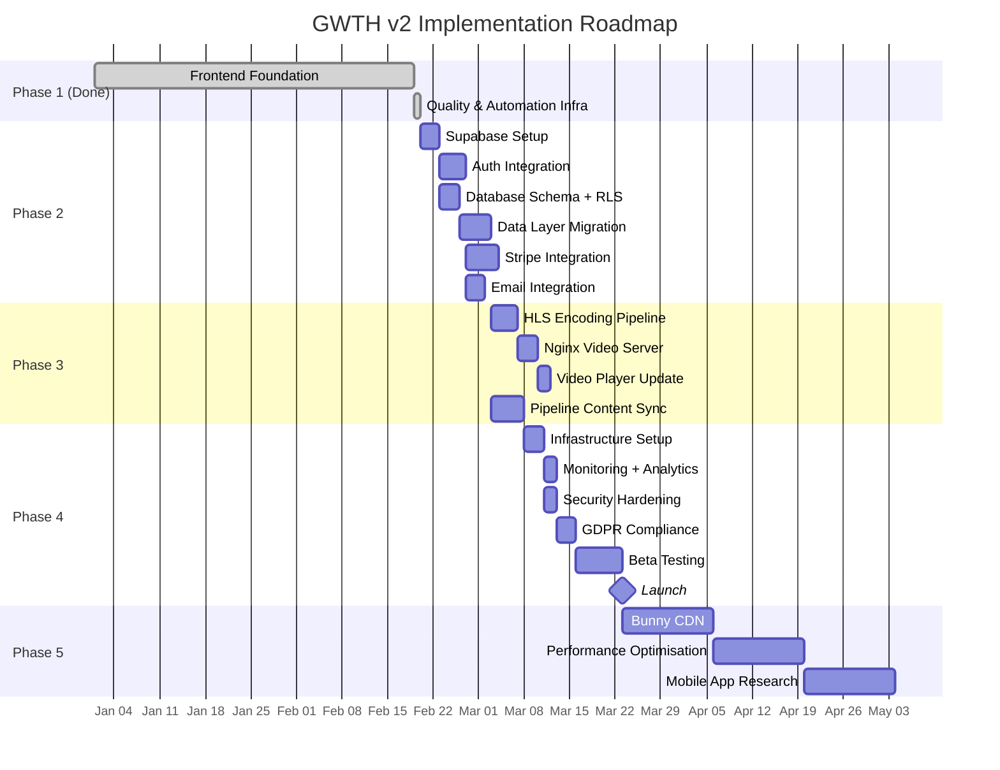

# Implementation Roadmap

> Phased rollout plan for GWTH v2 backend integration, with cost projections at each phase.
>
> Last updated: 2026-02-20

---

## Table of Contents

1. [Phase Overview](#1-phase-overview)
2. [Phase 1 — Foundation (Complete)](#2-phase-1--foundation-complete)
3. [Phase 2 — Backend Integration](#3-phase-2--backend-integration)
4. [Phase 3 — Content & Video](#4-phase-3--content--video)
5. [Phase 4 — Launch](#5-phase-4--launch)
6. [Phase 5 — Growth](#6-phase-5--growth)
7. [Cost Analysis](#7-cost-analysis)
8. [MCP Setup Guide](#8-mcp-setup-guide)
9. [Risk Register](#9-risk-register)

---

## 1. Phase Overview



---

## 2. Phase 1 — Foundation (Complete)

**Status: Done** (all checkpoints passing — 32/32 tests, 0 TypeScript errors, ESLint clean, Knip clean)

### Frontend
- Next.js 16 frontend with all pages (public + dashboard)
- shadcn/ui component library with custom components
- Design system (OKLCH colours, Graphite Warm dark mode, cascading spiral)
- TypeScript types for entire domain model
- Mock data layer with realistic seed data (1 course, 94 lessons, 5 labs)
- Auth abstraction (`lib/auth.ts`) with mock user
- Config centralisation (`lib/config.ts`)
- Route protection stubs (`middleware.ts` with security headers)
- Error boundaries, loading states, not-found pages on every route
- Vitest component tests + Playwright E2E tests (32/32 passing)
- Dev toolbar for testing subscription states

### Quality & Automation Infrastructure
- **CI/CD pipeline:** GitHub Actions (audit → lint → typecheck → knip → test → build → deploy to Hetzner + P520)
- **Security scanning:** CodeQL (weekly + on push/PR), Dependabot (auto-PRs for vulnerable deps)
- **Dependency updates:** Renovate config (auto-merge patches), Dependabot config
- **AI code review:** CodeRabbit config (`.coderabbit.yaml` with path-specific instructions)
- **Pre-commit hooks:** Husky + lint-staged (ESLint fix, Prettier, full test suite)
- **Commit enforcement:** Commitlint for conventional commit format
- **Post-merge hooks:** Auto `npm install` after pulling new dependencies
- **Dead code detection:** Knip config (`knip.json`) running in CI
- **Security headers:** HSTS, CSP, X-Frame-Options, etc. in middleware
- **XSS protection:** DOMPurify sanitisation on markdown HTML rendering
- **TypeScript strictness:** `noUncheckedIndexedAccess` enabled (9 errors fixed across 6 files)
- **Test coverage:** Vitest thresholds (40% lines/functions/statements, 35% branches)
- **Web Vitals:** `useReportWebVitals` component in root layout (console output in dev)
- **Bundle analysis:** `@next/bundle-analyzer` configured (`ANALYZE=true npm run build`)
- **Claude Code hooks:** Stop hook (auto-test + auto-commit), PostToolUse hook (lint on edit)
- **Context management:** `CLAUDE_AUTOCOMPACT_PCT_OVERRIDE=60` for auto-compaction
- **Lighthouse CI:** Config ready (`lighthouserc.js`), will activate in Phase 4
- **Documentation:** Quality tools research doc, automation setup guide

---

## 3. Phase 2 — Backend Integration

### 2.1 Supabase Project Setup

**Duration:** 1-2 days

- [ ] Create Supabase project (free tier, eu-central-1 region)
- [ ] Create a second project for dev/staging (free tier allows 2 projects)
- [ ] Install Supabase CLI: `npm install -D supabase`
- [ ] Initialise local config: `npx supabase init`
- [ ] Configure environment variables in `.env.local`
- [ ] Install packages: `npm install @supabase/supabase-js @supabase/ssr`
- [ ] Set up Supabase MCP in Claude Code configuration

**Environment variables:**
```bash
# .env.local
NEXT_PUBLIC_SUPABASE_URL=https://PROJECT.supabase.co
NEXT_PUBLIC_SUPABASE_ANON_KEY=eyJ...
SUPABASE_SERVICE_ROLE_KEY=eyJ...  # Server-side only, never expose
```

### 2.2 Authentication Integration

**Duration:** 3-4 days

- [ ] Create `lib/supabase/server.ts` (server-side client with cookie handling)
- [ ] Create `lib/supabase/client.ts` (browser-side client)
- [ ] Create `lib/supabase/middleware.ts` (middleware client)
- [ ] Update `middleware.ts` to use Supabase Auth (replace stubs)
- [ ] Configure Google OAuth provider in Supabase dashboard
- [ ] Configure GitHub OAuth provider in Supabase dashboard
- [ ] Enable email/password auth with email verification
- [ ] Update `lib/auth.ts` to use Supabase (replace mock user)
- [ ] Update login page to use Supabase Auth (social + email/password)
- [ ] Update signup page to use Supabase Auth
- [ ] Implement forgot-password flow with Supabase
- [ ] Create `profiles` table with trigger to auto-create on signup
- [ ] Remove dev toolbar mock user switching (replace with real auth)
- [ ] Test all auth flows (signup, login, logout, password reset, social)

**Database trigger for profile creation:**
```sql
-- Auto-create profile when user signs up
CREATE OR REPLACE FUNCTION public.handle_new_user()
RETURNS trigger AS $$
BEGIN
  INSERT INTO public.profiles (id, name, subscription_state)
  VALUES (
    NEW.id,
    COALESCE(NEW.raw_user_meta_data->>'full_name', NEW.raw_user_meta_data->>'name', 'New User'),
    'registered'
  );
  RETURN NEW;
END;
$$ LANGUAGE plpgsql SECURITY DEFINER;

CREATE TRIGGER on_auth_user_created
  AFTER INSERT ON auth.users
  FOR EACH ROW EXECUTE FUNCTION public.handle_new_user();
```

### 2.3 Database Schema & RLS

**Duration:** 2-3 days

- [ ] Create migration for all tables (see `technology-decisions.md` section 4)
- [ ] Apply RLS policies on every table
- [ ] Create indexes for common queries
- [ ] Generate TypeScript types: `npx supabase gen types typescript --linked > lib/supabase/types.ts`
- [ ] Test RLS: verify users cannot read other users' data
- [ ] Seed content tables (courses, sections, lessons, labs) from mock data

### 2.4 Data Layer Migration

**Duration:** 4-5 days

This is the critical step — replacing mock data functions with real Supabase queries while keeping the same interface.

- [ ] Update `lib/data/courses.ts` — replace mock with Supabase queries
- [ ] Update `lib/data/lessons.ts` — replace mock with Supabase queries
- [ ] Update `lib/data/labs.ts` — replace mock with Supabase queries
- [ ] Update `lib/data/progress.ts` — replace mock with Supabase queries (read + write)
- [ ] Update `lib/data/bookmarks.ts` — replace mock with Supabase queries
- [ ] Update `lib/data/notes.ts` — replace mock with Supabase queries
- [ ] Update `lib/data/notifications.ts` — replace mock with Supabase queries
- [ ] Implement `lib/data/scores.ts` — dynamic score calculation
- [ ] Update `lib/data/tech-radar.ts` — keep JSON file or move to Supabase
- [ ] Run all existing tests — they should still pass with the same interfaces
- [ ] Add integration tests for Supabase queries

**Example migration (courses.ts):**
```typescript
// Before (mock)
export async function getCourse(slug: string): Promise<Course | null> {
  return MOCK_COURSES.find(c => c.slug === slug) ?? null
}

// After (Supabase)
export async function getCourse(slug: string): Promise<Course | null> {
  const supabase = await createClient()
  const { data, error } = await supabase
    .from('courses')
    .select(`
      *,
      sections (
        *,
        lessons (*)
      )
    `)
    .eq('slug', slug)
    .single()

  if (error || !data) return null
  return mapCourseFromDb(data)
}
```

### 2.5 Stripe Integration

**Duration:** 4-5 days

- [ ] Create Stripe account (UK entity) and configure products/prices
- [ ] Install packages: `npm install stripe @stripe/stripe-js`
- [ ] Create `lib/stripe.ts` (server-side Stripe client)
- [ ] Set up Stripe MCP in Claude Code configuration
- [ ] Create API route: `POST /api/stripe/checkout` — create Checkout Session
- [ ] Create API route: `POST /api/stripe/webhook` — handle Stripe events
- [ ] Create API route: `POST /api/stripe/portal` — customer billing portal
- [ ] Implement webhook handlers:
  - `checkout.session.completed` → set subscription_state to 'month1'
  - `invoice.payment_succeeded` → increment payment_count, update state
  - `invoice.payment_failed` → set grace_period_end, send email
  - `customer.subscription.updated` → sync current_period_end
  - `customer.subscription.deleted` → set state to 'lapsed'
- [ ] After 3rd payment: update subscription price from $37.50 → $7.50
- [ ] Enable Stripe Tax (automatic VAT calculation)
- [ ] Configure Smart Retries (14-day retry window in Stripe dashboard)
- [ ] Update pricing page with real Stripe Checkout links
- [ ] Update settings page with Stripe Customer Portal link
- [ ] Test full payment flow in Stripe test mode
- [ ] Test grace period and lapse flow

**Stripe Products:**
```
Product: "GWTH — Applied AI Skills"
├── Price ID (course): $37.50/month recurring
└── Price ID (ongoing): $7.50/month recurring
```

### 2.6 Email Integration

**Duration:** 2-3 days

- [ ] Create Resend account and verify sending domain (gwth.ai)
- [ ] Install packages: `npm install resend @react-email/components`
- [ ] Create email templates in `lib/emails/`:
  - `welcome.tsx` — welcome email after signup
  - `payment-receipt.tsx` — after successful payment
  - `payment-failed.tsx` — when payment fails
  - `grace-reminder.tsx` — day 1, 7, 12 of grace period
  - `month-unlocked.tsx` — when new month content unlocks
  - `study-reminder.tsx` — if inactive for 3+ days
- [ ] Create `lib/email.ts` (Resend client + send functions)
- [ ] Wire email sending into Stripe webhook handlers
- [ ] Configure MailerLite for newsletter form on `/newsletter`
- [ ] Test email delivery in Resend test mode

---

## 4. Phase 3 — Content & Video

### 3.1 HLS Encoding Pipeline

**Duration:** 3-4 days

- [ ] Create `encode-hls.sh` script for the P520 pipeline (see `technology-decisions.md` section 6)
- [ ] Integrate HLS encoding into the existing pipeline's export service
- [ ] Encode test videos at 480p/720p/1080p with adaptive bitrate master playlist
- [ ] Generate signed URL implementation in `lib/video.ts`
- [ ] Test encoding quality and file sizes

**Estimated storage per lesson (2 videos):**
| Quality | Bitrate | Size per min | Size per lesson (60 min × 2) |
|---------|---------|-------------|------------------------------|
| 1080p | 5 Mbps | ~37.5 MB | ~4.5 GB |
| 720p | 2.5 Mbps | ~18.75 MB | ~2.25 GB |
| 480p | 1 Mbps | ~7.5 MB | ~0.9 GB |
| **All 3** | | | **~7.65 GB per lesson** |

**For 94 lessons × 2 videos = 188 videos: ~720 GB total**

Both the P520 and Hetzner have 3.6 TB disk, with up to 2 TB allocatable to the GWTH VMs. 720 GB fits comfortably with ~1.28 TB headroom for OS, containers, backups, and future content.

**Recommendation:** Encode all three qualities (480p + 720p + 1080p) from the start. No need to compromise — disk space is not a constraint.

### 3.2 Nginx Video Server

**Duration:** 2-3 days

- [ ] Create Nginx configuration for `video.gwth.ai`
- [ ] Implement signed URL validation (Nginx njs module or Lua)
- [ ] Configure CORS (allow only `gwth.ai`)
- [ ] Configure rate limiting
- [ ] Set up SSL via Coolify/Let's Encrypt
- [ ] Deploy Nginx container via Coolify
- [ ] Test video streaming from browser

### 3.3 Video Player Update

**Duration:** 1-2 days

- [ ] Install `hls.js`: `npm install hls.js`
- [ ] Update `VideoPlayer` component to use hls.js for HLS playback
- [ ] Implement Safari/iOS fallback (native HLS — no hls.js needed)
- [ ] Add quality selector UI (auto/1080p/720p/480p)
- [ ] Disable right-click on video element
- [ ] Test on Chrome, Firefox, Safari, iOS Safari

### 3.4 Pipeline Content Sync

**Duration:** 4-5 days

- [ ] Define the sync API: pipeline pushes lesson data to Supabase
- [ ] Create API route or Supabase Edge Function for content ingestion
- [ ] Map pipeline manifest fields to database schema
- [ ] Implement content versioning (`content_updated_at` for score decay)
- [ ] Create rsync script for HLS video deployment (P520 → Hetzner)
- [ ] Automate: pipeline export → rsync videos → API sync metadata → done
- [ ] Test full pipeline-to-website content flow

**Sync interface:**
```typescript
// What the pipeline sends
interface LessonSyncPayload {
  month: number
  lesson_number: number
  slug: string
  title: string
  description: string
  duration_minutes: number
  difficulty: string
  learn_content: string        // Markdown
  build_instructions: object   // Step-by-step JSON
  questions: object            // Quiz JSON
  resources: object            // Links JSON
  intro_video_path: string     // Relative HLS path
  build_video_path: string     // Relative HLS path
  audio_file_path: string      // Relative path
  audio_duration_seconds: number
  checksum: string             // SHA256 of content
}
```

---

## 5. Phase 4 — Launch

### 4.1 Infrastructure Setup

**Duration:** 2-3 days

- [ ] Create Hetzner Proxmox VM (64 GB RAM, 200 GB+ SSD)
- [ ] Install Ubuntu 24.04, Docker, Coolify
- [ ] Configure firewall (UFW) and fail2ban
- [ ] Deploy Next.js app via Coolify
- [ ] Deploy Nginx video server via Coolify
- [ ] Configure domain DNS (gwth.ai, video.gwth.ai, status.gwth.ai)
- [ ] Verify SSL certificates

### 4.2 Monitoring & Analytics

**Duration:** 2-3 days

Already done (Phase 1):
- [x] Web Vitals reporting component in root layout (`src/components/shared/web-vitals.tsx`)
- [x] CodeQL security scanning (`.github/workflows/codeql.yml`)
- [x] Dependabot vulnerability alerts (`.github/dependabot.yml`)
- [x] Lighthouse CI config ready (`lighthouserc.js`)

Still to do:
- [ ] Deploy Uptime Kuma via Coolify
- [ ] Configure all monitors (website, API, video, Supabase, pipeline)
- [ ] Connect Telegram alerts
- [ ] Deploy Plausible via Coolify
- [ ] Add Plausible script to Next.js layout
- [ ] Configure Sentry (install SDK, set DSN) — see [research §6.1](../research-quality-tools-2025-2026.md)
- [ ] Configure PostHog (analytics + feature flags + session replay) — see [research §6.2](../research-quality-tools-2025-2026.md)
- [ ] Wire Web Vitals reporting to PostHog/Sentry (replace console.log)
- [ ] Activate Lighthouse CI in GitHub Actions workflow
- [ ] Create `/api/health` endpoint
- [ ] Test all alerts (trigger a failure, verify Telegram message)

### 4.3 Security Hardening

**Duration:** 1-2 days

Already done (Phase 1):
- [x] Security headers in middleware (HSTS, CSP, X-Frame-Options, X-Content-Type-Options, Referrer-Policy, Permissions-Policy)
- [x] DOMPurify XSS sanitisation on markdown HTML rendering
- [x] CodeQL semantic security scanning (weekly + on push/PR)
- [x] Dependabot auto-PRs for vulnerable dependencies
- [x] `npm audit --audit-level=high` in CI pipeline
- [x] `security.txt` at `/.well-known/security.txt`
- [x] GitHub Secrets configured for CI deploy jobs (no secrets in code)

Still to do:
- [ ] Update CSP in middleware to allow Supabase, Stripe, Plausible, video domains
- [ ] Consider Nosecone for type-safe CSP management (see [research §3.1](../research-quality-tools-2025-2026.md))
- [ ] Configure Arcjet for bot protection + rate limiting (see [research §3.3](../research-quality-tools-2025-2026.md))
- [ ] Audit RLS policies (test with multiple users)
- [ ] Enable Supabase Auth email verification
- [ ] Configure rate limiting on auth and API routes
- [ ] Install Socket Security GitHub App for supply chain scanning
- [ ] Run Mozilla Observatory scan after deployment to verify headers

### 4.4 GDPR Compliance

**Duration:** 2-3 days

- [ ] Create privacy policy page (`/privacy`)
- [ ] Create terms of service page (`/terms`)
- [ ] Implement data export API (`/api/user/export`)
- [ ] Implement account deletion API (`/api/user/delete`)
- [ ] Sign DPAs with Supabase, Stripe, Resend
- [ ] Verify Plausible doesn't set cookies (it doesn't by default)
- [ ] Add cookie notice only if strictly necessary cookies need disclosure (likely not needed)
- [ ] Test data export and deletion flows

### 4.5 Beta Testing

**Duration:** 5-7 days

- [ ] Invite 10-20 beta users
- [ ] Monitor Sentry for errors
- [ ] Monitor Uptime Kuma for availability
- [ ] Gather feedback on UX, performance, video quality
- [ ] Fix critical bugs
- [ ] Load test with k6 (simulate 50 concurrent users — see [research §5.4](../research-quality-tools-2025-2026.md))
- [ ] Load test video server (simulate 50 concurrent viewers)
- [ ] Verify Stripe payment flow with real cards (test mode → live mode)
- [ ] Run Unlighthouse full-site audit (see [research §2.2](../research-quality-tools-2025-2026.md))

### 4.6 Launch Checklist

- [ ] Switch Stripe from test mode to live mode
- [ ] Verify all Coolify env vars are production values
- [ ] Enable Supabase email verification
- [ ] DNS propagation verified (gwth.ai, video.gwth.ai)
- [ ] SSL certificates valid
- [ ] Monitoring all green
- [ ] Backup system tested (restore from backup)
- [ ] GDPR pages published
- [ ] Launch announcement email via MailerLite

---

## 6. Phase 5 — Growth

### After Launch (3-12 months)

| Initiative | Trigger | Description |
|-----------|---------|-------------|
| **Bunny CDN** | >200 concurrent viewers or US users | Add CDN in front of Nginx for video edge caching. ~£3-5/month. |
| **Supabase Pro** | >500 MB database or need PITR | Upgrade from free tier. $25/month. |
| **Resend Pro** | >3,000 emails/month (~500 active users) | Upgrade from free tier. $20/month. |
| **Performance audit** | After 1,000 users | Optimise slow queries, add caching (Supabase edge caching or Redis). |
| **Mobile app research** | After 6 months | Evaluate React Native or Expo for iOS/Android app. HLS video works natively. |
| **Offline video + DRM** | With mobile app | Add FairPlay (iOS) + Widevine (Android) via Mux or Bitmovin. Enables offline downloads with content protection. Existing HLS segments are reused — just adds an encryption wrapper. ~£100+/month. |
| **Enterprise features** | First team customer | Admin dashboard, team billing, progress reporting. |
| **Content search** | User feedback | Full-text search across lessons using Supabase pg_trgm or vector search. |

### Quality & DX Improvements (from [Quality Tools Research](../research-quality-tools-2025-2026.md))

| Initiative | Priority | Trigger | Description |
|-----------|----------|---------|-------------|
| **Storybook** | HIGH | After 20+ custom components | Component development environment + visual documentation. `@storybook/nextjs-vite`. |
| **PPR (Partial Prerendering)** | HIGH | Phase 4 performance tuning | Static shell + dynamic streaming for dashboard pages. Built into Next.js 16. |
| **Dynamic OG images** | HIGH | Before launch SEO | Auto-generated social preview images per course/lesson via `next/og`. |
| **JSON-LD structured data** | HIGH | Before launch SEO | Schema.org Course + LearningResource markup for Google rich results. |
| **Stryker mutation testing** | HIGH | After 70%+ coverage | Verify test effectiveness beyond code coverage numbers. |
| **k6 load testing** | HIGH | Beta testing phase | Simulate concurrent users to find capacity limits on Coolify/Docker setup. |
| **Chromatic** | MEDIUM | If Storybook adopted | Visual regression testing. Free: 5,000 snapshots/month. |
| **CSS Container Queries** | MEDIUM | Component refinement | Component-level responsive design for cards and widgets. |
| **View Transitions API** | MEDIUM | After launch polish | Browser-native page transitions (experimental in React 19/Next.js 16). |
| **PWA manifest** | MEDIUM | User request | Installable app + offline lesson reading. Use Serwist. |
| **Guidepup screen reader testing** | HIGH | Accessibility audit | Automated NVDA/VoiceOver testing with Playwright. |
| **Biome** | LOW | If ESLint causes friction | Replace ESLint + Prettier with 10-25x faster Rust toolchain. |
| **Partytown** | HIGH | If analytics scripts impact CWV | Offload third-party scripts to web worker. |
| **Arcjet full security** | HIGH | Post-launch hardening | Bot protection, advanced rate limiting, Shield WAF. |

---

## 7. Cost Analysis

### Phase 2-4: Pre-Launch and Launch (0-100 users)

| Service | Monthly Cost | Notes |
|---------|-------------|-------|
| Hetzner Dedicated Server | Already paid | Proxmox host |
| Supabase (free tier) | £0 | 500 MB DB, 1 GB storage, 50K MAU |
| Stripe | Transaction fees only | ~2.5% + 20p per payment |
| Stripe Tax | 0.5% per transaction | Automatic VAT |
| Resend (free tier) | £0 | 3,000 emails/month |
| MailerLite (free tier) | £0 | 1,000 subscribers |
| Sentry (free tier) | £0 | 5,000 errors/month |
| Uptime Kuma | £0 | Self-hosted |
| Plausible | £0 | Self-hosted |
| GitHub Actions | £0 | Free tier (2,000 min) |
| Linear (free tier) | £0 | Unlimited issues |
| Domain (gwth.ai) | ~£2 | Annual, amortised |
| **Total** | **~£2/month** | + Stripe transaction fees |

### Phase 5: Growth (100-5,000 users)

| Service | Monthly Cost | Trigger |
|---------|-------------|---------|
| Supabase Pro | £20 ($25) | >500 MB DB or need daily backups |
| Bunny CDN | £3-5 | >200 concurrent video viewers |
| Resend Pro | £16 ($20) | >500 active users sending emails |
| MailerLite Growing | £8 ($10) | >1,000 newsletter subscribers |
| Sentry Team | £21 ($26) | >5,000 errors or need session replay |
| **Total** | **~£50-70/month** | At ~2,000-3,000 active users |

### Revenue vs. Cost at Scale

At 1,000 subscribers:
- **Revenue:** ~1,000 × $37.50 = $37,500/month (minus churn, some at $7.50)
- **Infrastructure cost:** ~£50/month
- **Margin:** >99%

The infrastructure costs are negligible relative to revenue at any meaningful scale.

---

## 8. MCP Setup Guide

### Required MCP Servers

Configure these in your Claude Code MCP settings:

#### Supabase MCP
```json
{
  "mcpServers": {
    "supabase": {
      "command": "npx",
      "args": ["-y", "@supabase/mcp-server-supabase@latest", "--access-token", "YOUR_SUPABASE_PAT"]
    }
  }
}
```

**Capabilities:** Create/alter tables, write RLS policies, run SQL queries, inspect data, manage migrations.

#### Stripe MCP
```json
{
  "mcpServers": {
    "stripe": {
      "command": "npx",
      "args": ["-y", "@stripe/agent-toolkit@latest", "mcp", "--api-key", "YOUR_STRIPE_SECRET_KEY"]
    }
  }
}
```

**Capabilities:** Create products/prices, manage subscriptions, inspect invoices and webhook events, test payment flows.

#### Sentry MCP
```json
{
  "mcpServers": {
    "sentry": {
      "command": "npx",
      "args": ["-y", "@sentry/mcp-server-sentry@latest", "--auth-token", "YOUR_SENTRY_TOKEN"]
    }
  }
}
```

**Capabilities:** List and inspect issues, view stack traces, search errors, check release health.

#### Linear MCP
```json
{
  "mcpServers": {
    "linear": {
      "command": "npx",
      "args": ["-y", "mcp-remote", "https://mcp.linear.app/sse"]
    }
  }
}
```

**Note:** The `@linear/mcp-server` npm package does not exist. Use the official hosted server at `mcp.linear.app/sse` via `mcp-remote`. Authentication is handled via browser OAuth on first connection.

**Capabilities:** Create/update issues, manage cycles, search backlog, link PRs to issues.

### Verification

After configuring MCPs, verify in Claude Code:
```
/mcp
```
Should show all 4 MCP servers connected with their available tools.

---

## 9. Risk Register

| Risk | Likelihood | Impact | Mitigation |
|------|-----------|--------|------------|
| **Supabase free tier limits hit** | Medium (at 3,000+ users) | Low | Upgrade to Pro ($25/mo) or self-host. Data layer abstraction makes migration clean. |
| **Video storage growth** | Low (720 GB of 2 TB used at full library) | Low | Both servers have 3.6 TB total. 2 TB allocated. Monitor disk usage as new content is added. |
| **Stripe webhook failures** | Low | High | Stripe retries webhooks for 3 days. Implement idempotency keys. Log all events. |
| **Pipeline sync breaks** | Medium | Medium | Content sync is additive (new/updated lessons). Existing content unaffected. Manifest checksums detect corruption. |
| **Supabase outage** | Low | High | Supabase has 99.9% SLA on Pro. Free tier has no SLA. Upgrade to Pro before launch if concerned. |
| **Video HLS encoding quality** | Low | Medium | Test with real videos before launch. Adjust FFmpeg CRF/bitrate params. Use ABR to handle varied connections. |
| **GDPR complaint** | Low | High | Privacy policy, data export, account deletion all implemented before launch. DPAs signed with all processors. |
| **Payment fraud** | Low | Medium | Stripe Radar (included) handles fraud detection. Enable 3D Secure for additional protection. |
| **npm supply chain attack** | Medium | High | Dependabot + `npm audit` in CI detect known vulns. Socket Security GitHub App detects typosquatting and suspicious packages. `npm ci` enforces lockfile integrity. Renovate auto-merges only patch/minor updates. |
| **Regression from dependency update** | Medium | Low | CI runs full test suite before deploy. Auto-merge only for patches with passing CI. Major updates require manual review. |

---

## Summary

The critical path is:

1. **Quality infrastructure** (done) — CI/CD, security scanning, automated testing, dependency management
2. **Supabase setup + Auth** (week 1) — unlocks all other backend work
3. **Database schema + Data layer migration** (week 2) — replaces mock data with real persistence
4. **Stripe integration** (week 2-3) — enables payments and subscription gating
5. **Video pipeline + Nginx** (week 3-4) — enables real lesson content delivery
6. **Infrastructure + monitoring** (week 4-5) — production readiness
7. **Beta testing** (week 5-6) — validate everything with real users
8. **Launch** (week 6-7)

Total estimated time: **6-7 weeks** from start of Phase 2 to launch, working full-time with Claude Code.

### Quality Tools Reference

For full details on all quality tools (implemented and planned), see:
- [Quality Tools Research](../research-quality-tools-2025-2026.md) — comprehensive research with rationale, setup guides, and priority matrix
- [Automation Setup Guide](../automation-setup-guide.md) — reusable guide for setting up the full automation stack
- [Technology Decisions §15](./technology-decisions.md#15-quality--automation-tooling) — detailed documentation of implemented tools
