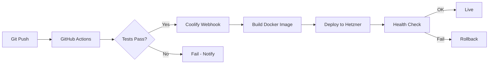

# Technology Decisions

> Detailed rationale for every technology choice in the GWTH v2 stack.
> Each decision includes: what it is, why it was chosen, alternatives considered, MCP/AI-coding status, cost, and risks.
>
> Last updated: 2026-02-19

---

## Table of Contents

1. [Authentication — Supabase Auth](#1-authentication--supabase-auth)
2. [Database — Supabase PostgreSQL](#2-database--supabase-postgresql)
3. [File Storage — Supabase Storage](#3-file-storage--supabase-storage)
4. [Database Schema](#4-database-schema)
5. [Payments — Stripe](#5-payments--stripe)
6. [Video Delivery — Self-Hosted HLS](#6-video-delivery--self-hosted-hls)
7. [Transactional Email — Resend](#7-transactional-email--resend)
8. [Marketing Email — MailerLite](#8-marketing-email--mailerlite)
9. [Error Tracking — Sentry](#9-error-tracking--sentry)
10. [Uptime Monitoring — Uptime Kuma](#10-uptime-monitoring--uptime-kuma)
11. [Analytics — Plausible](#11-analytics--plausible)
12. [CI/CD — GitHub Actions + Coolify](#12-cicd--github-actions--coolify)
13. [Project Management — Linear](#13-project-management--linear)
14. [GDPR Compliance](#14-gdpr-compliance)

---

## 1. Authentication — Supabase Auth

### What It Is

Supabase Auth (powered by GoTrue) provides email/password authentication, social login (Google, GitHub), session management, and JWT token generation. It integrates directly with Supabase's PostgreSQL database and Row Level Security.

### Why Chosen

| Criterion | Score | Notes |
|-----------|-------|-------|
| Robustness | High | GoTrue is battle-tested (used by Supabase's 1M+ projects). Handles edge cases like account linking, email verification, password reset out of the box. |
| AI-coding | Excellent | Supabase MCP allows Claude Code to manage auth configuration. Extensive documentation. Claude has deep training data on Supabase Auth patterns. |
| Speed | Fast | JWT-based sessions. No database lookup on every request (JWT verified locally). |
| Cost | Free | Included in Supabase free tier. 50,000 MAU limit. |
| Security | Strong | Bcrypt password hashing. PKCE flow for OAuth. Configurable session duration. MFA support (future). |

### Implementation

```typescript
// lib/supabase/server.ts — Server-side Supabase client
import { createServerClient } from '@supabase/ssr'
import { cookies } from 'next/headers'

export async function createClient() {
  const cookieStore = await cookies()
  return createServerClient(
    process.env.NEXT_PUBLIC_SUPABASE_URL!,
    process.env.NEXT_PUBLIC_SUPABASE_ANON_KEY!,
    {
      cookies: {
        getAll() { return cookieStore.getAll() },
        setAll(cookiesToSet) {
          cookiesToSet.forEach(({ name, value, options }) =>
            cookieStore.set(name, value, options))
        },
      },
    }
  )
}
```

```typescript
// lib/auth.ts — Updated auth abstraction (replaces mock)
import { createClient } from '@/lib/supabase/server'

export async function getCurrentUser() {
  const supabase = await createClient()
  const { data: { user } } = await supabase.auth.getUser()
  if (!user) return null

  const { data: profile } = await supabase
    .from('profiles')
    .select('*')
    .eq('id', user.id)
    .single()

  return { ...user, ...profile }
}

export async function requireAuth() {
  const user = await getCurrentUser()
  if (!user) redirect('/login')
  return user
}
```

### Social Login Configuration

- **Google:** OAuth 2.0 via Supabase dashboard. Requires Google Cloud Console project with OAuth consent screen.
- **GitHub:** OAuth App via GitHub Settings. Straightforward setup.
- **Email/Password:** Built-in. Email verification configurable (enable for production).

### Middleware Integration

```typescript
// middleware.ts — Updated to use Supabase Auth
import { createServerClient } from '@supabase/ssr'
import { NextResponse, type NextRequest } from 'next/server'

export async function middleware(request: NextRequest) {
  const response = NextResponse.next({ request })

  const supabase = createServerClient(
    process.env.NEXT_PUBLIC_SUPABASE_URL!,
    process.env.NEXT_PUBLIC_SUPABASE_ANON_KEY!,
    {
      cookies: {
        getAll() { return request.cookies.getAll() },
        setAll(cookiesToSet) {
          cookiesToSet.forEach(({ name, value, options }) => {
            request.cookies.set(name, value)
            response.cookies.set(name, value, options)
          })
        },
      },
    }
  )

  const { data: { user } } = await supabase.auth.getUser()

  // Redirect unauthenticated users from protected routes
  if (!user && request.nextUrl.pathname.startsWith('/dashboard')) {
    const loginUrl = new URL('/login', request.url)
    loginUrl.searchParams.set('redirect', request.nextUrl.pathname)
    return NextResponse.redirect(loginUrl)
  }

  return response
}
```

### Alternatives Considered

| Alternative | Why Not |
|-------------|---------|
| **Auth.js v5 (NextAuth)** | More widespread but: Credentials provider has edge cases with sessions, no unified MCP (separate from DB), more configuration complexity. Would require separate Prisma setup for session storage. |
| **Better Auth** | Excellent TypeScript-first DX, but newer with smaller community. Less AI training data. No MCP. |
| **Clerk** | Best DX in the industry, but $25/month at 1,000 MAU. Exceeds budget for auth alone. |
| **Lucia Auth** | Deprecated — maintainer recommends building your own. |

---

## 2. Database — Supabase PostgreSQL

### What It Is

Managed PostgreSQL 15 hosted by Supabase. Includes PostgREST (auto-generated REST API), real-time subscriptions, and Row Level Security.

### Why Chosen

| Criterion | Score | Notes |
|-----------|-------|-------|
| Robustness | Excellent | PostgreSQL is the most robust open-source database. Supabase manages backups, upgrades, and availability. |
| AI-coding | Excellent | Supabase MCP lets Claude Code create tables, write migrations, run queries, and inspect data directly. Claude has extensive PostgreSQL and Supabase training data. |
| Speed | Fast | Connection pooling via Supavisor. Server in eu-central-1 (Frankfurt) — same region as Hetzner. |
| Cost | Free → $25/mo | Free tier: 500 MB, unlimited API requests. Pro: $25/month for 8 GB, daily backups, 7-day PITR. |
| Security | Strong | SSL connections enforced. RLS policies on every table. Encrypted at rest. SOC 2 Type II certified. |

### Free Tier Capacity

For 5,000 users, estimated database size:

| Table | Rows (est.) | Size (est.) |
|-------|------------|-------------|
| profiles | 5,000 | ~2 MB |
| lesson_progress | 50,000 (10/user avg) | ~5 MB |
| lab_progress | 15,000 | ~2 MB |
| bookmarks | 10,000 | ~1 MB |
| notes | 5,000 | ~5 MB |
| notifications | 25,000 | ~3 MB |
| study_streaks | 5,000 | ~1 MB |
| daily_activity | 100,000 | ~10 MB |
| score_history | 50,000 | ~5 MB |
| Content tables | ~200 rows | ~1 MB |
| **Total** | | **~35 MB** |

**500 MB is more than sufficient.** The database stores user data and metadata, not content (videos are on the filesystem, lesson markdown is synced from the pipeline).

### Row Level Security (RLS)

Every table gets RLS policies. Example:

```sql
-- Users can only read/write their own progress
ALTER TABLE lesson_progress ENABLE ROW LEVEL SECURITY;

CREATE POLICY "Users read own progress"
  ON lesson_progress FOR SELECT
  USING (auth.uid() = user_id);

CREATE POLICY "Users update own progress"
  ON lesson_progress FOR UPDATE
  USING (auth.uid() = user_id);

CREATE POLICY "Users insert own progress"
  ON lesson_progress FOR INSERT
  WITH CHECK (auth.uid() = user_id);

-- Content tables are readable by all authenticated users
ALTER TABLE lessons ENABLE ROW LEVEL SECURITY;

CREATE POLICY "Authenticated users read lessons"
  ON lessons FOR SELECT
  USING (auth.role() = 'authenticated');
```

### Migration Strategy

Use the Supabase CLI for schema migrations:

```bash
# Create a new migration
supabase migration new create_profiles_table

# Apply migrations locally
supabase db push

# Apply to production
supabase db push --linked
```

Migrations are stored in `supabase/migrations/` and committed to git. The Supabase MCP can help generate migration SQL.

### Alternatives Considered

| Alternative | Why Not |
|-------------|---------|
| **Neon** | Excellent managed Postgres with branching. Has its own MCP. But no auth or storage — would need separate services, adding complexity. |
| **Self-hosted Postgres (Coolify)** | Free, full control. But: you manage backups, upgrades, monitoring. No RLS tooling. No MCP integration for database inspection. The user explicitly preferred managed initially. |
| **PlanetScale** | MySQL-based (not Postgres). No RLS. Deprecated free tier. |

### Exit Strategy

If Supabase costs exceed budget:
1. Export schema and data via `pg_dump`
2. Import into self-hosted Postgres on Hetzner (via Coolify)
3. Replace `@supabase/ssr` with direct `pg` client or Prisma
4. Move auth to Auth.js v5 with Prisma adapter
5. Move storage to MinIO (S3-compatible, self-hosted via Coolify)

The `lib/data/` abstraction layer means only the data files change — no component modifications.

---

## 3. File Storage — Supabase Storage

### What It Is

S3-compatible object storage integrated with Supabase Auth. Supports public and private buckets with RLS-like policies.

### Use Cases

| Bucket | Access | Content |
|--------|--------|---------|
| `avatars` | Public (with transformation) | User profile photos |
| `certificates` | Private (signed URLs) | Generated certificate PDFs |
| `resources` | Private (authenticated) | Lab downloads, PDF resources |

### Free Tier

- 1 GB storage
- 2 GB bandwidth/month
- Sufficient for launch. Certificate PDFs are small (~100 KB each). Avatars are resized on upload.

### Note on Video Files

Videos are NOT stored in Supabase Storage. They are served via Nginx on Hetzner (see section 6). Supabase Storage is only for small files (avatars, certificates, PDFs).

---

## 4. Database Schema

### Entity Relationship Diagram

```mermaid
erDiagram
    PROFILES ||--o{ LESSON_PROGRESS : tracks
    PROFILES ||--o{ LAB_PROGRESS : tracks
    PROFILES ||--o{ BOOKMARKS : saves
    PROFILES ||--o{ NOTES : writes
    PROFILES ||--o{ NOTIFICATIONS : receives
    PROFILES ||--|| STUDY_STREAKS : has
    PROFILES ||--o{ DAILY_ACTIVITY : logs
    PROFILES ||--o{ SCORE_HISTORY : records
    PROFILES ||--o{ CERTIFICATES : earns
    PROFILES ||--o{ OPTIONAL_SELECTIONS : chooses

    COURSES ||--o{ SECTIONS : contains
    SECTIONS ||--o{ LESSONS : contains
    LESSONS ||--o{ LESSON_PROGRESS : tracked_by
    LESSONS ||--o{ BOOKMARKS : bookmarked_by
    LESSONS ||--o{ NOTES : annotated_by

    LABS ||--o{ LAB_PROGRESS : tracked_by
    LABS ||--o{ BOOKMARKS : bookmarked_by

    PROFILES {
        uuid id PK "References auth.users"
        text name
        text bio
        text avatar_url
        text subscription_state "registered|month1|month2|month3|ongoing|lapsed"
        text stripe_customer_id UK
        text stripe_subscription_id UK
        int payment_count "Tracks payments for month gating"
        timestamptz current_period_end
        timestamptz grace_period_end
        timestamptz created_at
        timestamptz updated_at
    }

    COURSES {
        uuid id PK
        text slug UK
        text title
        text description
        text thumbnail
        text blur_data_url
        timestamptz created_at
        timestamptz updated_at
    }

    SECTIONS {
        uuid id PK
        uuid course_id FK
        int month "1|2|3"
        int week
        text title
        text description
        int order
        boolean is_optional
        text track_name
    }

    LESSONS {
        uuid id PK
        uuid section_id FK
        text slug UK
        text title
        text description
        int order
        int duration_minutes
        text difficulty
        text intro_video_path "Relative path to HLS manifest"
        text build_video_path "Relative path to HLS manifest"
        text learn_content "Markdown/MDX"
        jsonb build_instructions "Step-by-step JSON"
        text audio_file_path
        int audio_duration_seconds
        jsonb questions "Quiz questions JSON"
        jsonb resources "Links and downloads JSON"
        boolean is_optional
        text track_name
        timestamptz content_updated_at "For score decay"
        timestamptz created_at
        timestamptz updated_at
    }

    LABS {
        uuid id PK
        text slug UK
        text title
        text description
        text difficulty
        int duration_minutes
        text[] technologies
        text[] learning_outcomes
        text prerequisites
        text content "Markdown"
        jsonb instructions "Step-by-step JSON"
        text category
        text project_type
        text color
        text icon
        boolean is_premium
        timestamptz created_at
        timestamptz updated_at
    }

    LESSON_PROGRESS {
        uuid id PK
        uuid user_id FK
        uuid lesson_id FK
        boolean is_completed
        timestamptz completed_at
        float progress "0-1"
        float quiz_score
        float best_quiz_score
        int quiz_attempts
        int time_spent_seconds
        timestamptz last_accessed_at
    }

    LAB_PROGRESS {
        uuid id PK
        uuid user_id FK
        uuid lab_id FK
        boolean is_completed
        timestamptz completed_at
        float progress "0-1"
        int current_step
        int time_spent_seconds
    }

    STUDY_STREAKS {
        uuid id PK
        uuid user_id FK UK
        int current_streak
        int longest_streak
        date last_active_date
    }

    DAILY_ACTIVITY {
        uuid id PK
        uuid user_id FK
        date activity_date
        int lessons_completed
        int labs_completed
        int time_spent_seconds
    }

    BOOKMARKS {
        uuid id PK
        uuid user_id FK
        uuid lesson_id FK "Nullable"
        uuid lab_id FK "Nullable"
        timestamptz created_at
    }

    NOTES {
        uuid id PK
        uuid user_id FK
        uuid lesson_id FK
        text content "Markdown"
        int video_timestamp_seconds "Nullable"
        timestamptz created_at
        timestamptz updated_at
    }

    NOTIFICATIONS {
        uuid id PK
        uuid user_id FK
        text type "achievement|reminder|announcement"
        text title
        text message
        boolean read
        text action_url
        timestamptz created_at
    }

    CERTIFICATES {
        uuid id PK
        uuid user_id FK
        uuid course_id FK
        timestamptz issued_at
        text certificate_url
        text verification_code UK
    }

    SCORE_HISTORY {
        uuid id PK
        uuid user_id FK
        date score_date
        float overall_score
        float percentile
        float curiosity_index
        float consistency_score
        float improvement_rate
    }

    OPTIONAL_SELECTIONS {
        uuid id PK
        uuid user_id FK
        uuid lesson_id FK
        timestamptz selected_at
    }
```

### Key Indexes

```sql
-- Fast lookups for progress queries
CREATE INDEX idx_lesson_progress_user ON lesson_progress(user_id);
CREATE INDEX idx_lesson_progress_lesson ON lesson_progress(lesson_id);
CREATE INDEX idx_lab_progress_user ON lab_progress(user_id);

-- Fast bookmark lookups
CREATE INDEX idx_bookmarks_user ON bookmarks(user_id);
CREATE UNIQUE INDEX idx_bookmarks_unique_lesson ON bookmarks(user_id, lesson_id) WHERE lesson_id IS NOT NULL;
CREATE UNIQUE INDEX idx_bookmarks_unique_lab ON bookmarks(user_id, lab_id) WHERE lab_id IS NOT NULL;

-- Fast notification queries
CREATE INDEX idx_notifications_user_unread ON notifications(user_id) WHERE read = false;

-- Content lookups by slug
CREATE UNIQUE INDEX idx_lessons_slug ON lessons(slug);
CREATE UNIQUE INDEX idx_labs_slug ON labs(slug);

-- Daily activity for streak calculations
CREATE UNIQUE INDEX idx_daily_activity_user_date ON daily_activity(user_id, activity_date);

-- Score history for charts
CREATE INDEX idx_score_history_user_date ON score_history(user_id, score_date);
```

---

## 5. Payments — Stripe

### What It Is

Stripe handles subscription billing, payment processing, tax calculation (Stripe Tax), and invoicing.

### Configuration

- **Entity:** Stripe UK (registered in the UK)
- **Currency:** USD (as specified in pricing — $37.50 / $7.50)
- **Tax:** Stripe Tax (0.5% per transaction, handles EU VAT automatically)
- **Dunning:** Stripe Smart Retries + 14-day retry window

### MCP Integration

The `stripe/agent-toolkit` MCP server lets Claude Code:
- Create and manage products/prices
- Inspect subscriptions and invoices
- Debug webhook events
- Test payment flows

### Pricing Implementation

```
Product: "GWTH — Applied AI Skills"
├── Price: $37.50/month (course access)
└── Price: $7.50/month (ongoing access)
```

**Subscription lifecycle:**

1. **User subscribes:** Create Stripe Checkout Session with the $37.50 price
2. **Payments 1-3:** `invoice.payment_succeeded` webhook increments `payment_count` in profiles table
3. **After payment 3:** Webhook handler calls `stripe.subscriptions.update()` to switch to $7.50 price
4. **Payment 4+:** User is charged $7.50/month ongoing

**Grace period:**

1. Payment fails → Stripe marks subscription `past_due`
2. Stripe Smart Retries attempt to collect on optimal days
3. Application checks `past_due` status and sets `grace_period_end = NOW() + 14 days`
4. Non-dismissable banner shown during grace period
5. After 14 days: cancel subscription via API, set `subscription_state = 'lapsed'`
6. Lapsed users retain their data and can resubscribe to restore access

### Webhook Events to Handle

| Event | Action |
|-------|--------|
| `checkout.session.completed` | Create profile record, set `subscription_state = 'month1'` |
| `invoice.payment_succeeded` | Increment `payment_count`. Update `subscription_state`. After 3rd, switch to $7.50 price. |
| `invoice.payment_failed` | Set `grace_period_end`. Show payment banner. Send Resend email. |
| `customer.subscription.updated` | Sync `current_period_end`. Handle price changes. |
| `customer.subscription.deleted` | Set `subscription_state = 'lapsed'`. Preserve all user data. |

### Stripe Tax

- Automatic VAT/sales tax calculation based on customer location
- Tax is added to the price (not included) — customer sees $37.50 + applicable tax
- Stripe Tax handles EU VAT ID validation for B2B customers
- Tax invoices generated automatically
- Cost: 0.5% per transaction (on top of Stripe's standard 1.5% + 20p for UK cards)

### Alternatives Considered

| Alternative | Why Not |
|-------------|---------|
| **Paddle / LemonSqueezy** | Merchant of record (handles VAT for you) but: 5-8% per transaction vs. ~2.5% for Stripe + Tax. Worse developer experience. Less AI training data. No MCP. |
| **Stripe Subscription Schedules** | Cleaner for the 3-phase pricing model but harder to debug. Simple `payment_count` approach with manual price update is more transparent. |

---

## 6. Video Delivery — Self-Hosted HLS

### What It Is

Videos are encoded to HLS (HTTP Live Streaming) format by the P520 pipeline using FFmpeg. HLS segments are deployed to the Hetzner server and served by Nginx with signed, expiring URLs.

### Why HLS

- **Adaptive bitrate:** Player automatically selects quality (480p/720p/1080p) based on connection speed
- **Native iOS support:** Safari and iOS play HLS natively (no JavaScript library needed)
- **Segment-based:** Only downloads the current 10-second segment, not the entire file
- **Industry standard:** Used by Netflix, YouTube, Twitch. Battle-tested.

### Encoding Pipeline (FFmpeg on P520)

```bash
#!/bin/bash
# encode-hls.sh — Encode a single MP4 to multi-bitrate HLS
INPUT="$1"
OUTPUT_DIR="$2"
LESSON_SLUG="$3"

mkdir -p "$OUTPUT_DIR/$LESSON_SLUG"

# 1080p (original quality)
ffmpeg -i "$INPUT" \
  -c:v libx264 -preset medium -crf 23 -maxrate 5000k -bufsize 10000k \
  -c:a aac -b:a 128k -ac 2 \
  -vf "scale=1920:1080" \
  -hls_time 10 -hls_playlist_type vod \
  -hls_segment_filename "$OUTPUT_DIR/$LESSON_SLUG/1080p_%04d.ts" \
  "$OUTPUT_DIR/$LESSON_SLUG/1080p.m3u8"

# 720p
ffmpeg -i "$INPUT" \
  -c:v libx264 -preset medium -crf 23 -maxrate 2500k -bufsize 5000k \
  -c:a aac -b:a 128k -ac 2 \
  -vf "scale=1280:720" \
  -hls_time 10 -hls_playlist_type vod \
  -hls_segment_filename "$OUTPUT_DIR/$LESSON_SLUG/720p_%04d.ts" \
  "$OUTPUT_DIR/$LESSON_SLUG/720p.m3u8"

# 480p
ffmpeg -i "$INPUT" \
  -c:v libx264 -preset medium -crf 23 -maxrate 1000k -bufsize 2000k \
  -c:a aac -b:a 96k -ac 2 \
  -vf "scale=854:480" \
  -hls_time 10 -hls_playlist_type vod \
  -hls_segment_filename "$OUTPUT_DIR/$LESSON_SLUG/480p_%04d.ts" \
  "$OUTPUT_DIR/$LESSON_SLUG/480p.m3u8"

# Master playlist (adaptive bitrate)
cat > "$OUTPUT_DIR/$LESSON_SLUG/master.m3u8" << EOF
#EXTM3U
#EXT-X-STREAM-INF:BANDWIDTH=5000000,RESOLUTION=1920x1080
1080p.m3u8
#EXT-X-STREAM-INF:BANDWIDTH=2500000,RESOLUTION=1280x720
720p.m3u8
#EXT-X-STREAM-INF:BANDWIDTH=1000000,RESOLUTION=854x480
480p.m3u8
EOF
```

### Signed URL Generation

```typescript
// lib/video.ts — Generate signed HLS URLs
import crypto from 'crypto'

const VIDEO_SECRET = process.env.VIDEO_SIGNING_SECRET!
const VIDEO_BASE_URL = process.env.VIDEO_BASE_URL! // https://video.gwth.ai

/**
 * Generates a signed URL for an HLS master playlist.
 * URL expires after 4 hours to prevent link sharing.
 */
export function getSignedVideoUrl(videoPath: string): string {
  const expires = Math.floor(Date.now() / 1000) + (4 * 60 * 60) // 4 hours
  const signature = crypto
    .createHmac('sha256', VIDEO_SECRET)
    .update(`${videoPath}${expires}`)
    .digest('hex')

  return `${VIDEO_BASE_URL}/${videoPath}?expires=${expires}&sig=${signature}`
}
```

### Nginx Configuration

```nginx
# /etc/nginx/sites-available/video.gwth.ai
server {
    listen 443 ssl http2;
    server_name video.gwth.ai;

    ssl_certificate /etc/letsencrypt/live/video.gwth.ai/fullchain.pem;
    ssl_certificate_key /etc/letsencrypt/live/video.gwth.ai/privkey.pem;

    root /var/www/gwth-videos;

    # Only allow requests from gwth.ai
    add_header Access-Control-Allow-Origin "https://gwth.ai" always;
    add_header Access-Control-Allow-Methods "GET, OPTIONS" always;

    # Prevent embedding on other sites
    add_header X-Frame-Options "SAMEORIGIN" always;

    # Signed URL validation (via Lua or njs module)
    location ~ \.(m3u8|ts)$ {
        # Validate signature and expiry
        # Implementation depends on Nginx module choice (njs or Lua)
        # See infrastructure doc for full Nginx config

        # Enable range requests for seeking
        add_header Accept-Ranges bytes;

        # Cache control
        add_header Cache-Control "private, max-age=3600";

        try_files $uri =404;
    }

    # Block direct directory browsing
    location / {
        return 403;
    }
}
```

### Frontend Player

Update the existing `VideoPlayer` component to use `hls.js`:

```typescript
// components/shared/video-player.tsx — HLS-aware player
import Hls from 'hls.js'

// hls.js handles adaptive bitrate selection automatically
// Falls back to native HLS on Safari/iOS (no hls.js needed)
// The signed URL is passed as the src prop
```

### Protection Summary

| Protection | What It Prevents |
|-----------|-----------------|
| Signed URLs (4h expiry) | Link sharing — shared links expire |
| CORS (gwth.ai only) | Embedding player on other sites |
| No download button | Casual "right-click save" |
| HLS segments (not full file) | Must download hundreds of .ts files and stitch them together |
| Rate limiting | Automated bulk downloading |

**What it does NOT prevent:** A determined user with dev tools can still capture segments. Full DRM (Widevine/FairPlay) would prevent this but costs $100+/month and adds significant complexity.

### Growth Path

| Phase | Action | Cost |
|-------|--------|------|
| Launch | Self-hosted HLS on Hetzner (all 3 qualities: 480p/720p/1080p). ~720 GB on 2 TB disk. | Free |
| 500+ concurrent viewers | Add Bunny CDN for edge caching | ~£3-5/mo |
| Global audience | Evaluate Bunny Stream for built-in HLS + CDN | ~£10-15/mo |
| Mobile app | Evaluate Mux for native SDK support | ~£50+/mo |

### Mobile App & Offline Viewing

The current HLS architecture is the correct foundation for future offline video support, but offline playback with content protection requires DRM — which is a separate decision for the mobile app phase.

**How offline viewing works with HLS:**
- iOS supports HLS offline downloads natively via `AVAssetDownloadTask` (AVFoundation)
- Android supports it via ExoPlayer's download manager
- HLS segments (.ts files) can be cached on-device for playback without a network connection

**The content protection tension:**

| Approach | Offline? | Protected? | Cost |
|----------|----------|-----------|------|
| Current HLS + signed URLs | No (streaming only) | "Good enough" — signed URLs, CORS, no download button | Free |
| HLS download without DRM | Yes | No — user has raw .ts files on device, trivially copyable | Free |
| HLS + FairPlay (iOS) + Widevine (Android) | Yes | Yes — encrypted, device-locked, expiry-controlled | £100+/mo (Mux/Bitmovin) |

**Why this doesn't need to be solved now:**
- Signed URLs expire after 4 hours, preventing casual link sharing for streaming — adequate for web launch
- Offline downloads are a mobile app feature (6+ months away)
- DRM requires encrypted HLS packaging, which wraps the *same segments* we're already encoding — no wasted work
- Revenue at the mobile app stage will justify the cost of a DRM-capable platform (Mux, Bitmovin)

**Upgrade path when mobile app is built:**
1. Keep existing HLS segments (already encoded at 480p/720p/1080p)
2. Add DRM packaging step — encrypt segments with FairPlay (iOS) and Widevine (Android) keys
3. Use a managed service (Mux or Bitmovin) for DRM key exchange and license management
4. Mobile app downloads encrypted segments — playable only on the authenticated device, with configurable expiry (e.g. 30 days offline, re-auth required if subscription lapses)

**No architectural changes needed now.** The decision to use HLS from day one ensures a clean upgrade path to DRM-protected offline viewing when the mobile app is built.

---

## 7. Transactional Email — Resend

### What It Is

Resend is a modern email delivery service with a developer-friendly API and React Email support (write email templates in JSX).

### Why Chosen

- **React Email integration:** Write email templates as React components — same language as the frontend. This is excellent for AI-assisted development (Claude can write email templates like any other component).
- **Clean API:** Simple REST API with excellent TypeScript SDK.
- **Free tier:** 3,000 emails/month (covers <500 active users sending password resets, payment receipts, study reminders).
- **Good deliverability:** Uses AWS SES infrastructure under the hood.

### Use Cases

| Email Type | Trigger | Template |
|-----------|---------|----------|
| Welcome | User signs up | Welcome message + how to get started |
| Password reset | User requests reset | Reset link (6h expiry) |
| Payment receipt | `invoice.payment_succeeded` | Receipt with amount and period |
| Payment failed | `invoice.payment_failed` | Update payment method link |
| Grace period reminder | Day 1, 7, 12 | Escalating urgency |
| Lesson completed | Student marks complete | Encouragement + next lesson |
| Study streak milestone | 7, 30, 60, 90 days | Achievement celebration |
| Month unlocked | 2nd/3rd payment | New content available |
| Score update | Weekly digest | Score changes, percentile |

### Cost

- Free: 3,000 emails/month, 1 sending domain
- Pro: $20/month for 50,000 emails (needed at ~1,000+ active users)

### Alternative Considered

- **MailerSend:** Similar feature set but HTML-only templates (no React Email). Less AI-coding friendly.
- **Postmark:** Excellent deliverability but no free tier ($15/month minimum).

---

## 8. Marketing Email — MailerLite

### What It Is

MailerLite handles newsletter subscriptions, email nurture sequences, and marketing campaigns.

### Why Chosen

- **Already referenced** in the project's `.env.local.example` (continuity).
- **Visual editor** for marketing emails — good for non-developer email creation.
- **Automation workflows** for nurture sequences (welcome series, re-engagement).
- **Free tier:** 1,000 subscribers, 12,000 emails/month.

### Use Cases

- Weekly newsletter (Tech Radar updates, practical AI tips)
- Pre-signup nurture sequence (5-email series from `email-nurture-sequence.md`)
- Re-engagement campaigns for lapsed subscribers
- New content announcements

### Integration

- Newsletter signup form on `/newsletter` page
- API integration for subscriber management
- Webhook to sync subscriber status with Supabase

---

## 9. Error Tracking — Sentry

### What It Is

Sentry captures runtime errors, performance data, and session replays from both client and server.

### Why Chosen

| Criterion | Score | Notes |
|-----------|-------|-------|
| Robustness | Industry standard | Used by millions of apps. Handles Next.js SSR + client errors. |
| AI-coding | Excellent | Sentry MCP (`@sentry/mcp-server`) lets Claude Code inspect errors, stack traces, and performance data directly. |
| Cost | Free | Free tier: 5,000 errors/month, 10,000 transactions/month. |

### Configuration

```bash
# Install
npx @sentry/wizard@latest -i nextjs

# .env.local
SENTRY_DSN=https://xxx@sentry.io/yyy
SENTRY_ORG=gwth
SENTRY_PROJECT=gwth-v2
```

Sentry's Next.js SDK automatically instruments:
- Server-side rendering errors
- Client-side React errors (caught by error boundaries)
- API route errors
- Performance metrics (LCP, FID, CLS)

---

## 10. Uptime Monitoring — Uptime Kuma

### What It Is

Self-hosted uptime monitoring tool. Checks endpoints at configurable intervals and sends alerts via Telegram (already configured).

### Why Chosen

- **Free.** Self-hosted via Coolify on the Hetzner VM.
- **Simple.** Web UI for configuring checks. No code needed.
- **Telegram integration.** Already have a Telegram bot for alerts.
- **Status page.** Can expose a public status page at `status.gwth.ai`.

### Monitors to Configure

| Monitor | URL | Interval | Alert |
|---------|-----|----------|-------|
| Website | `https://gwth.ai` | 60s | Telegram |
| API health | `https://gwth.ai/api/health` | 60s | Telegram |
| Video server | `https://video.gwth.ai/health` | 60s | Telegram |
| Supabase | DB connection check | 300s | Telegram |
| Stripe webhooks | Webhook endpoint | 300s | Telegram |
| Pipeline (P520) | `http://192.168.178.50:8088/health` | 300s | Telegram |

---

## 11. Analytics — Plausible

### What It Is

Privacy-friendly web analytics. Self-hosted via Coolify. No cookies, no tracking pixels, no personal data — GDPR compliant by design.

### Why Chosen

- **GDPR compliant without cookie consent banners.** Plausible doesn't use cookies or collect personal data. No cookie banner needed. This is a significant UX win.
- **Self-hosted via Coolify.** Free. No data leaves your server.
- **Lightweight.** ~1 KB script (vs. Google Analytics ~45 KB). Doesn't slow page load.
- **Simple.** Dashboard shows pageviews, referrers, countries, devices. No configuration needed.

### What It Tracks

- Page views and unique visitors
- Referral sources (where traffic comes from)
- Country and device breakdown
- Goal conversions (signup, subscribe, lesson complete)
- UTM campaign tracking

### Alternative Considered

- **Google Analytics 4:** Free but requires cookie consent banner (GDPR). Sends user data to Google. Heavier script. Over-engineered for a learning platform.

---

## 12. CI/CD — GitHub Actions + Coolify

### What It Is

GitHub Actions runs tests and linting on every push. Coolify handles deployment via webhook trigger.

### Pipeline



### GitHub Actions Workflow

```yaml
# .github/workflows/ci.yml
name: CI
on: [push, pull_request]
jobs:
  test:
    runs-on: ubuntu-latest
    steps:
      - uses: actions/checkout@v4
      - uses: actions/setup-node@v4
        with: { node-version: 22 }
      - run: npm ci
      - run: npm run lint
      - run: npm test
      - run: npx tsc --noEmit

  deploy:
    needs: test
    if: github.ref == 'refs/heads/master' && github.event_name == 'push'
    runs-on: ubuntu-latest
    steps:
      - name: Trigger Coolify deployment
        run: |
          curl -s "${{ secrets.COOLIFY_DEPLOY_URL }}" \
            -H "Authorization: Bearer ${{ secrets.COOLIFY_API_TOKEN }}"
```

### Cost

- GitHub Actions free tier: 2,000 minutes/month (more than enough for daily deploys)
- Coolify: self-hosted, free

---

## 13. Project Management — Linear

### What It Is

Issue tracking and project management. Already in use on the free tier for another project.

### Why Chosen

- **Already using it.** Proven helpful for prioritisation.
- **Free tier.** Covers solo development (unlimited issues, basic workflows).
- **Linear MCP.** Claude Code can read and create issues, meaning the AI assistant understands the project backlog.
- **Course alignment.** Can recommend Linear in the GWTH course as an AI-friendly project management tool.

### Structure

| Level | Purpose | Example |
|-------|---------|---------|
| Project | GWTH v2 | — |
| Cycle | 2-week sprint | "Phase 2: Auth + Database" |
| Epic | Major feature | "Subscription & Payment Flow" |
| Issue | Individual task | "Implement Stripe webhook handler for invoice.payment_succeeded" |

---

## 14. GDPR Compliance

### Requirements

As a UK/EU-serving platform collecting personal data:

| Requirement | How We Handle It |
|------------|-----------------|
| **Lawful basis for processing** | Consent (signup) and contract performance (subscription) |
| **Right to access** | "Export my data" in settings — generates JSON export of all user data |
| **Right to deletion** | "Delete account" in settings — cascading delete of all user data from Supabase |
| **Right to portability** | Data export includes progress, notes, bookmarks in standard JSON format |
| **Data minimisation** | Only collect name, email, bio. No unnecessary tracking. |
| **Cookie consent** | Not required — Plausible doesn't use cookies. Supabase Auth uses httpOnly session cookies (exempt as "strictly necessary"). |
| **Privacy policy** | Required page at `/privacy` — describe what data is collected and why |
| **DPA with processors** | Supabase (DPA available), Stripe (DPA available), Resend (DPA available) |
| **Data breach notification** | Sentry alerts + Telegram for monitoring. 72-hour ICO notification if breach occurs. |

### Technical Implementation

```typescript
// API route: /api/user/export
// Returns all user data as downloadable JSON
export async function GET(request: NextRequest) {
  const user = await requireAuth()
  const supabase = await createClient()

  const [profile, progress, notes, bookmarks, streaks] = await Promise.all([
    supabase.from('profiles').select('*').eq('id', user.id).single(),
    supabase.from('lesson_progress').select('*').eq('user_id', user.id),
    supabase.from('notes').select('*').eq('user_id', user.id),
    supabase.from('bookmarks').select('*').eq('user_id', user.id),
    supabase.from('study_streaks').select('*').eq('user_id', user.id),
  ])

  return Response.json({
    exported_at: new Date().toISOString(),
    profile: profile.data,
    lesson_progress: progress.data,
    notes: notes.data,
    bookmarks: bookmarks.data,
    study_streaks: streaks.data,
  })
}

// API route: /api/user/delete
// Cascading delete of all user data
export async function DELETE(request: NextRequest) {
  const user = await requireAuth()
  const supabase = await createServiceRoleClient() // Service role for cascading delete

  // Cancel Stripe subscription first
  if (user.stripe_subscription_id) {
    await stripe.subscriptions.cancel(user.stripe_subscription_id)
  }

  // Delete Supabase auth user (cascades to profiles and all related tables via FK)
  await supabase.auth.admin.deleteUser(user.id)

  return Response.json({ success: true })
}
```
