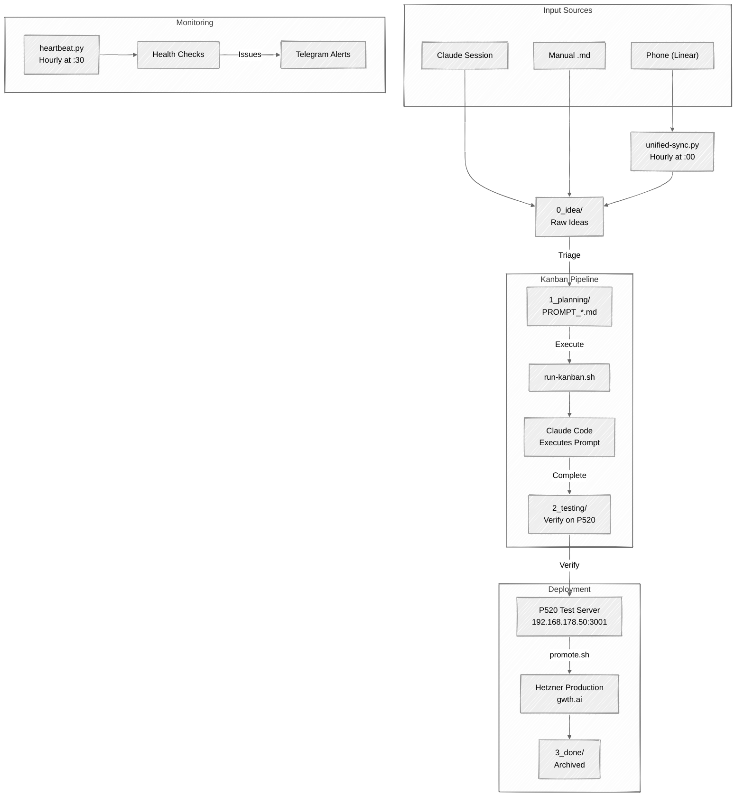

# Unified Workflow — Mermaid Hand-Drawn Demo

Generated: 2026-03-02

## Mermaid Source Code (with handDrawn look)

## Preview/Edit Link

[Open in Mermaid Chart Editor](https://mermaid.ai/live/edit?utm_source=mermaid_mcp_server&utm_medium=remote_server&utm_campaign=claude#pako:eNp9k1uP0zAQhf-K1SdASkhbLSx5QOr2fq92K14Iqtxk2lh1x5HjbLdQ_jvjOJQGVuTJk-_M8XE8-dGIVQKNsOF5XoSxwp3YhxEyJpU6hCzlmPQ0P6F9ZVI4QsgQCqO5jLBs2Ul1ilOuDVv3rIixvNjuNc9S9qQKHUP-NWqMMSvM7zpqfHNC-3SIrlKFwN7MBALXb2v4gXBX8iIB9gR5LhTWcJfwnGPBJfOPyRUBJhG6ZY8UBYqdgMTLzxj72TmKcERJ5Jlxw8IguLb1SRtsRAL8PWke-YmNae3y_nW0lchAUl7qmHLccry-qeUbEG9uMskRBe6t6-pxOV-tN-9u49pnSEpdoHco3fw8rdHRn8_Qpeuin_4LxIWBnK20Omamph6TurUhaKpNv4AWuzNTlPKuFbz2ma4H60Em1ZkM3OIIWPee2PsiE7Yme7oT_Qyadmh-avnND_d-8-O9fxeE7SBo1tqm1DYC8x1B28RJERt7lxHuTyb1uaiJZyRubxIaChu-o-NUPEPy39hzhcIobcfBrejkNc85oZTGy2yBm3-GoB3UxIsyLZcmZd0U4kN9ZJdE1yCBdj6yjgRt8teydZjnfWbVP_FQFn1XdG-L3m3Rt8WF7LXgexqlCxs4MKhAde2WDB0Zlv0jV4wqWZdmQoLTjR0aV8jNggUTByYVyGiQlIFy9C5s6uC0dJ-5Yl4WC1csqrZxnhf2n76wZePnL2OjSxo)

## Notes

- Uses `look: handDrawn` config which enables RoughJS rendering
- Currently only supported for flowcharts and state diagrams
- The sketch aesthetic is subtle — wobbly lines and organic edges
- Combined with `theme: neutral` for muted colors
- Could be post-processed through Nano Banana 2 for richer visuals
