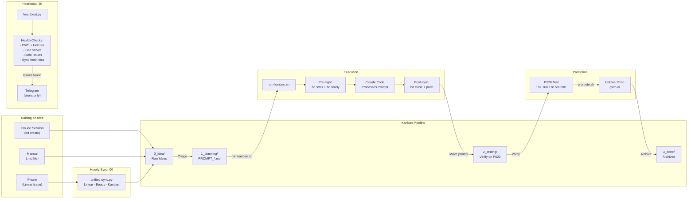

# Unified Workflow — Mermaid Demo

Generated: 2026-03-02

## Mermaid Source Code

## Preview/Edit Link

[Open in Mermaid Chart Editor](https://mermaid.ai/live/edit?utm_source=mermaid_mcp_server&utm_medium=remote_server&utm_campaign=claude#pako:eNp9Vc1uEzEQfhUrJ36UkLQqlByQSAtNRSOiJOVCUOTserNWXXtlexsCQeqJCxJIFHGohBCIAzfglfIEPAIztjfJhqo5zcx-45n55rPzuhKpmFWalUSoaZRSbclRbygJ_Ew-nmiapeRQZrl9Pqz8_fr-F-lRbricECrJYczosPLCo_HXTZVkDnjxxzvDobxxxCWjmhwak7ObJfyeoHnsE358Dh7pM2O4kpg5jkmkGbUbaR0qcyp8nS_BQ3jtNCYJF2toJuOh3JimP5MR5C4-_CZtlWsxcxHSrNdLRY77AMolTziLqwYQtWwGRcIwi7efSIvR2DjrCZVjKq-t2uUZE7xg511IWYZLpWOuWWSBAzJoraLINmTXRxyMO9BKj05d0JR3IKiUsCCANkZZcBDe7T3tdAejW8BSKWHAjPX4rZH1NsKfMc2TGYEmujtbZWr2_Za3RzEYiH2oo5SfsfhaBh69ZFFuMXFx-S14uOf1k3u59MQASueyeuKcmknLI2r2WPBJipoEu5o4pwmNgGCMpdaQ2wRMkE48u0JwWBtSg972QP9Ij1YRKI8ZOF6dZrZcURkbdIOm00OoFwllGNTL8rUur5q_oyS3SjsBfLwgbZCRHYO4SXO7TG-7BZi0-IyyK42QsujEAAIOEDYNPjazOP_udgXNtJl9JZkOwX0lLDFMny0jfUsFIxxvpClCeAkSzUwqgYayQg68an-CVgSDaU7xtsEJGphWUsyuv3D7LBNq5o64PHfsqv8Wj30judg-ChIKNO5v1Rp3d2uNe7u1nTqQVG-UafIzOiachUfHkDiZ2rRG-VU9uTeJVKsP4Hr7SBABhtxzJlcPzEbwuL8W8CG0MTgfVgaa0wlc4_nyAoaKwQuwDVHPV4r38KXrai2FHs4qXPdxpeX1SdD3uUGyITV4oY2OOmMkCzqfF09AMVZwA9Y_BG4yfAhksa7wOXP7ZGGcQnhybUMBGB4JROEDUhRrt_w0TsZhEmeHNPe3YUiiclgj9npQefMPzSIxyg)

## Notes

- This is a standard Mermaid flowchart with subgraphs
- Rendered via Mermaid Chart MCP tool
- Style is clean/corporate — not hand-drawn
- Mermaid supports a "handDrawn" look option (rough.js integration) that could add sketch aesthetic
