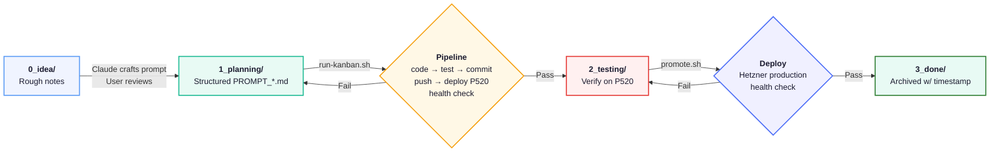

# Kanban Pipeline Workflow

```mermaid
flowchart LR
    A["<b>0_idea/</b><br/>Rough notes"] -->|"Claude crafts prompt<br/>User reviews"| B["<b>1_planning/</b><br/>Structured PROMPT_*.md"]
    B -->|"run-kanban.sh"| C{"<b>Pipeline</b><br/>code → test → commit<br/>push → deploy P520<br/>health check"}
    C -->|"Pass"| D["<b>2_testing/</b><br/>Verify on P520"]
    C -->|"Fail"| B
    D -->|"promote.sh"| E{"<b>Deploy</b><br/>Hetzner production<br/>health check"}
    E -->|"Pass"| F["<b>3_done/</b><br/>Archived w/ timestamp"]
    E -->|"Fail"| D

    style A fill:#f0f4ff,stroke:#5B9BF5,stroke-width:2px,color:#1a1a2e
    style B fill:#e8faf4,stroke:#1CBA93,stroke-width:2px,color:#1a1a2e
    style C fill:#fff8e6,stroke:#F59E0B,stroke-width:2px,color:#1a1a2e
    style D fill:#fff0f0,stroke:#E53935,stroke-width:2px,color:#1a1a2e
    style E fill:#f0f0ff,stroke:#4A6CF7,stroke-width:2px,color:#1a1a2e
    style F fill:#e8faf4,stroke:#2E7D32,stroke-width:2px,color:#1a1a2e
```
